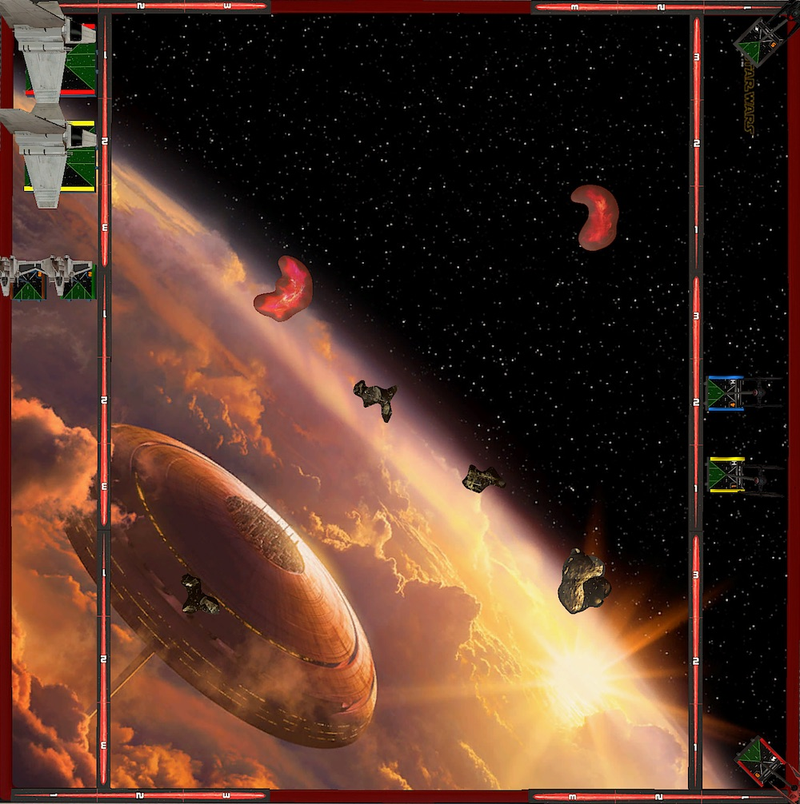

It's time for the second week of the [German TTS League](https://www.tabletop.to/xwing-tabletop-simulator-liga-deutschland)! I lost my first match, as expected. Will I lose my second one? Well, I wouldn't bet on myself. But winning isn't my prime directive anyway. Learning is.

So what was my take away from the last match? Flying aces is hard, especially if you are relatively new to the game. But oh boy do I have fun flying these squirrly ships! Maybe I should switch to a faction that has real aces? Nah!

Speaking of Imperials. My next opponent Hannes is flying Imps. This already gets me excited because most of the times when I play locally, I fly against Scum. And while I don't despise Boba and whatever his wingman of the day is, I find it super exhausting flying against him.

Anyway, on to the game.

## Lists

Hannes told me before the game that he was sorry. He read my last post and that I really struggle flying against high health squads. This is why he chose to pack the most health he can think of into an Imperial squad and bring two shuttles and two Star Wings.

Seriously though, he chose the squad before he read my post. I am more than happy that someone reads what I write. You're allowed, no, entitled to bring whatever makes you happy. Afterall, I am the one flying the meta list 😄

<XWS list={{
  description: '',
  faction: 'galacticempire',
  name: 'Unnamed Squadron',
  pilots: [
    {
      id: 'lieutenantsai',
      name: 'lieutenantsai',
      points: 51,
      ship: 'lambdaclasst4ashuttle',
      upgrades: { title: ['st321'] },
    },
    {
      id: 'coloneljendon',
      name: 'coloneljendon',
      points: 52,
      ship: 'lambdaclasst4ashuttle',
      upgrades: { crew: ['directorkrennic'] },
    },
    {
      id: 'nusquadronpilot',
      name: 'nusquadronpilot',
      points: 48,
      ship: 'alphaclassstarwing',
      upgrades: {
        sensor: ['firecontrolsystem'],
        torpedo: ['advprotontorpedoes'],
        missile: ['barragerockets'],
        configuration: ['os1arsenalloadout'],
      },
    },
    {
      id: 'nusquadronpilot',
      name: 'nusquadronpilot',
      points: 48,
      ship: 'alphaclassstarwing',
      upgrades: {
        sensor: ['firecontrolsystem'],
        torpedo: ['advprotontorpedoes'],
        missile: ['barragerockets'],
        configuration: ['os1arsenalloadout'],
      },
    },
  ],
  points: 199,
  vendor: {
    yasb: {
      builder: 'Yet Another Squad Builder 2.0',
      builder_url: 'https://raithos.github.io/',
      link:
        'https://raithos.github.io/?f=Galactic%20Empire&d=v8ZsZ200Z166XWWWWW162Y167XWW28WWWY164X113W134W97WW139WWY164X113W134W97WW139WW&sn=Unnamed%20Squadron&obs=',
    },
  },
  version: '2.0.0',
}}/>

Coordinate shenanigens again. This time paired with the ability to lock past range three. All to support the two ordnance carriers, which are armed to the teeth. It doesn't matter if you're at range one, two or three. The have an option to throw at least three dice at you. The range one Advanced Proton Torpedo is extra ugly.

Even the support ships, the two Lamdbas, can dish out some real damage. With the Krennic crew one of them can remove shields for a focus token.

I am still excited about Kylo, Vonreg plus two FOs. It may not be an S-Tier list, or even A-Tier, but I like flying First Order and I really like the TIE/ba. Vonreg with Daredevil is just pure madness.

I swapped some upgrades and pilots for this match. I wanted to make the list more effective and only play stuff that has value regardless of the opponent's squad.

This means removing the Mag-Pulse Warheads and the Advanced Optics. It is only worth to fire the warheads if Vonreg or Kylo is in trouble against another aces or to remove the lock from an ordanance carrier. Too bad my opponent brought not one but two ordanance carriers.

As for the Advanced Optics. Kylo always is the primary target. I am fine with that because it means Vonreg can do his thing and shoot stuff. But if Kylo runs he doesn't needs the optics. I find that optics on high initiative ships isn't that great anyway. You don't know if you need the focus for defense later and a target lock is almost as good for Kylo since he has force mods.

This freed-up 10 points which I chose to invest in upgrading the TIE/fo pilots. 10 points will exactly be enough to Rivas and Scorch. In my opinion two of the best TIE/fo pilots. Rivas is only two points more than a cadet and will get lots of free target locks from Vonreg. And other than a cadet, Scorch can not be ignored. Throwing up to four dice at a target is no fun for the opponent. He is also I4 and can be an ace in some matchups.

<XWS list={{
  description: '',
  faction: 'firstorder',
  name: 'Unnamed Squadron',
  pilots: [
    {
      id: 'majorvonreg',
      name: 'majorvonreg',
      points: 59,
      ship: 'tiebainterceptor',
      upgrades: { talent: ['daredevil'] },
    },
    { id: 'kyloren', name: 'kyloren', points: 76, ship: 'tievnsilencer' },
    { id: 'scorch', name: 'scorch', points: 33, ship: 'tiefofighter' },
    {
      id: 'lieutenantrivas',
      name: 'lieutenantrivas',
      points: 27,
      ship: 'tiefofighter',
    },
  ],
  points: 195,
  vendor: {
    yasb: {
      builder: 'Yet Another Squad Builder 2.0',
      builder_url: 'https://raithos.github.io/',
      link:
        'https://raithos.github.io/?f=First%20Order&d=v8ZsZ200Z381X117WWWY236XWWWY262XWWY265XW&sn=Unnamed%20Squadron&obs=coreasteroid5,gascloud4,gascloud5',
    },
  },
  version: '2.0.0',
  obstacles: ['coreasteroid5', 'gascloud4', 'gascloud5'],
}}/>

The list is very vanilla, but has some extra triggers (Rivas) to remember. It's just a bunch of quality pilots the First Order has to offer. With five points the bid is the same than last week. I was thinking about putting Crack Shot on Scorch, but in my opinion 195 is the threshold for bidding. If you want to win the bid, you can not go higher. You maybe even need to be a little lower to win against everything but Boba.

Looking at what the squad has to fly against. Neither Kylo, nor Vonregs like to be the receipient of torps and missiles. None of my ships have the health to withstand the firepower of the Starwings. That combined with the high health count, 34 to be exact, will be no easy task. Hannes' squad comes with one more health than Roger's las week but at least the health is more evenly distributed.

Still, there are no easy points. I can not expect to go in, destroy a ship and get out, leaving the FOs to die. I have to stick to one target for multiple rounds. Not necessarly the plan I have in mind with this squad. Also, know that the two FOs hold 60 instead of 50 points I need to secure an extra 10 points. A clear disatvantage in investing in better pilots.

## Turn 0

Hannes brought three of the smaller debris as obstacles. I am still not sure why. I guess the Lamdbas don't care about stress, they are better for him than clouds and of course you usually don't bring rocks with too large bases.

I packed the two large gas clouds and the largest rock again. After the match and how the obstacles got placed I am no longer sure that this is the correct choice for the list. Maybe it is just because of the lists I am flying against but dang I want more rocks on the playing area.

Since I won the bid, I chose Hannes to go first. Clearly a mistake if there is only one real obstacle, the rock. Hannes tugged the rock in the corner on my side. Great. I grabbed on ouf the clouds and tried to get as much obstacles in the center of the battle field. Hannes stucked to this plan and put his remaining obstacles, the other cloud and one debris field in the other corners, while I created a diagonal lane with the last two debris fields. I hoped that this would split the mat into two zones and leave no lanes for the Lamdbas.

Hannes placed his ships in groups of two. The two Lamdbas facing down the northern edge of the board and the two Starwings started horizontally right next to them. Sai got assigned the "Optimized Prototype" so he would be flypping crits and removing shield for a focus token. By the looks of Hannes formation the Lamdbas would occupy the northern zone of the board, while the Starwings patrolled to the south of the obstacles field.

I did the usual. FOs in the middle. Kylo and Vonreg start in opposite corners to react to the first few turns of movement. At least that's the idea. The only adjustment I made was placing the FOs such that they would fly directly at an obstacle. I wanted the option to bank either way with them. The potential of slamming Starwings made me wary.

