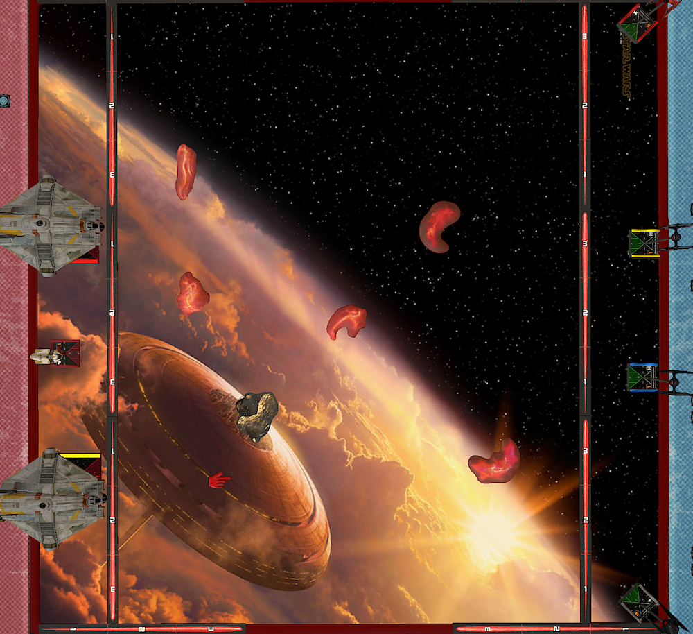
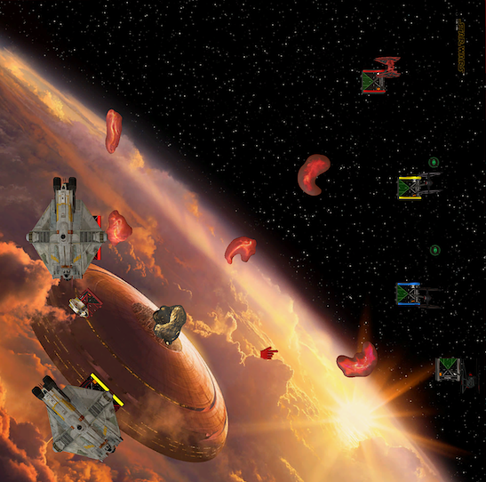
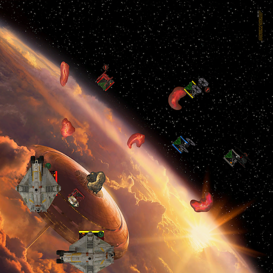
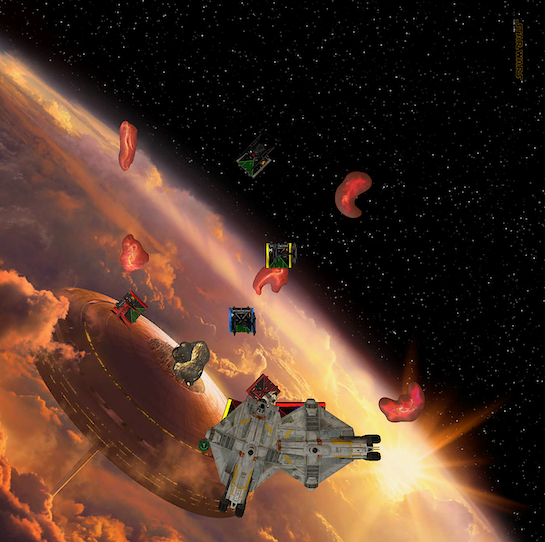

The [second season of the German TTS league](https://www.tabletop.to/xwing-tabletop-simulator-liga-deutschland) started this week. This is my very first tournament, so if your looking for some real content, I guess you should rather checkout [Phil GC's](https://suchanxwinghipster.wordpress.com/) or [Dylan's](http://dylan-jones.co.uk/) blog.

Shoutout to them, because they inspired me to try writing down a battle report and sharing what I was thinking ... or not thinking. Anyway, I am trying to get better at this game and I hope that sharing my thoughts will help me to notice mistakes and what I should do better.

The game was also streamed by [funwok](https://www.twitch.tv/funwok). If want some good commentary (in German), **[watch the game on Twitch](https://www.twitch.tv/videos/680608539)**. If not, here we go!

## Lists

Roger is my first opponent and luckily for me he knew that this was my first tournament. He brought a fun list, rather than his battle-tested tournament list. Phew.

That said, it didn't really made it easier for me. Because I never flew against two large base ships with that much health and fire power. Let alone all the coordinate and Leia shenanigens.

**[Roger's Rebels](https://raithos.github.io/?f=Rebel%20Alliance&d=v8ZsZ200Z63XWWW58W65W164WWY64XWWW314WWWW148Y72X133W46WW5W167&sn=Unnamed%20Squadron&obs=)**

```
"Chopper" (68)    
    Saw Gerrera (9)    
    "Zeb" Orrelios (1)    
    Hull Upgrade (2)    
    
Ship total: 80  Half Points: 40  Threshold: 8    
    
Lothal Rebel (67)    
    K-2SO (8)    
    Ghost (0)    
    
Ship total: 75  Half Points: 38  Threshold: 7    
    
AP-5 (32)    
    Trick Shot (4)    
    Leia Organa (7)    
    R4 Astromech (2)    
    Phantom (0)    
    
Ship total: 45  Half Points: 23  Threshold: 3    
    
    
Total: 200
```

Funwok, who commented the match, called my list *meta*. Fair enough, I wasn't aware that there is any FO list is meta at all 😄 I like to fly aces and I like the FO as a faction. Especially the TIE/ba has grown on me.

I am not completely happy with the list. I am still trying some different things. This time Mag-Pulse Warheads. How much bid I need is also to be defined. 195 feels save, but maybe 196 or 197 is fine too?

**[Top Gun](https://raithos.github.io/?f=First%20Order&d=v8ZsZ200Z381X117WW311WY236XW186WWY269XWY269XW&sn=Unnamed%20Squadron&obs=coreasteroid5,gascloud4,gascloud5)**

```
Major Vonreg (57)    
    Daredevil (2)    
    Mag-Pulse Warheads (6)    
    
Ship total: 65  Half Points: 33  Threshold: 2    
    
Kylo Ren (76)    
    Advanced Optics (4)    
    
Ship total: 80  Half Points: 40  Threshold: 3    
    
Epsilon Squadron Cadet (25)    
Ship total: 25  Half Points: 13  Threshold: 2    
    
Epsilon Squadron Cadet (25)    
Ship total: 25  Half Points: 13  Threshold: 2    
    
    
Total: 195    
````

## Turn 0

He brought the obvious smalles gas clouds. I brought the largest asteroid and two of the new larger gas clouds. Following [Oli's advice](https://www.youtube.com/watch?v=FCfxSF4itv8) I am trying to create a dense area somewhere on the mat.

I chose to go first, not necessary because of blocking. The VCXs are I2 anyway. The reason why I wanted to go first was that I wanted to have control over where the only real obstablce, the asteroid, goes. I didn't wanted it to be tugged in one of the corners. I wanted it to matter.

Like the asteroid, I placed the gas clouds within of range 3 of the board edge. Roger placed his obstacles in the corners. I was happy how it turned out. The clouds wouldn't matter too much anyway. The rock on the other hand was my focal point. I wanted the fight to happen close to that rock as much as possible. The VCXs have to fly around it and my ships are much more mobile.



In hindsight, maybe I should placed the rock at the center of the board. I guess that would ensure its role in the game.

When it comes to ship placement, I always return to the one think I know. Kylo and Vonreg at the left and right board edge and my two blockers in the middle. This allows me to be very reactive and threaten the flanks with either Kylo or Vonreg. The cadets have the shortets way to block, usually.

Since I have zero experience flying against that much health. I wasn't sure what my win condition was. The plan was to dodge the VCX arcs as much as possible and nibble away one of the large ships.

I didn't expect to have shot's at AP-5. He flew between mom and dad. After the match Roger also told me that he could have docked the Sheathipede if it was in danger. I didn't think about that during the match.

## Turn 1

I followed my game plan and dialed in slow maneuvers. Two straights for everyone. Because all of Rorger's ships turned to Kylo's lane, he boosted and barrel rolled away. Vonreg used a boost to go further down his lane.



## Turn 2

Roger started to fly around the stone! This made me feel very safe with Vonreg. He three banked in and followed it up with a barrel roll and a boost. The Lothal Rebel was just a few pixels out of range for a range three shot, meh.



Kylo and the cadets didn't wanted to face Roger's ships face on. They all turned right. I knew this would make the yellow cadet land on the cloud, but ey, it's just a cloud and the strain could be easily cleared with a two speed maneuver in the next round.

## Turn 3

So far, so okay. I hadn't messed up yet, I guess.


The cadets moved into position to start blocking next turn. The blue cadet parked behind the cloud. I thought that this was a relative safe spot to be shot at.

To my surprise Roger bumped Chopper into AP-5. It wasn't that big of deal since I could not benefit from it. As expected Chopper had an obstructed unmodified shot at the blue cadet which did nothing.

Vonreg flew between the two gas clouds. I could have done the more aggresiv move and flew directly towards Roger's ships. I chose the safer route because I thought that Chopper would have a shot at Vonreg through the asteroid. Vonreg tends to pop sometimes. I rather get not shot at all. Patience young padawan.

I also knew that the big fat VCX could not get away this time because of Daredevil. A one left turn placed the Lothal Rebel in range three of Vonreg. Roger reinforced the front so that the Rebel lost two shields.

Kylo still was in escape mode and flew straight at the next gas cloud. I tried to barrel roll back so that I couldn't threat a one hard next turn that woul turn Kylo to the VCXs but it would not have fit. Instead Kylo rolled right and boosted straight behind the cloud.

I was happy with Kylo's position. I would not have turned him in next round anyway. That would have been suicide. However, Roger would have to respect that and maybe it would have opened up more lanes for Vonreg.

## Turn 4

Did I say that the cadets where in a position to block next turn? Well, that failed horribly. Not only did I not block any of Roger's ships, the yellow cadet landed on a cloud, again. This time it wasn't planned.


Kylo, trailing behind, started to turn in. 80 points well spend on a moving target. He did not yet shoot once, ugh.

Vonreg cautiously followed his target. 

Did not see the 4k.

Kill AP-5 to force Roger to dock and not have Leia? Rather stayed on target.

