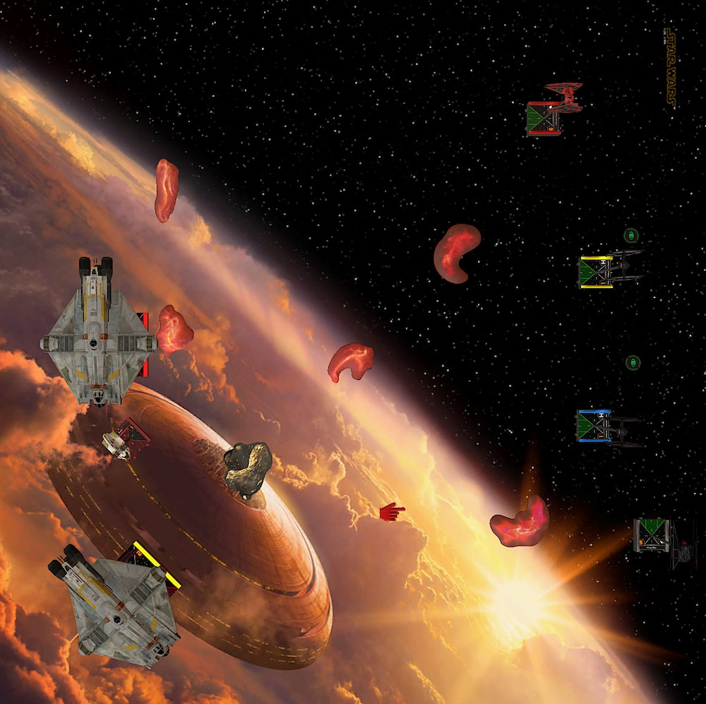
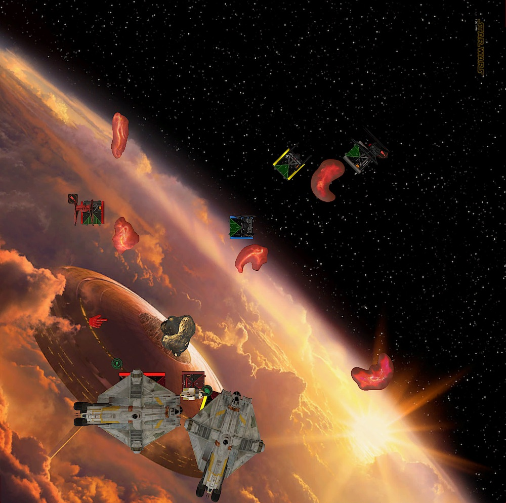
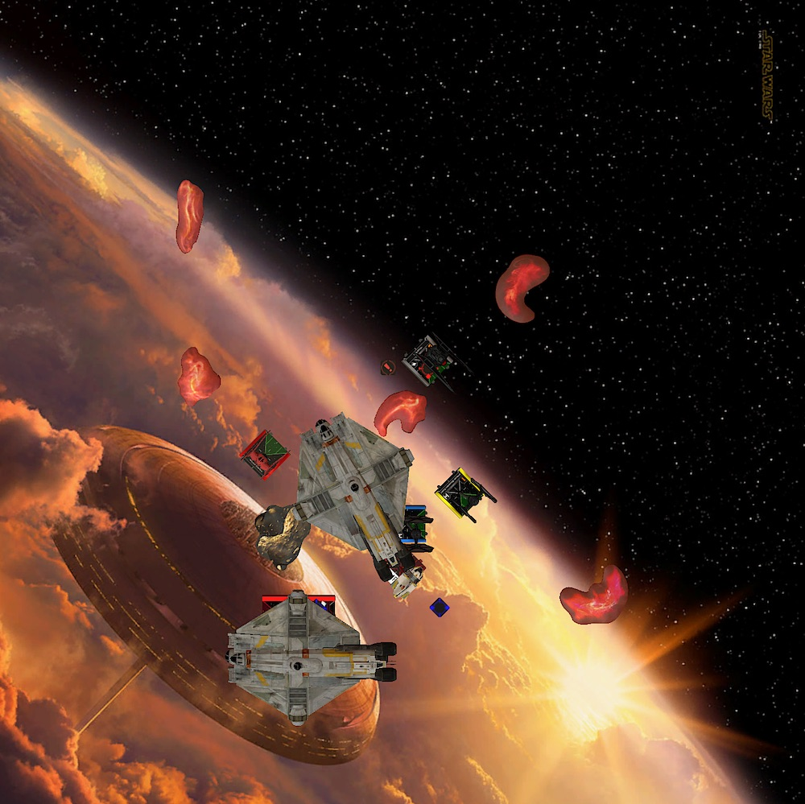
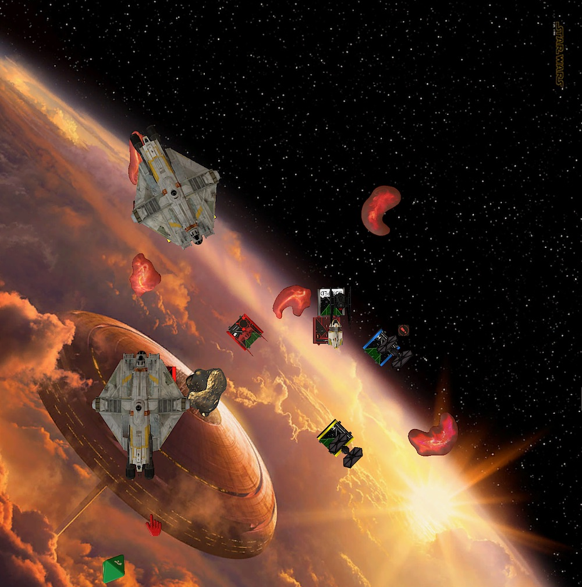
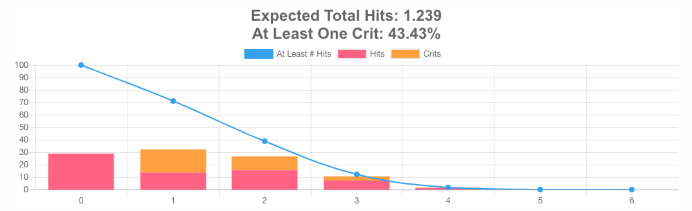
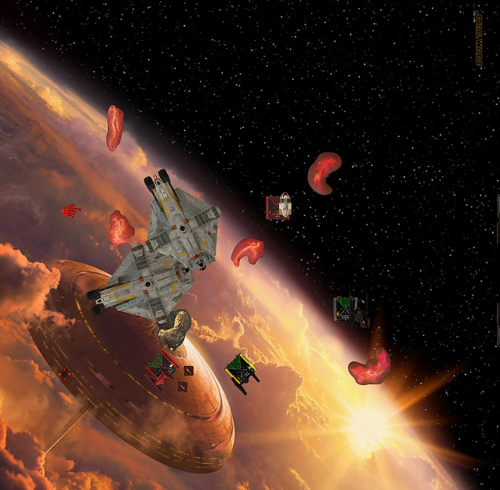
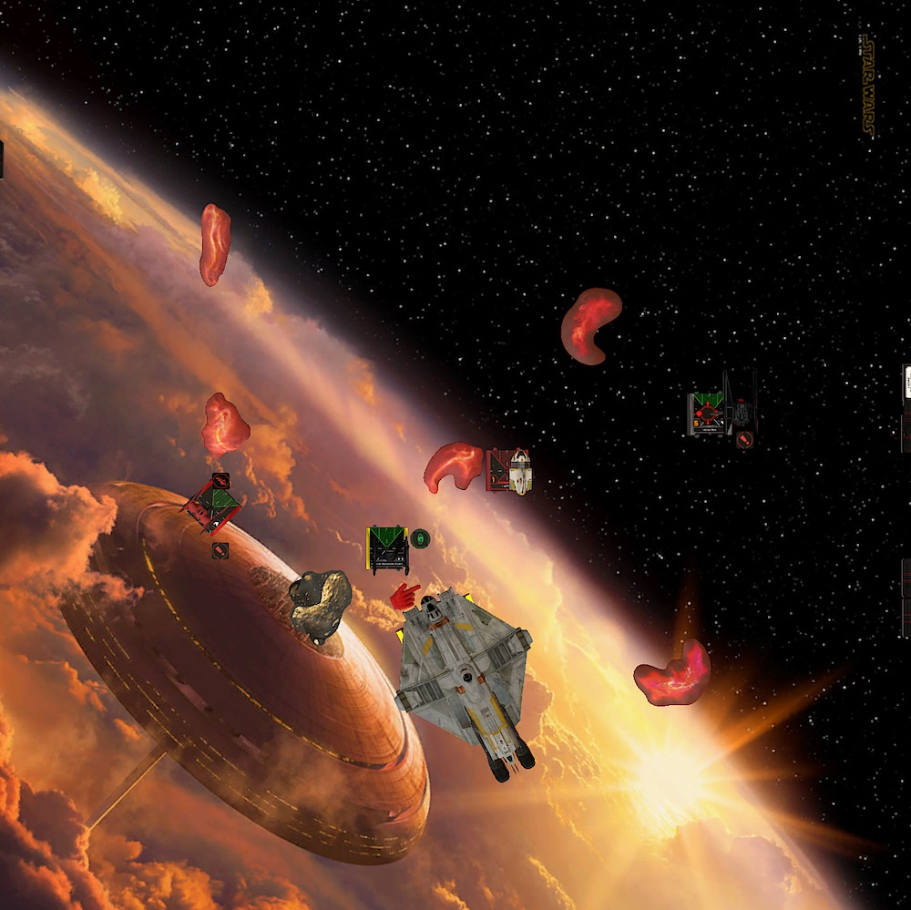

The [second season of the German TTS league](https://www.tabletop.to/xwing-tabletop-simulator-liga-deutschland) started last week. This will be my very first tournament after getting into X-wing almost one year ago. My goal is obviously not to win. I want to enjoy the experience, have a good time with awesome people and hopefully get a little better at the game along the way.

So if you're looking for some real content, I guess you should rather checkout [Phil GC's](https://suchanxwinghipster.wordpress.com/) or [Dylan's](http://dylan-jones.co.uk/) blog. Shoutout to both of them. They inspired me to start this project of writing battle reports and to share what I was thinking ... or not thinking. I hope that revisiting my games will help me notice mistakes and learn from them.

*The game was also streamed by [funwok](https://www.twitch.tv/funwok). If you rather want something more visual and good commentary (in German), you can [watch the game on Twitch](https://www.twitch.tv/videos/680608539).*

## Lists

Roger is my first opponent and luckily for me he knew that this was my first tournament. He brought a fun list rather than his battle-tested tournament list. Phew.

That said, it didn't really make it easier for me. Because I never flew against two large base ships with that much health and fire power. Let alone all the coordinate and Leia shenanigans.

I only played X-wing against two other people. Bring whatever you want. It will be a new challenge for me 😀

<XWS list={{
  description: '',
  faction: 'rebelalliance',
  name: 'Unnamed Squadron',
  pilots: [
    {
      id: 'chopper',
      name: 'chopper',
      points: 80,
      ship: 'vcx100lightfreighter',
      upgrades: {
        crew: ['zeborrelios', 'sawgerrera'],
        modification: ['hullupgrade'],
      },
    },
    {
      id: 'lothalrebel',
      name: 'lothalrebel',
      points: 75,
      ship: 'vcx100lightfreighter',
      upgrades: { crew: ['k2so'], title: ['ghost'] },
    },
    {
      id: 'ap5',
      name: 'ap5',
      points: 45,
      ship: 'sheathipedeclassshuttle',
      upgrades: {
        talent: ['trickshot'],
        crew: ['leiaorgana'],
        astromech: ['r4astromech'],
        title: ['phantom'],
      },
    },
  ],
  points: 200,
  vendor: {
    yasb: {
      builder: 'Yet Another Squad Builder 2.0',
      builder_url: 'https://raithos.github.io/',
      link:
        'https://raithos.github.io/?f=Rebel%20Alliance&d=v8ZsZ200Z63XWWW65W58W164WWY64XWWW314WWWW148Y72X133W46WW5W167&sn=Unnamed%20Squadron&obs=',
    },
  },
  version: '2.0.0',
}}/>

Funwok, who commented the match, called my list *meta*. Fair enough. I feel most comfortable flying aces and I like the FO as a faction. Especially the TIE/ba has grown on me over the past months.

<XWS list={{
  description: '',
  faction: 'firstorder',
  name: 'Unnamed Squadron',
  pilots: [
    {
      id: 'majorvonreg',
      name: 'majorvonreg',
      points: 65,
      ship: 'tiebainterceptor',
      upgrades: { talent: ['daredevil'], missile: ['magpulsewarheads'] },
    },
    {
      id: 'kyloren',
      name: 'kyloren',
      points: 80,
      ship: 'tievnsilencer',
      upgrades: { tech: ['advancedoptics'] },
    },
    {
      id: 'epsilonsquadroncadet',
      name: 'epsilonsquadroncadet',
      points: 25,
      ship: 'tiefofighter',
    },
    {
      id: 'epsilonsquadroncadet',
      name: 'epsilonsquadroncadet',
      points: 25,
      ship: 'tiefofighter',
    },
  ],
  points: 195,
  vendor: {
    yasb: {
      builder: 'Yet Another Squad Builder 2.0',
      builder_url: 'https://raithos.github.io/',
      link:
        'https://raithos.github.io/?f=First%20Order&d=v8ZsZ200Z381X117WW311WY236XW186WWY269XWY269XW&sn=Unnamed%20Squadron&obs=coreasteroid5,gascloud4,gascloud5',
    },
  },
  version: '2.0.0',
  obstacles: ['coreasteroid5', 'gascloud4', 'gascloud5'],
}}/>

I have yet to find the perfect balance for me on how to kit out Kylo and Vonreg. And how much bid do I need? 195 feels safe, but maybe 196 or 197 is fine too?

## Turn 0

Roger brought the smallest gas clouds. The obvious choice for these large, bulky ships. I brought the largest asteroid and two of the new gas clouds. Following [Oli's advice](https://www.youtube.com/watch?v=FCfxSF4itv8) I tried to create a dense area somewhere on the mat, where the movement of the large ships would be constrained.

I chose to go first, not necessary because to block. The VCXs are I2 anyway. I wanted to go first to have control where the only real obstacle, the asteroid, goes. I didn't want it to end up tugged in one of the corners. I wanted it to matter. So I placed it on Roger's right side, just within range three of the board edges.

Roger on the other hand placed his obstacles in the corners to create space. In the end, I was happy how it turned out. The clouds wouldn't matter too much anyway. The rock on the other hand was my focal point. I wanted the fight to happen as close to that rock as possible because the VCXs have to fly around it and my ships are much more mobile.

In hindsight, I maybe should have placed the rock at the center of the board. I guess that would have ensured its role in the game.

When it comes to ship placement, I always return to the one thing I know. Kylo and Vonreg go to the left and right of my board edge and the two blockers are placed in the middle. This allows me to be very reactive and threaten the flanks with Kylo or Vonreg. The cadets can react to the opponent and should have the shortest way to block.

Since I have zero experience flying against that much health and firepower, I wasn't sure what my win condition was. The plan was to dodge the VCX arcs as much as possible and nibble away one of the large ships.

Neither of my ships can land in front of Chopper or the Rebel. Even my dedicated blockers had to be careful. Especially because Chopper can shoot at range zero with Zeb as crew.

I didn't expect to have shot's at AP-5. He flew between mom and dad. After the match Roger also told me that he could have docked the Sheathipede if it was in danger. I didn't think about that during the match.

## Turn 1

I followed my game plan and dialed in slow maneuvers. Two straights for everyone. Because all of Roger's ships turned to Kylo's lane, he boosted and barrel rolled away. Vonreg used a boost to go further down his lane.

## Turn 2

Since Roger pointed all his ships in one direction, I decided to turn mine the other way. As already said, I didn't want to face his ships head on.

Kylo and the cadets all turned right. I knew this would make the yellow cadet land on the cloud, but hey, it's just a cloud and the strain could be easily cleared with a two speed maneuver in the next round.

The direction he chose also meant that he had to fly around the rock. This made me feel safe with Vonreg and so he flew a three bank, followed up with a barrel roll and a boost. The Lothal Rebel was just a few pixels out of range, meh.

## Turn 3

So far, so okay. I hadn't messed up yet.

The cadets moved into position to block the next turn. The blue cadet parked behind the cloud. I thought that this was a relative safe spot to be shot at.

To my surprise Chopper bumped into AP-5. It wasn't that big of a deal since I could not benefit from it. However, the bump caused Chopper's shot at the blue cadet to be unobstructed. Still did nothing, ha!

Vonreg two-banked between the two gas clouds. I could have done a more aggressive move and flew directly towards Roger's ships but I chose the safer route in the hope that Chopper would have a shot at Vonreg. Even though it would have been through the rock, Vonreg tends to pop sometimes. I rather get not shot at all.

I also knew that the Lothal Rebel could not get away this time. Daredevil made sure of it.A one left turn placed the Lothal Rebel in range three of Vonreg. Fortunately for me, Roger reinforced the front of the Rebel which meant the Rebel lost two shields instead of one.

Kylo still was in escape mode and flew straight at the gas cloud in front of him. I tried to barrel roll back so that Kylo could threaten a flank with a one hard next turn but it would not have fit. Instead Kylo boosted straight behind the cloud after the barrel roll.

I still was happy with Kylo's position. I would not have turned him in the next round anyway. That would have been suicide. However, Roger would have to respect the possibility of Kylo moving in and maybe it would have opened up more lanes for Vonreg.

## Turn 4

I dialed in a two turn and a three bank for the cadets to block fast maneuvers. I unfortunately misjudged the distance of a two bank and the yellow cadet landet on a cloud, again.

Kylo, trailing behind, started to turn in. 80 points well spent on a moving target. He did not shoot once so far, ugh. This is actually becoming a trend with me playing Kylo. He's always the target and has to run.

Vonreg cleared the stress and strain with a two bank, following my primary target, the Lothal Rebel. The Rebel already did a white 4k (Leia) and had Vonreg in arc. I didn't see that coming.

Because the last time someone shot at Vonreg at range three through an obstacle, he almost popped, I took the more defensive approach and took a deplete for a lock on the Rebel and a focus.

Chopper bumped into AP-5. This time on purpose and ment that he didn't move at all this round. My plan to block failed horribly. The blue cadet was stranded right in front of Chopper.

When I chose the receiver for Vonreg's lock I was pondering if I should switch targets and shoot at AP-5 with Vonreg and the two cadets. A damaged AP-5 could force Roger to dock him and disable Leia. But two of the shots were obstructed, one with a cloud. The only good shot would be coming from the blue cadet, but unmoded. I chose to stick to the plan and ping away on the Lothal Rebel, which had still 12 health left.

Vonreg did one damage without spending the target lock. In return the Rebel rolled a natural hit, hit, crit and blank. Gathering my five green dice I was thinking: This can't happen again! Last time I blanked out, this time I rolled some paint and spending the focus token ment no damage. This time the math worked!

Chopper pinged a shield of the blue cadet. AP-5 failed doing damage to the yellow cadet. The two cadets did nothing to the Lothal Rebel.

## Turn 5

To protect Kylo and allow him to get a flank, I sent out the two cadets to occupy the space between the central cloud and the rock. If Roger shoots at the cadets rather than my two aces I am happy anyway. Sorry cadets but you are the pawn sacrifice.

AP-5 tried a 3K but the two TIE blocked it. Chopper casually two banked over all the traffic and Rebel made his way back to Roger's board edge where Vonreg was hanging out.

Kylo did the usual two turn, took a lock on the Rebel and boosted out of Chopper's arc. If the cadets wouldn't have blocked AP-5 Kylo would have had the perfect shot at him instead of not having any targets at all, meh. Guess blocking is sometimes favorable for the opponent too.

Because I was hoping for a block on Chopper or a faster maneuver from him, Vonreg did a turn left. He landed right in front of Chopper and the shot at Chopper did nothing. He blanked out. Not a good turn so far.

To my advantage, the returning fire of Chopper also did nothing. Two evades plus an evade token made sure of that. Chopper also did one damage to himself because he was using Saw.

I honestly should have been punished for that move with Vonreg. I made the mistake the turn before flying too close to the rock. Roger made sure that Vonreg would end up in one of the VCX arcs. I have to think more ahead and not get my aces in such a tight spot. I need more escape routes and fly less aggressively.

## Turn 6

The TIEs weren't in a good spot to block again. I expected AP-5 to try to block Kylo and a one turn from the blue cadet could hamper that but Kylo would then fly into the cadet. Not the best idea. That's why I took the turn to get the TIEs in a better position for next turn, while hoping to get some pot shots off.

AP-5, as expected, got into position to block the two turn from Kylo. The Rebel turned right to fly around the rock. Chopper did a 4k.

Kylo? Of course I dialed in a two turn! And yes, AP-5 blocked Kylo. But here me out. I'll try to explain why I thought this was my best option in that situation!

I dialed in a right turn with Vonreg because even though a five straight plus a boost would get him out of Chopper's arc, there would be no way to get to the Rebel again in time. Yes the Rebel only had one more damage than Chopper and I could switch to the other big guy, but my ships, including Kylo, were in a slightly better position to shoot at the Rebel than Chopper the following turns. AP-5 was also on his way out and could not coordinate the Rebel.

Here is the problem though. The right turn from Vonreg also meant that he was sitting right in front of Chopper. Would he get away unscathed again? I don't know. Even with no mods I rather have Chopper shoot at Kylo. He can take a beating.

And dialing in a maneuver with Kylo that would get blocked by AP-5 ment that AP-5 can not shoot Kylo. So only one incoming shot. Com'on Kylo you can do it!

I am not sure if this is a good justification. I am just very protective of Vonreg. In the past he popped on a random shot too many times. Did I have a better option?

I also did something very dumb.

After doing the one turn with Vonreg, I tried to boost him closer to AP-5. That failed. I don't know why I tried that at all. Vonreg was in a good spot already. Shooting the droid was not my game plan. The Rebel was.

With Saw and the lock, Chopper rolles hit and three crits, ugh! Kylo did what Vonreg's role usually is. He blanked out. Only one paint resulted in a *console fire* and 40 points for Roger.

At least the blue cadet pinged off the last shield of the Rebel...

## Turn 7

I expected some damage on Kylo. Losing one or two shields would have been fine. Roger would not have gained any points and a five straight or banking behind south-east cloud would have brought Kylo out of harm's way. If you believe the math, my chances for that happening aren't that bad.

That 11% chance was game changing. Before that show it felt even. But now I had to do something fast. Only 18 minutes on the clock left.

So instead going the safe route with Kylo, I dialed in a talon roll well-knowing that he'll get shots from at least AP-5 and damage from the console fire. The Cadets returned to the space between the rock and the central gas cloud. Guns pointing at the Lothal Rebel. Vonreg squeezed himself through the cadets with a three turn. A daredevil boost allowed Vonreg to fire at the Rebel.

AP-5 went straight. The VCXs bumped into each other.

This time Vonreg did his job. After rolling nothing the reroll thanks to the target lock resulted in two hits and a crit. Because the crit was a fuel leak I could hope that the TIEs will also do some work.

Well, one TIE. Mr. Blue melted under Chopper's fire. A focus token doesn't help if you roll three blanks, I guess. But Mr. Yellow more than compensated for the loss of the other cadet. Hit, crit thanks to a focus! Triggering fuel leak *and* flipping a direct hit! Only three hulls left on the Rebel.

Console fire of course did damage to Kylo. Two hulls left. The shot at AP-5 was good. One more damage would have gained me half points on him. AP-5 did nothing to Kylo in return.

Roger 65. 38 points for me.

## Turn 8

This was the last round. Killing the Rebel would get me the lead with 75 points. But I could not give up any points on my ships. Even half points on the remaining TIE would make me certainly loose.

Vonreg did a two straight in the hopes that the Rebel had to move a bit forward. A boost would bring the Rebel in Vonreg's arc. The yellow cadet banked forward to hopefully have also a shot at the Rebel. Kylo this time makes the save move. Fly behind the next cloud and get rid of the console fire.

I couldn't bank Kylo in to also shoot at the Rebel. There was a chance that Chopper would then have a shot at Kylo. Nothing I could allow.

AP-5 did fly one backward to try to get a shot on Kylo again. Chopper did a white 4k landing behind the cadet. The Rebel bumped into the TIE which made enough room for Vonreg to daredevil turn and have a nice range one shot. This was, from my perspective, the only mistake Roger made. The Rebel could have bumped in Chopper again and would not have moved at all. I think Vonreg would not have had a shot then because he couldn't boost in.

After using the lock Vonreg put four hits into the Lothal Rebel. Down the goes. I gained the lead: 75 to 65.

Chopper had shots on Vonreg (range two, obstructed) or range one at the TIE, with the TIE having a focus token. Chopper had a cacculate. Vonreg and the TIE didn't have a scratch so he needed to put two damage in either one for half points and the win.

He chose to shoot at the TIE and rolled two hits and a crit, which meant I needed to evade two. [Doable](http://xwing.gateofstorms.net/2/multi/?d=gwAAAAAAAAAA&a1=UUAAAAAAAAAA).

<iframe src="https://clips.twitch.tv/embed?clip=AgitatedHumbleMageRalpherZ&parent=sebald.github.io" autoplay="false" frameborder="0" allowfullscreen="true" scrolling="no" height="378" width="620"></iframe>

I rolled one eye and two blanks. Roger was in the lead again: 78 to 75! Congrats! 🥳

## Conclusion

I know I showed some sad math graph which could be interpreted as me being salty that the dies were not on my side. The truth is I am happy that Roger won. He flew better than me with a handicap (the list) and I did some really dump things.

I definitely need to play faster. It was my fault that we only got to play 8 turns. I need to talk less and play more. Especially if I want to kill big things like the VCX. It takes time and I could have disengaged more if I had more time.

My aces oftentimes had not enough good options. I need to plan more ahead and be more unpredictable with them. Kylo needs to do blue maneuvers a lot, sure. But maybe sneak in a bank instead of a turn or even not get stressed more often. He also has a one hard!

Speaking of Kylo, I still believe that allowing the block was the right move to distract from Vonreg. Vonreg was my MVP this game and did a lot of the work. Daredevil on the TIE/ba is absolutely fantastic. It adds so much time on target.

If you got so far, I hope you enjoyed reading my ramblings! Hopefully until next time.
