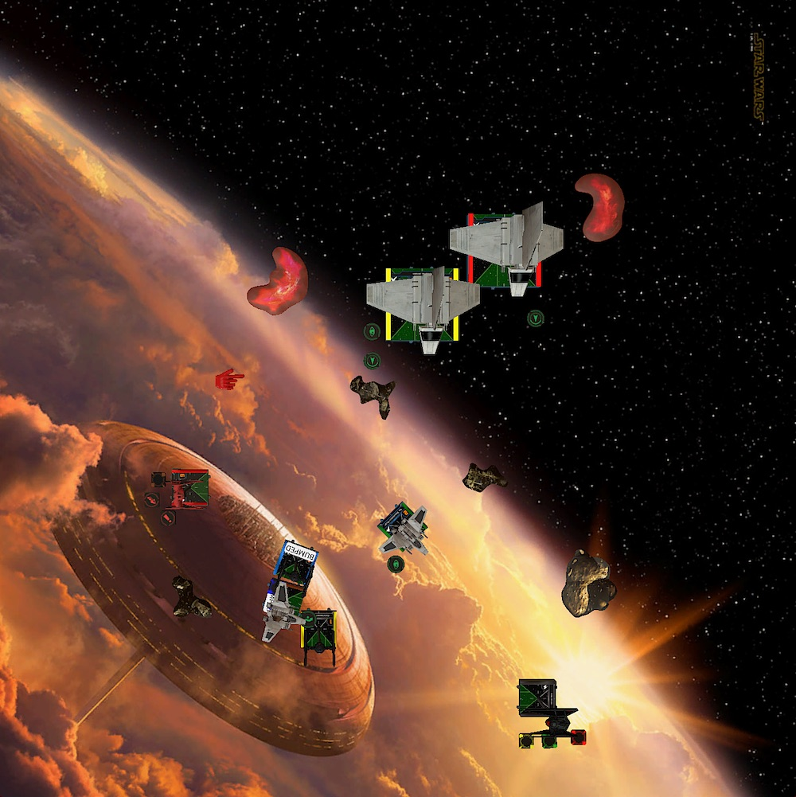

It's time for the second week of the [German TTS League](https://www.tabletop.to/xwing-tabletop-simulator-liga-deutschland)! I lost my first match, as expected. Will I lose my second one? Well, I wouldn't bet on myself. But winning isn't my prime directive anyway. Learning is.

So what was my take away from the last match? Flying aces is hard, especially if you are relatively new to the game. But oh boy do I have fun flying these squirrly ships! Maybe I should switch to a faction that has real aces? Nah!

Speaking of Imperials. My next opponent Hannes is flying Imps. This already gets me excited because most of the times when I play locally, I fly against Scum. And while I don't despise Boba and whatever his wingman of the day is, I find it super exhausting flying against him.

Anyway, on to the game.

## Lists

Hannes told me before the game that he was sorry. He read my last post and that I really struggle flying against high health squads. This is why he chose to pack the most health he can think of into an Imperial squad and bring two shuttles and two Star Wings.

Seriously though, he chose the squad before he read my post. I am more than happy that someone reads what I write. You're allowed, no, entitled to bring whatever makes you happy. Afterall, I am the one flying the meta list 😄

<XWS list={{
  description: '',
  faction: 'galacticempire',
  name: 'Unnamed Squadron',
  pilots: [
    {
      id: 'lieutenantsai',
      name: 'lieutenantsai',
      points: 51,
      ship: 'lambdaclasst4ashuttle',
      upgrades: { title: ['st321'] },
    },
    {
      id: 'coloneljendon',
      name: 'coloneljendon',
      points: 52,
      ship: 'lambdaclasst4ashuttle',
      upgrades: { crew: ['directorkrennic'] },
    },
    {
      id: 'nusquadronpilot',
      name: 'nusquadronpilot',
      points: 48,
      ship: 'alphaclassstarwing',
      upgrades: {
        sensor: ['firecontrolsystem'],
        torpedo: ['advprotontorpedoes'],
        missile: ['barragerockets'],
        configuration: ['os1arsenalloadout'],
      },
    },
    {
      id: 'nusquadronpilot',
      name: 'nusquadronpilot',
      points: 48,
      ship: 'alphaclassstarwing',
      upgrades: {
        sensor: ['firecontrolsystem'],
        torpedo: ['advprotontorpedoes'],
        missile: ['barragerockets'],
        configuration: ['os1arsenalloadout'],
      },
    },
  ],
  points: 199,
  vendor: {
    yasb: {
      builder: 'Yet Another Squad Builder 2.0',
      builder_url: 'https://raithos.github.io/',
      link:
        'https://raithos.github.io/?f=Galactic%20Empire&d=v8ZsZ200Z166XWWWWW162Y167XWW28WWWY164X113W134W97WW139WWY164X113W134W97WW139WW&sn=Unnamed%20Squadron&obs=',
    },
  },
  version: '2.0.0',
}}/>

Coordinate shenanigens again. This time paired with the ability to lock past range three. All to support the two ordnance carriers, which are armed to the teeth. It doesn't matter if you're at range one, two or three. The have an option to throw at least three dice at you. The range one Advanced Proton Torpedo is extra ugly.

Even the support ships, the two Lamdbas, can dish out some real damage. With the Krennic crew one of them can remove shields for a focus token.

I am still excited about Kylo, Vonreg plus two FOs. It may not be an S-Tier list, or even A-Tier, but I like flying First Order and I really like the TIE/ba. Vonreg with Daredevil is just pure madness.

I swapped some upgrades and pilots for this match. I wanted to make the list more effective and only play stuff that has value regardless of the opponent's squad.

This means removing the Mag-Pulse Warheads and the Advanced Optics. It is only worth to fire the warheads if Vonreg or Kylo is in trouble against another aces or to remove the lock from an ordanance carrier. Too bad my opponent brought not one but two ordanance carriers.

As for the Advanced Optics. Kylo always is the primary target. I am fine with that because it means Vonreg can do his thing and shoot stuff. But if Kylo runs he doesn't needs the optics. I find that optics on high initiative ships isn't that great anyway. You don't know if you need the focus for defense later and a target lock is almost as good for Kylo since he has force mods.

This freed-up 10 points which I chose to invest in upgrading the TIE/fo pilots. 10 points will exactly be enough to Rivas and Scorch. In my opinion two of the best TIE/fo pilots. Rivas is only two points more than a cadet and will get lots of free target locks from Vonreg. And other than a cadet, Scorch can not be ignored. Throwing up to four dice at a target is no fun for the opponent. He is also I4 and can be an ace in some matchups.

<XWS list={{
  description: '',
  faction: 'firstorder',
  name: 'Unnamed Squadron',
  pilots: [
    {
      id: 'majorvonreg',
      name: 'majorvonreg',
      points: 59,
      ship: 'tiebainterceptor',
      upgrades: { talent: ['daredevil'] },
    },
    { id: 'kyloren', name: 'kyloren', points: 76, ship: 'tievnsilencer' },
    { id: 'scorch', name: 'scorch', points: 33, ship: 'tiefofighter' },
    {
      id: 'lieutenantrivas',
      name: 'lieutenantrivas',
      points: 27,
      ship: 'tiefofighter',
    },
  ],
  points: 195,
  vendor: {
    yasb: {
      builder: 'Yet Another Squad Builder 2.0',
      builder_url: 'https://raithos.github.io/',
      link:
        'https://raithos.github.io/?f=First%20Order&d=v8ZsZ200Z381X117WWWY236XWWWY262XWWY265XW&sn=Unnamed%20Squadron&obs=coreasteroid5,gascloud4,gascloud5',
    },
  },
  version: '2.0.0',
  obstacles: ['coreasteroid5', 'gascloud4', 'gascloud5'],
}}/>

The list is very vanilla, but has some extra triggers (Rivas) to remember. It's just a bunch of quality pilots the First Order has to offer. With five points the bid is the same than last week. I was thinking about putting Crack Shot on Scorch, but in my opinion 195 is the threshold for bidding. If you want to win the bid, you can not go higher. You maybe even need to be a little lower to win against everything but Boba.

Looking at what the squad has to fly against. Neither Kylo, nor Vonregs like to be the receipient of torps and missiles. None of my ships have the health to withstand the firepower of the Star Wings. That combined with the high health count, 34 to be exact, will be no easy task. Hannes' squad comes with one more health than Roger's las week but at least the health is more evenly distributed.

Still, there are no easy points. I can not expect to go in, destroy a ship and get out, leaving the FOs to die. I have to stick to one target for multiple rounds. Not necessarly the plan I have in mind with this squad. Also, knowing that the two FOs hold 60 instead of 50 points I need to secure an extra 10 points. A clear disatvantage in investing in better pilots.

I thought my best option were the Star Wings. I wanted to take down one of them as fast as possible and then take half points on my best option, depending on the game state.

## Turn 0

Hannes brought three of the smaller debris as obstacles. I am still not sure why. I guess the Lamdbas don't care about stress, they are better for him than clouds and of course you usually don't bring rocks with too large bases.

I packed the two large gas clouds and the largest rock again. After the match and how the obstacles got placed I am no longer sure that this is the correct choice for the list. Maybe it is just because of the lists I am flying against but dang I want more rocks on the playing area.

Since I won the bid, I chose Hannes to go first. Clearly a mistake if there is only one real obstacle, the rock. Hannes tugged the rock in the corner on my side. Great. I grabbed on ouf the clouds and tried to get as much obstacles in the center of the battle field. Hannes stucked to this plan and put his remaining obstacles, the other cloud and one debris field in the other corners, while I created a diagonal lane with the last two debris fields. I hoped that this would split the mat into two zones and leave no lanes for the Lamdbas.

Hannes placed his ships in groups of two. The two Lamdbas were facing down the northern edge of the board. The two Star Wings started horizontally right next to them. Sai got assigned the "Optimized Prototype" so he would be flypping crits and removing shield for a focus token. By the looks of Hannes formation the Lamdbas would occupy the northern zone of the board, while the Star Wings patrolled to the south of the obstacles field.

I did the usual. FOs in the middle. Kylo and Vonreg start in opposite corners to react to the first few turns of movement. At least that's the idea. The only adjustment I made was placing the FOs such that they would fly directly at an obstacle. I wanted the option to bank either way with them. The potential of slamming Star Wings made me wary.

## Turn 1

As expected, Hannes slow rolled the first turn with the Star Wings and used Jendon to aquire locks on my ships. Sai and the green Starwing locked Kylo. The brown Starwing locked Vonreg.

My ships all did a two straights. This is me going slow, I guess.

In addition, Kylo rolled back to have more options next turn. Vonreg boosted to face down the board and threaten the flank where both Star Wings were located. Scorched rolled right so that he and Kylo potentially could go after the shuttles next turn.

At least I hope that was what it looked like. I never planned to face the shuttles directly. Rolling Scorch towards them just gave him a better angle to fly through the obstacles with a three bank the following turn.

## Turn 2

Hannes did go slow again with a one straight and one bank with his Star Wings. The shuttles strolled further down the northern lane towards Kylo.

Because the shuttles are so slow and need time to get through the debris I chose to try to catch the Star Wings without their support. Full trotthe with all my ships!

Vonreg did a five straight and rolled left to be out of arc. Scorch did his three bank to lank almost between the two debris fields. Rivas passed the rock and debris with a two bank. Even Kylo, trailing behind as usual, advanced in the direction of the Star Wings.

I didn't want to go too fast with Kylo. I hoped to bait the shuttles into further trying to hunt down Kylo and since he had two locks on him I couldn't take the risk of engaging with him anyway.

Scorch and the green Starwing exchanged shots through the debris. No damage. Everyone else didn't had a shot.

## Turn 3

This was the curcial turn for my plan to get to the Star Wings without the shuttles helping out. Hannes slow rolled the first to turns, hence I wanted to go fast.

With the Star Wings still trying to catch Vonreg, I dialed in another five straight for him. With the option to Daredevil boost slow maneuvers couldn't catch him and there was a good chance that at least one of the Star Wings will end up in his arc.

And the brown Star Wing did! As I hoped the debris protected Vonreg because the brown Star Wing couldn't turn right to face Vonreg.

With a three bank from Rivas and a five straight from Scorch, they also joined the fight. Both were in a good spot to shoot at the brown Star Wing. Only Scorch ended up in a wacky position between the two Star Wings.

Seeing that now I maybe did a mistake here. Even though Scorch's shot would have been unmoded a barrel roll to the right would have brought him out of arc of all opponents. He would have been in a better spot for next turn too. At the time I just wasn't scarred of the two Star Wings shooting at Scorch. He shot first and I choose violence!

Kylo chose the save route. Now with three locks (!) on him, he did want to have anything to do with it. The banked left and rolled left to get our of arc of the green Star Wing and the shuttles.

Shooting through the debris at brown Vonreg pinged of one shield using his lock. Scorch activated and rolled four hits, wich resulted in three hits. One more than expected.

In return the Star Wings only got rid of Scorch's shield.

With the shields gone a double modded Rivas, thanks Vonreg, put a hit/crit into brown. The crit stuck and was a direct. The brown Starwing remained with one hull left.

I traded six damage for one. A very good start for me thanks so some better than average dice.

## Turn 4

The shuttles were closing in on the battle. I blocked browns escape path with a one hard from Rivas. Scorch then bumped into brown, clearing his stress. Two guns that will not shoot this turn, ugh.

Anticipating this I chose to bring in Kylo. I wanted to make sure the brown Star Wing dies and wasn't sure if Vonreg alone could do it. I actually wasn't certain that Vonreg hat a shot at all.

I considered doing a two straight with Vonreg. Clearing all red tokens and then Daredevil-ing in again with a single modded attack. I wasn't sure if a two straight was enough to pass the debris, so dialed in three straight instead.

The brown Star Wing ended up just a few pixels out of Vonreg's arc. Not got. This meant I only had one shot from Kylo to finish the job.

And while I was failry certain that Kylo would do it, there still was the other Star Wing, which made his way into range. A double modded rocket attack would hit Kylo this turn. Worth it? I don't think so.

To make things worse, this was the turn the shuttles finally arrived. Hello ... there 😕

In anticipation that the boost would bring brown in arc, Vonreg had a target lock on him. So the shot on green was unmodified, but still pinged of a shield.

Kylo finished off the brown Star Wing. Seeing his brother's ship explode, the green Star Wing stripped of Kylo's shields. The force couldn't help the dark lord this time. No paint.

Jendon finished off the round with a shot at Scorch, who suffered hit/crit. The crit was Disabled Power Regulator. Uff, that hurt. I had to get Scorch in a position next round, where I still could be be useful the round after. All while Hannes knowing where Scorch would be.

## Turn 5

After a good start, I lost ground. Altough I got rid of the brown Star Wings, two of my ships suffered crucial damage. Plus, the position of Kylo meant that he had to run from the green Star Wing while his right flank was shut down by the two shuttles. There were no good escape paths for him anymore. 

The two FOs where also not in a prime position to do damage and be relevant. Only Vonreg was were he should be. In no arc and firing at things.

I couldn't lose any points with Kylo. There wasn't enough time left to shoot down one of the remaining shits to make up for it. So the hail mary was to do a five straight with Kylo, hoping to dodge as many arcs as possible.

And he did! Even with a slam the green Star Wing couldn't get Kylo in arc. All while the set up block from Rivas failed. The Star Wing and the lieutnant wouldn't shoot at anything this round. Scorch on the other hand was in a nice position to put another four red dice in the Star Wing.

Jendon flew over the debris, stressing him. He still got a coordinated focus by Sai, who flew directly behind Jendon. Thanks to the title, Sai also had a focus.

Vonreg flanked the shuttles and started shooting at Jendon. Because Vonreg rolled left to be out of Sai's arc the obstructed shot into Jendon only removed one shield.

Scorch's single modded four-dice attack into the green Star Wing pinged off two shields. Rivas didn't had anyone in arc.

But to my suprise Jendon and Sai had someone in their arc that shouldn't be there, Kylo. I was so focused on rolling and boosting out of the Star Wing's arc that I had forgotten how huge the args of larges ships is.

Jendon shot first and rolled hit, hit, crit. I rolled two blanks and an eye ball for Kylo's defense. The second time in row, the green dice failed me. The crit was a Fuel Leak. So better not suffer any crits, I guess. Or even better, do not suffer any damage at all anymore.

Which Kylo kinda did. Sai's shot only showed one eye ball. But since Sai had the Optimized Prorotype assigned, Hannes spent the result to flip the other damage card: a Paniced Pilot.

Kylo sat there with three stress. The third one was from Autothrusters. This was the worst crit I could think of in this situation because now there was no way to escape the slamming Star Wing. Not beeing able to reposition with Kylo was his death scentence.

With half points on Kylo and Scorch Hannes took the lead, 55 to 48.

## Turn 6

The least I could do was try to save Kylo. I dialed in a five straight. It was a desperate move because none of the FOs could block the Star Wing, they both faced in the wrong direction. Scorch was ionized from the crit anyways so I sent our Rivas to block the shuttles and deny any actions. Vonreg turned right, locked Jendon for a strain and took a focus as regular action.

Taking the strain was risky but I also was longing for points. Scorch or Kylo, in the worst case both, would not stay alive until the end of the game.

Vonreg stripped of the remaining three shields from Jendon which meant only one health until half points. Both shuttles fired back at Vonreg only removing one shield from the baron, phew. Unmodded dice are great!

Now it was the green Star Wings turn to finally revenge his brother. Another barrage rocket and not so great dice on my side ended the chase. Kylo was gone. Not being able to spent any force to save him. Kylo was removed from the board with two force available.

Rivas, with no lock on Sai because I forgot that his ability also triggers with stress, still got rid of two shields. I was really suprised what these little FOs can do.

## Turn 7

I was desperate for points. Hannes extended his lead in the last round to 93. That was a much higher number than what I wanted. Time for another hail mary.

Scorch, back in the fight with one health, tried to turn in and shoot at something. Ideally at Jendon but he was to close to Scorch so they bumped into each other. Rivas did a three turn left, setting up a block for Sai and hopefully helping out Vonreg getting half points for the Star Wing. The green Star Wing landed directly in front of Rivas.

The double modded but depleted shot into the Star Wing did two damage. Thee of the seven health left. Half points, yay!

Hannes took some time to think about if he should shoot Rivas or Vonreg. The Star Wing could shoot at both. Sai had Vonreg sitting in from of him. Jendon could shoot Rivas from the rear arc.

Sai opened the round of fire, shooting at Vonreg. The focus token prevented any damage on Vonreg. Jendons shot into Vonreg did also nothing. With one shield remaining the baron was holding on to his points.

The Star Wing had a focus and a lock on Rivas. It was finally time for the Advanced Proton Torpedo! Three hits and two crits one shotted Rivas. The game was over.

Hannes took the victory with 120 to 72. Congrats! 🙂

## Conclusion

I am really happy that I participate in the league. Even though I am now 0:2, I learned a lot playing in this enviroment. I expect to lose a lot in my first tournament. I don't feel bad about it. Especially because I had two great games against event greater opponents. It really is true what they say, the X-Wing comminity is full of great people.

Regarding the game, I find that I got a head start the first part of the game. My plan throwing everything at the Star Wings worked. I got rid of one with the Lamdbas still on their way to the battle.

But I still mess up keeping my guns pointed at the enemy ships. Sure I destroyed one of the Star Wings, but there was no follow up. Rivas and Scorch didn't really shoot enough afterswards. Only Scorch got one good shot off after the initial engagement. It's really bad if Vonreg is the only one shooting.

Revisiting the positions after the fifth round, I maybe just should have turned Kylo in and get a last shot off at one of the shuttles. It certainly would not won me the game, but I only needed to put one more damage into Jendon for half points.

As for obstacles, I can understand now why some player bring the biggest rocks. When you play such small and fragile but mobile ships you do not gain that much from the gas clouds. They are great for Jedi I guess. They can fly through them, still do a roll or boost and regen. Maybe it's time to put Deuterium Power Cells on Vonreg ... does he become a Jedi then? 😮

Until next week. If this trend continues my next opponent will supprise me with a list that has 35 total health. 😆