Another week, another league match. I pretty much reached the bottom of the ladder. But I am in good company. Holger, who was also 0:2, is my opponent for this round.

We chatted a bit before the match. Even though none of us had a win under his belt, we both weren't bitter about our standing. Playing in this league is too much fun. I immediately had a feeling that this would be a friendly and welcoming game of X-Wing.

## Lists

*Note: This match took place on July 28th, not even eight hours before the points update.*

Holger brought a two ship Rebel list: Hand and Luke. Finally an opposing squad with less than 30 health! That said, both ships are equipped with some very defensive upgrades, including a hull upgrade on Luke and hull plus shield upgrade on Han.

Because of his pilot ability, Luke has defensive mod all the time anyway but Holger added an R5 droid on top of that to help Luke stay alive longer. Not quite as threatening as an R2, since it requires an action and it repairs hull not shields but you can not allow Luke to get away and regen.

Han got Baze and Jyn on board. This means he can have a mix of up to three evade/focus tokens. Getting close to Han with multiple ships *and* shooting him isn't a good plan. He basically has a better reinforce with that setup.

To bolster the offensive power of the squad, Luke packs proton torps. With two force available the torpedo from Luke is very lethal and almost certainly results in four three hits and a crit.

Han has Ezra Bridger for the double tap and an additional reroll with lone wolf to improve his offensive. Even if Han couldn't shoot twice a round, the force point from Ezra is another offensive or defensive mod. An uncontested Han next to an obstacle would have mods for days and hit very hard.

<XWS list={{"description":"","faction":"rebelalliance","name":"Unnamed Squadron","pilots":[{"id":"lukeskywalker","name":"lukeskywalker","points":87,"ship":"t65xwing","upgrades":{"force-power":["heightenedperception"],"torpedo":["protontorpedoes"],"astromech":["r5astromech"],"modification":["hullupgrade"],"configuration":["servomotorsfoils"]}},{"id":"hansolo-modifiedyt1300lightfreighter","name":"hansolo-modifiedyt1300lightfreighter","points":108,"ship":"modifiedyt1300lightfreighter","upgrades":{"talent":["lonewolf"],"gunner":["ezrabridger"],"crew":["bazemalbus","jynerso"],"modification":["hullupgrade","shieldupgrade"]}}],"points":195,"vendor":{"yasb":{"builder":"Yet Another Squad Builder 2.0","builder_url":"https://raithos.github.io/","link":"https://raithos.github.io/?f=Rebel%20Alliance&d=v8ZsZ200Z4X72W136W6W164W142Y42X124WW81W17W40W164W165W&sn=Unnamed%20Squadron&obs="}},"version":"2.0.0"}}/>

I had packed the exact same squad as last week. Kylo, Vonreg, Scorch and my new favorite FO pilot Lieutenant Rivas. As I said last week, this list is very plain when it comes to upgrades and specialities. It features quality pilots that work well together. And that's pretty much it.

Vonreg and Kylo are both serious threats. Especially the major has proven over the course of the last two games that he can carry the squad if Kylo has to run. Besides that his ability to easily gain locks helps Rivas to double mod his attack when he is being ignored. Another pilot you can not dicount is Scorch. His range one shots are dangerous, that TIE packs a punch.

<XWS list={{"description":"","faction":"firstorder","name":"Unnamed Squadron","pilots":[{"id":"majorvonreg","name":"majorvonreg","points":57,"ship":"tiebainterceptor","upgrades":{"talent":["daredevil"]}},{"id":"kyloren","name":"kyloren","points":76,"ship":"tievnsilencer"},{"id":"scorch","name":"scorch","points":33,"ship":"tiefofighter"},{"id":"lieutenantrivas","name":"lieutenantrivas","points":27,"ship":"tiefofighter"}],"points":193,"vendor":{"yasb":{"builder":"Yet Another Squad Builder 2.0","builder_url":"https://raithos.github.io/","link":"https://raithos.github.io/?f=First%20Order&d=v8ZsZ200Z381X117WWWY236XWWWY262XWWY265XW&sn=Unnamed%20Squadron&obs=coreasteroid5,core2asteroid5,gascloud4"}},"version":"2.0.0","obstacles":["coreasteroid5","core2asteroid5","gascloud4"]}}/>

As for my strategy for this game, I wanted to get to Luke first and focus fire him down with all my ships. Three out of four of my ships only have four health. So a single torpedo could kill them if the dice fail me. I also don't want to half destroy Luke and give him time to regenerate. Kylo’s uncle has to go first.

Flying my ships together may also disable Han's Lone Wolf since Luke will be there too. Hopefully I can keep my ships in only one of Han's arcs while hunting down Luke to prevent double taps with Ezra. No ship in Han's arc would be even better of course, but I doubt that this will be possible.

And even though I will try to ignore Han as much as I can for the first part of the game, Scorch and Rivas will try to block him and attempt to restrict his movement.

If I get a block off Han has no action and can not use Jyn and Baze to get lots evade or focus tokens. Action economy on Han isn't that great anyway and denying him as much actions as possible might force him to turn his arc instead of tokening up.

However, this plan has one problem. What if I don't destroy Luke fast enough and he can get to safety behind Han? Well, I don't really have an answer for that before the match. I guess it kind of depends on the game state. I have to wing it.

If Kylo and Vonreg are still healthy enough, they should be able to easily hunt down a fleeing Luke. He is only in a T-65 after all.

## Turn 0

While I didn't change my list, I did change my choice of obstacles. Because my opponents seem to favor smaller rocks and debris, I switched one gas cloud to another big rock, leaving me with the two largest rocks and a large gas cloud.

Holger brought two small rocks and the Y-shaped debris field.

I won the bid and let Holger go first. Moving last is a Finn-like big deal in this matchup. Having Vonreg move after Han makes it easier to dodge the Falcon's arc. Kylo is “only” an I5 but with the same initiative as Luke he would still fly after him. This should allow him to dodge any arcs that otherwise could mean an incoming torpedo.

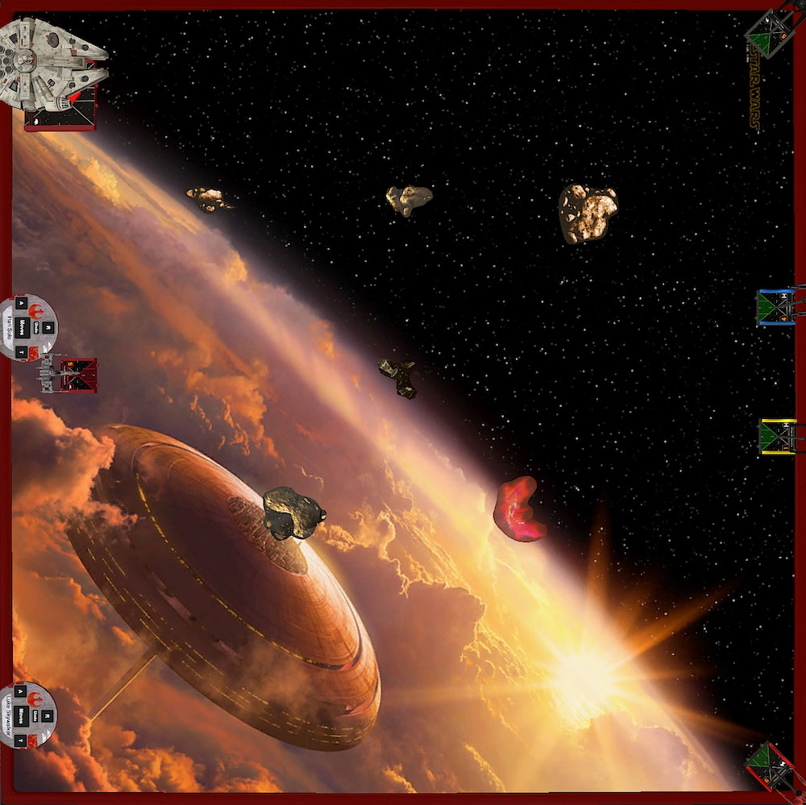

Placing obstacles, Holger tried to spread them as much as possible to make sure Han gets his rerolls. I just tried to cluster them in the center again. This might not be the optimal choice against an opposing Han but since there are four rocks I wanted to make it harder for Holger to fly the Falcon through the middle of the board.

I placed my ships the only way I know how. Aces tugged into the corners and the FOs in the middle. Vonreg got the southern side of the board with lots of space. Kylo got the corner with the big fat rock at range two. Still enough space for the Silencer to do whatever he wants.

I expected Holger to put the Falcon facing Vonreg’s flank and to circle the board from there. But he chose the northern flank with Kylo instead. The placement of the three rocks would make Han's movement more predictable. Fine with me.

Luke got assigned to the middle of the board. He was very much uncommitted and could go either way. But since Han got placed face-to-face with Kylo I expected Holger to go after Kylo first. Like every opponent playing against my list.

## Turn 1

Like any good Rebel player, Holger did a one straight with both ships. I did go slow too. Kylo, Scorch and Rivas did a two straight. Kylo followed up his movement with a boost and barrel roll to join the two FOs and maybe pounce at Luke next turn.

Vonreg did a three bank and boosted, threatening to flank Luke if he chose to fly further down the middle.

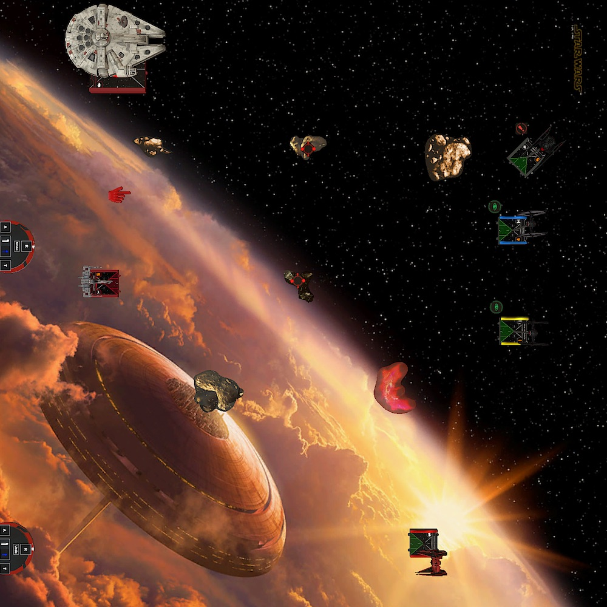

## Turn 2

The position of the Falcon made it so she only could fly forward or bank in with a three hard. Because the Falcon’s arc was pointing forward the chances were high that Han could only shoot if the action was used for a rotation. Which meant only one force for mods.

That's why I choose to go fast this turn, ideally blasting past Han and forcing him to turn right next turn. All my ships did a five straight to collapse as fast as possible on Luke.

I expected Luke to do another one straight and fire a torpedo at something, but to my surprise he turned towards Vonreg with a two hard. He even closed his foils to boost and focus further away from the TIEs and Kylo.

Han followed Luke and also did a two hard. Holger misjudged the distance, thank TTS, and Han barely landed on the rock. No damage on the rock roll but Han was not allowed to shoot this round. With the arc still pointing forward there was no target for him.

I was unsure about Vonreg's maneuver. Three bank? Or a five straight followed by a daredevil boost? I thought that with the position of Luke, going fast could not be punished by Holger, especially because there was no way he would get a lock on Vonreg to shoot his torp.

But because Luke turned towards Vonreg *and* boosted, Vonreg landed awfully close in front of him. To dodge Luke’s arc, Vonreg did a barrel roll followed by a focus action, straining himself. I was not sure if this was enough?

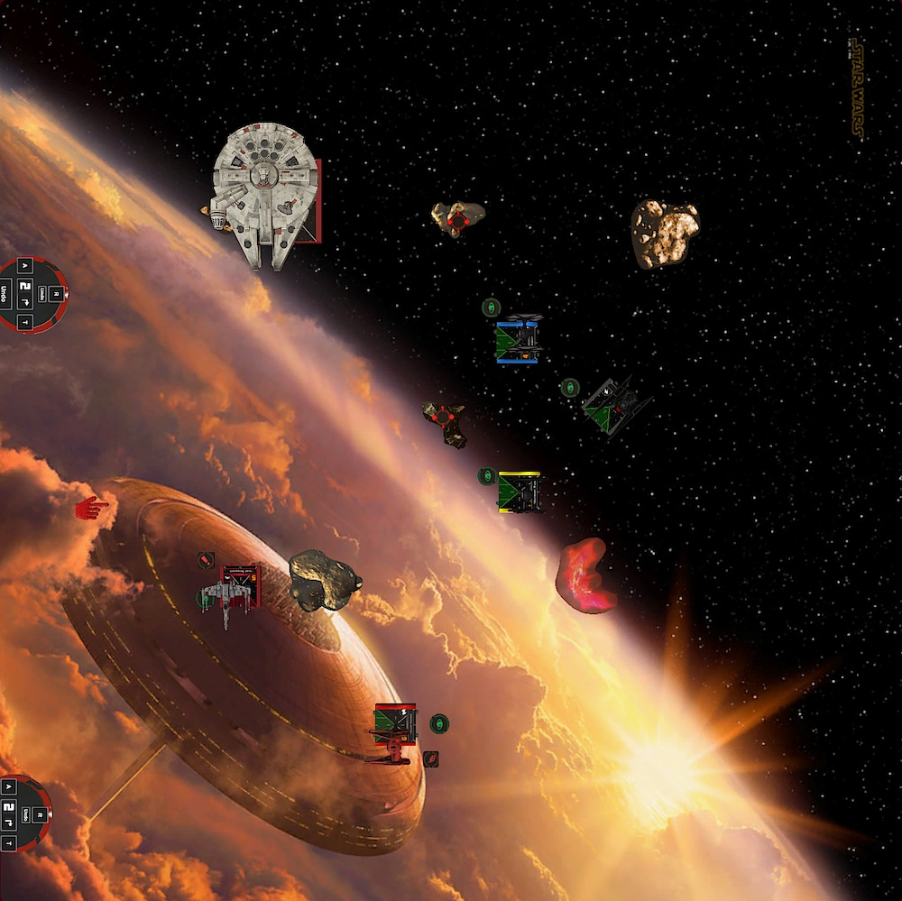

... and it wasn't. Vonreg was just a few pixels inside Luke's arc. Vonreg shot first and removed both shields from Luke but in return Vonreg lost both of his too. Two blanks plus the strain made sure of it. Two damage on Vonreg and Luke even had his foils closed.

The remaining TIE shots pinged off one shield from Han. Scorch's shot on Luke through the rock and missed. I did not activate Scorch. I wanted to keep my options open next round.

After the first round of combat, I was already lacking behind. Half points on Vonreg meant 30 to zero for Holger. I wasn't that concerned about the points though. A shieldless Vonreg so early in the game felt really really bad. I had to be extra careful with him from now on. He was basically out of the game.

## Turn 3

I tilted a bit. I was frustrated with myself. It felt like I did not have learned anything from the past games. I should know better. As long as my opponent didn't decide between Kylo and Vonreg for his target, I have to fly Vonreg very cagey.

I needed a Qui-Gon moment to calm myself down and focus back on the game. 

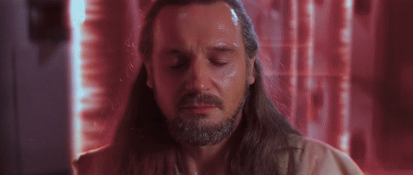

Scorch tried to block straight and left maneuvers from Han with a three bank so Han couldn't go where the action was. I wanted him to take the long way.

Rivas did a three hard to cut off Luke's escape path but landed right in Kylo's way. I dialed in a five straight for Kylo, hoping it would fit. Even though it didn't, I liked the positioning of Kylo.

The Red Baron did his infamous one hard, followed by a lock on Luke and rolling away from the Jedi. He would have good escape paths for the next round. The lock may feel weird but I wanted a possible double modded shot from Rivas.

Han dodged the block and flew a fast bank maneuver towards Holger's own board edge.

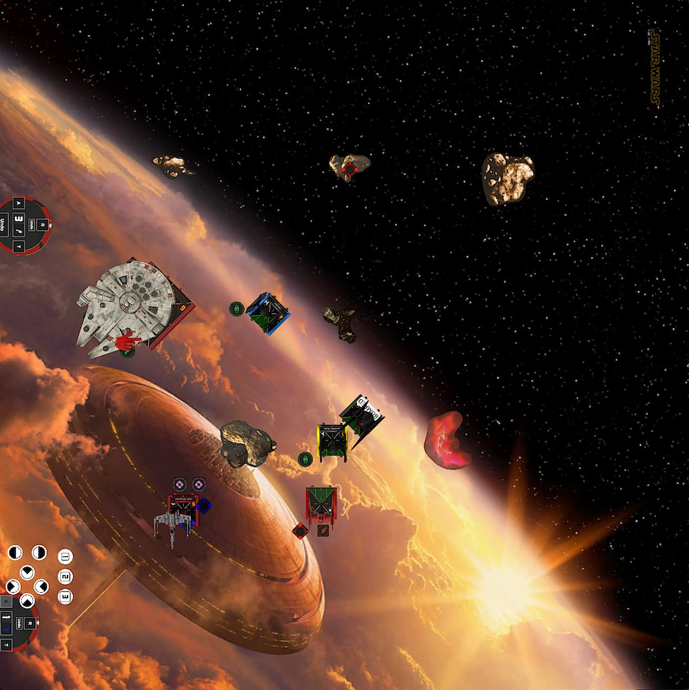

Vonreg had a shot on Han but missed. Han's only target was Scorch. Three hits into Scorch paired with two blanks and one eyeball for defense meant half points for him. Yikes, another great shot from Holger, who extended his lead to 46.

Luke was barely out of Riva's arc. Only Kylo and Scorch could shoot at the Jedi. Scorch, again not activating his ability for an obstructed range three shot, rolled nothing. Kylo on the other hand acquired two hits, spending a force. Luke countered with three natural evades, meh.

Another bad turn for me. This game is getting out of hand quicker than I thought. Maybe it was wrong to go after Luke first? But my ships were in no position to turn on Han and Luke was still relatively isolated. There was no escape for him. Not if I let him at least.

## Turn 4

So instead of following Qui-Gon's advice, I followed the one from our dark lord Kylo. It's time to let old things die. Old in this case is a reference to the uncle and father I guess!?

I chose to keep following my strategy and continue to shoot at Luke.

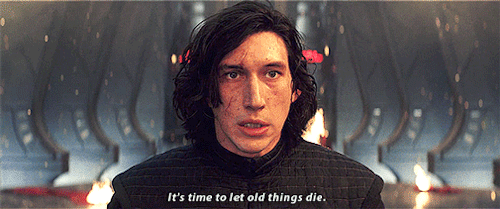

Scorch flew a five straight to block Han if he tried to turn in. The block didn't go off again, but Han had to rotate his arc to have something in his arc. There was no obstacle near Han, so any shot would only have a force modifier. Fingers crossed.

My other blocker, Rivas, did a three straight and rolled towards Holger's board edge. I tried to adjust his position such that he would block a three hard or a talon from Luke. Unfortunately for me Luke's talon roll fit.

Had I adjusted Rivas forward instead of backwards, he would have prevented Luke from turning, leaving him in a very awkward position. But as it stands Luke landed directly in front of Rivas and Kylo. His foils open to hit stuff.

Kylo advanced forward with a two straight and locked Luke. He landed in range one of Luke so he was in no danger to receive a torp.

Vonreg flew a bank maneuver towards Han. Again, I could have taken the safe route here and just went straight to get Vonreg out of harm's way. This is definitely something I have to work on. I am way too aggressive and often chose the more dangerous and violent path. On the other hand, I was down 46 points and I needed to catch up. And this was an option to do so.

After his maneuver, Vonreg locked Han and boosted out of his arc. While I was gathering my red dice to take a stab at Han, Holger announced that he would activate Heightened Perception on Luke.

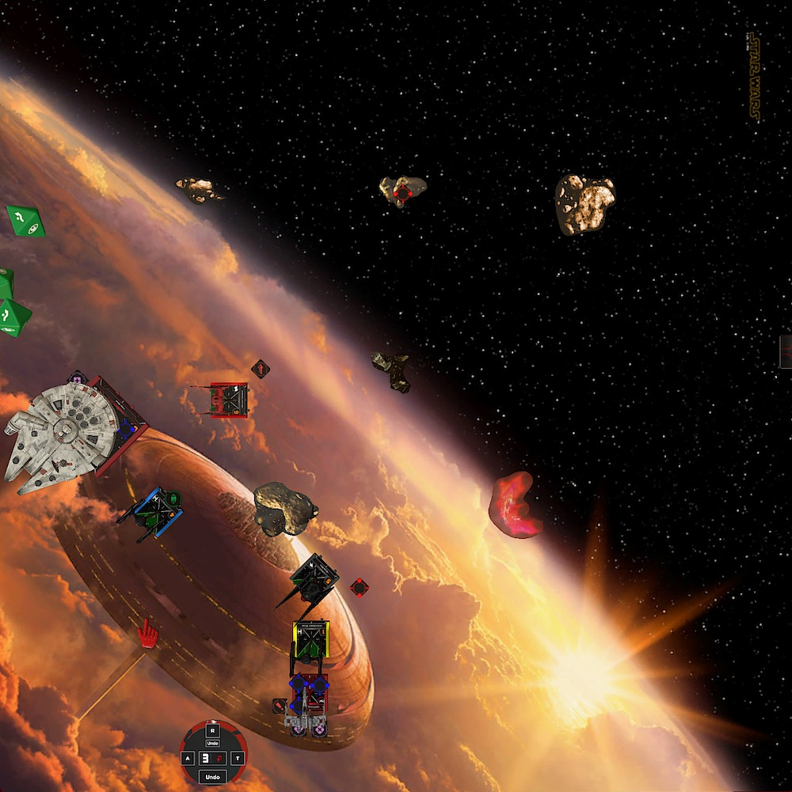

Luke had locked Vonreg the round before. The token did not move with Vonreg in TTS, so the above picture might be misleading. Maybe that was why I didn't even think about Luke when straining Vonreg.

Looking at the board I still thought that Vonreg never ever is in range of Luke. Of course I was wrong again.

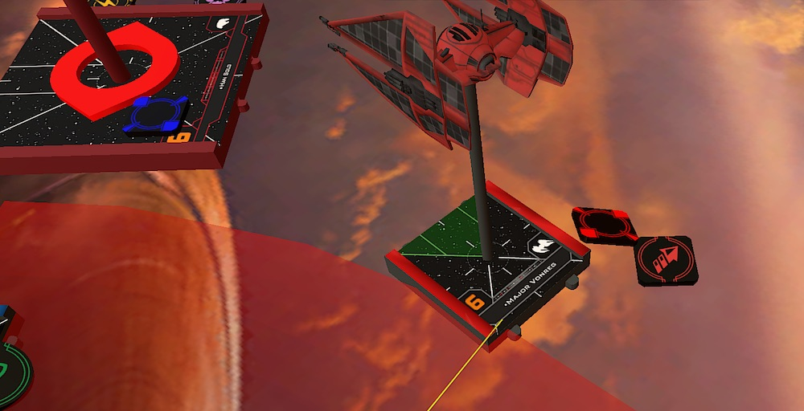

Vonreg was barely in range of Luke. Not a place you want to be in, especially if you have no defensive mods and are strained.

At that point I knew what was going to happen. I accepted Vonreg's fate. Luke got the expected three hits plus crit and easily removed Vonreg from the board. 76 to 0.

It was Han's turn to extend the lead even further, by using the force and Lone Wolf Han got two hits and a crit. Scorch evaded everything thanks to the focus token. And while this was fortunate, it made up for my bad dice before. Guess it is right what they say: regression to the mean.

My turn to shoot things.

Kylo and Rivas put everything they have into Luke, who was still at 5 life, thanks to a hull upgrade. 

Kylo got three hits and one crit into his uncle. Holger only rolled one evade. The crit was a Wounded Pilot. Rivas, the little FO that could, got three hits into Luke thanks to the free lock and a focus. Luke rolled paint with both of his defensive dice, which meant only one damage got through. Luke was still alive with one hull left. That hull upgrade was worth every point!

74 to 44 after round four. There is hope!

## Turn 5

There wasn't much room between Luke, Kylo and Rivas. None of my ships was in a prime position to tail Luke. If he turns right there is only one way to keep guns on him. Kylo needed to do a talon roll.

This move was very obvious so a hard one plus barrel roll from Rivas had to block the opposite escape route. I didn't have any possibility to block a two bank though. So fingers crossed.

Scorch already played one-on-one defense with Han. He continued his quest to finally block Han.

...and he did! Han ran out of options.

Because we were curious we tested other maneuvers but every left maneuver from Han was blocked by Scorch. Flying straight wasn't possible anymore because the Falcon would have landed outside the board.

It was Luke's turn to escape. Holger had dialed in a left two bank, the maneuver Rivas was blocking! To Holger's disadvantage it was my turn to have something just in arc. Because Luke was blocked halfway through the maneuver one of his edges remained in Kylo's arc with just a few pixels!

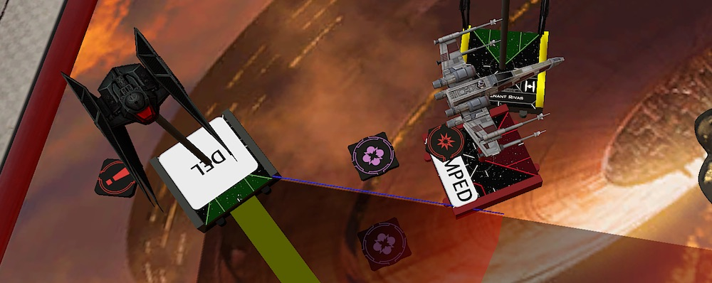

Kylo finished the job and removed his uncle from the battle.

However, the points from Luke were not enough. Han halved Rivas because I blanked out on defense. In return Rivas only pinged off another shield from Han.

New standing 88 to 80. Despite leading in points, Holger only had one ship left against my three. 2 half FOs and Kylo. Kylo had to carry and I knew he was good at that.

## Turn 6

There was still a long road ahead of me. I had to put six more damage into the Falcon for half points and only 20 minutes left on the clock.

Rivas slooped to block fast maneuvers. Scorch two banked to also block. I wanted to deny as many actions as possible. A successful block would leave Han with his turret pointing in the wrong direction (sideways) and he would not be able to shoot at the two damaged TIEs. 

At this point I was fine with getting some fire on Kylo. He was still healthy. He flew a two turn, followed by a lock on Han and a boost to get closer.

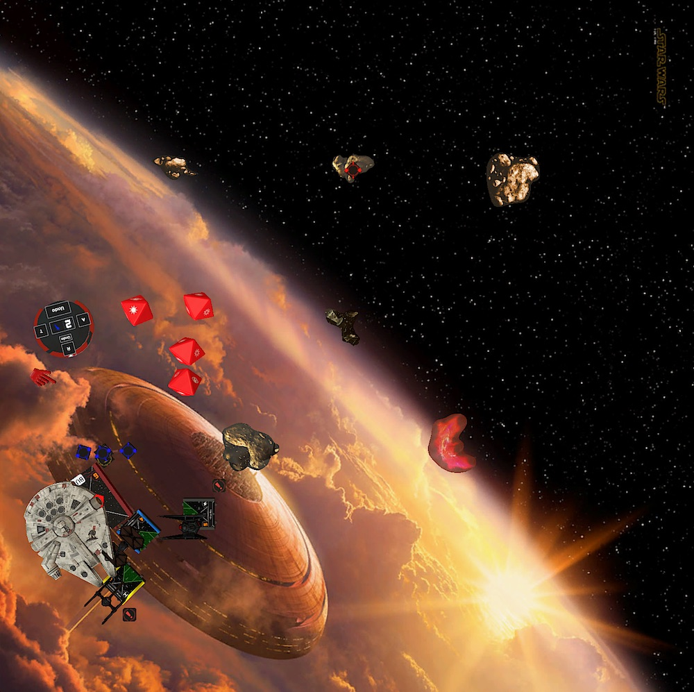

The shot from Han did not hit Kylo, thanks to using a force. Kylo stripped off three shields in return.

Because Scorch blocked Han, Rivas had a range one shot at the Falcon. Utilizing the lock, thanks Kylo, he rolled three hits, which resulted in another two damage on the Falcon. The shields were gone and he suffered the first hull damage. One damage short for half points.

## Turn 7

I needed a turn to get Kylo back on target. Because he was stressed last round he couldn't do a talon roll. Scorch and Rivas covered for him and blocked Hans movement again. Scorch was assigned to block the fast maneuvers. Rivas took care of the slow ones. I let Rivas bump into Scorch on purpose so the FO wouldn't move too much.

The plan worked like a charm. Han bumped with his arc still pointing sideways. No shots for him.

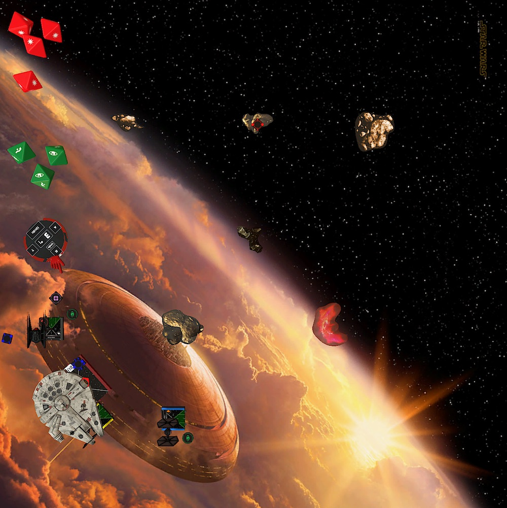

## Turn 8

With a hard one and a barrel roll, Kylo got his arc back on Han. I didn't boost with Kylo to cover short movements from Han and not fly past him.

Rivas tried to block short maneuvers again. Scorch got into position to cover the longer ones with a sloop. I wanted to have my arcs pointing at Han as much as possible.

Unfortunately Han's three bank fit between the two FOs. He finally could turn his arc in the right direction, front/back.

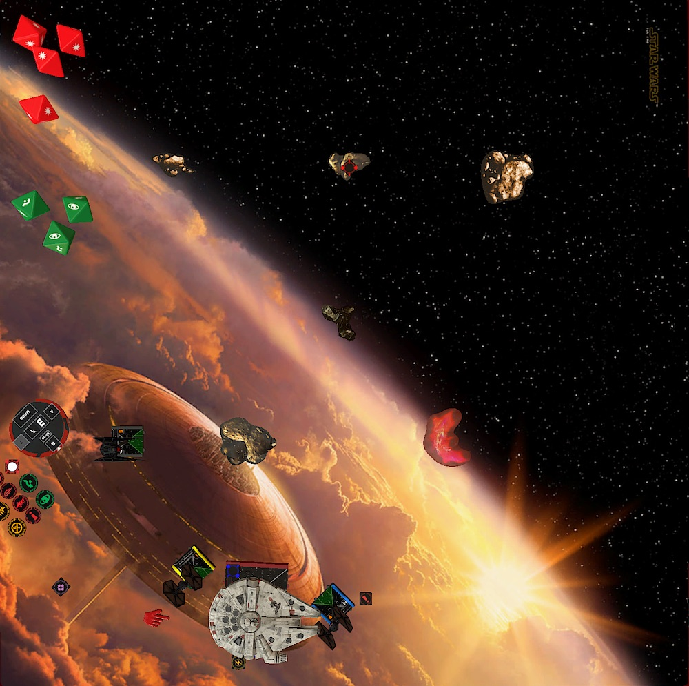 

Landing between the two FOs also meant that Han could double tap for the first time in the game. At least he was shooting with no additional mods at two heavily wounded FOs. He had to turn his arc and I managed to keep the Falcon away from obstacles all game long.

Rivas dodges Hans attack, but Scorch suffered a crit, which was loose stabilizers. This meant all of my ships could fire at Han. Two of them even at range one.

Using his lock, Kylo put three more damage on the Falcon. Scorch's unmodded shot added another one. It was Rivas turn. Two hits and one crit met no evade from Han. Han remained on one hull, with a loose stabilizer crit.

The hull and shield upgrade came in big for Holger again.

I honestly didn't expected to be able to put so much damage (seven!) into Han. But turning his arc and double tapping instead of tokening up meant that Han would have to fully rely on dice, while I had two modded and one unmodded shot.

If you believe the math, Han was expected to put one damage in each of the FOs. So they both could fire back. Again, the action economy on the Falcon was a problem.

For the first time I was in the lead with 143 to 90.

## Turn 9

Shortly afte I selected Scorch's maneuver the timer rang. This was the last round.

Rivas did had to much ships in front of him to pursue Han. Kylo was still behind the rock. I dialed in a two bank to pass the rock. Han executed a four straight and boosted to get away from my squad.

As I picked up defensive dice for Scorch I noticed that I did a turn maneuver with him and that he still hasd loose stablilizers. I picked up the mini and removed it from the board before Holger could roll the attack.

What an unnecessary mistake. I knew why I dialed in a turn with Sorch. I wanted him to get out of Kylo's way. However a two straight would have been fine. Scorch would have bumped into Han, not moving much.

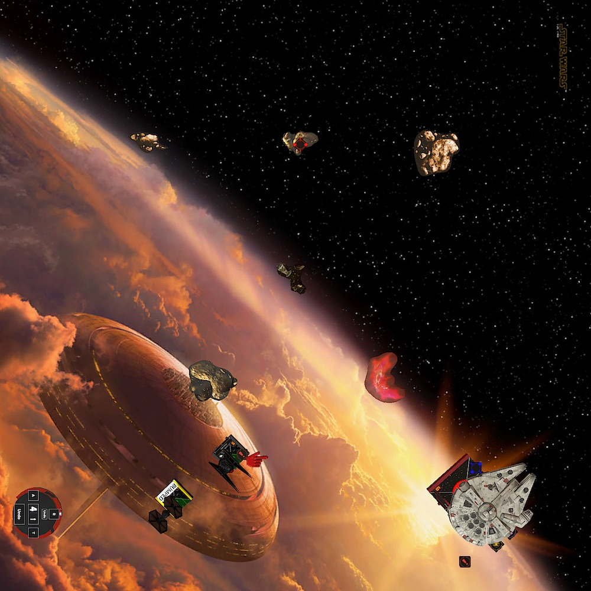

Only Kylo had a shot at Han. With a force charge and a lock on Han, it should be doable to get the last damage. Han didn't have any defensive mods.

Afer using the lock and the force, I got two hits. Holger had to roll two natural evades with two dice.

And he did! Kylo just couldn't kill his father a second time, I guess. The game ended 143 to 106.

## Conclusion

My first win in my first tournament after only three games. That went way better than expected, unlike the last shot in the game. 

I am glad that the game didn't end with destroying Holger's whole squad. I did way too many mistakes during the game. Starting with over-commiting Vonreg and losing two shields in the progress. I really have to remember to fly less agressive.

Over the course of the last two games I also noticed that I have issues to keep track of the whole board. In this and the last game one of my aceces died because I overlooked some of the opossing ships. This time it was Vonreg. I was so engaged in dodging Han's arc that I forgot about Luke.

Of course going after Han with a damaged Vonreg might be a bad idea anyway. I could have saved some points by just flying him out of the danger zone. Violence is not always the answer.

But I also noticed some improvements.

I rolled 53 red dice this game. Ignoring the first round, this results in 6.6 attack dice per round. I definitely had more time on target than the last game. Maybe it's much easier against the Falcon and a two ship list. So I don't trust that stats yet.

Revieweing the movement and blocking over the course of the game, I find that I really gave Holger a hard time flying close to obstacles with the Falcon. He said it himself after the match, I couldn't fly where he wanted, only where I would let him. Thank you for the compliment!

My plan denying Han actions and obstruct his movement definitely played a big roll in me winning this match. This is why I like the list so much. Having two blockers that support the aces feels better to run three aces. Not that the First Order has three aces ... but I absolutely favor the blocker over Quickdraw or Blackout.

I am still uncertain about Sorch. Having an I1 and I4 blocking sometimes complicates thinkgs. Maybe it is a good idea to sacrificing Scorch's offensive power for more movement options and run a cadet instead.

This would leave me with eight points to spare. 10 with the latest points update. I have to think about where to invest those points.

Hopefullly until next time!

