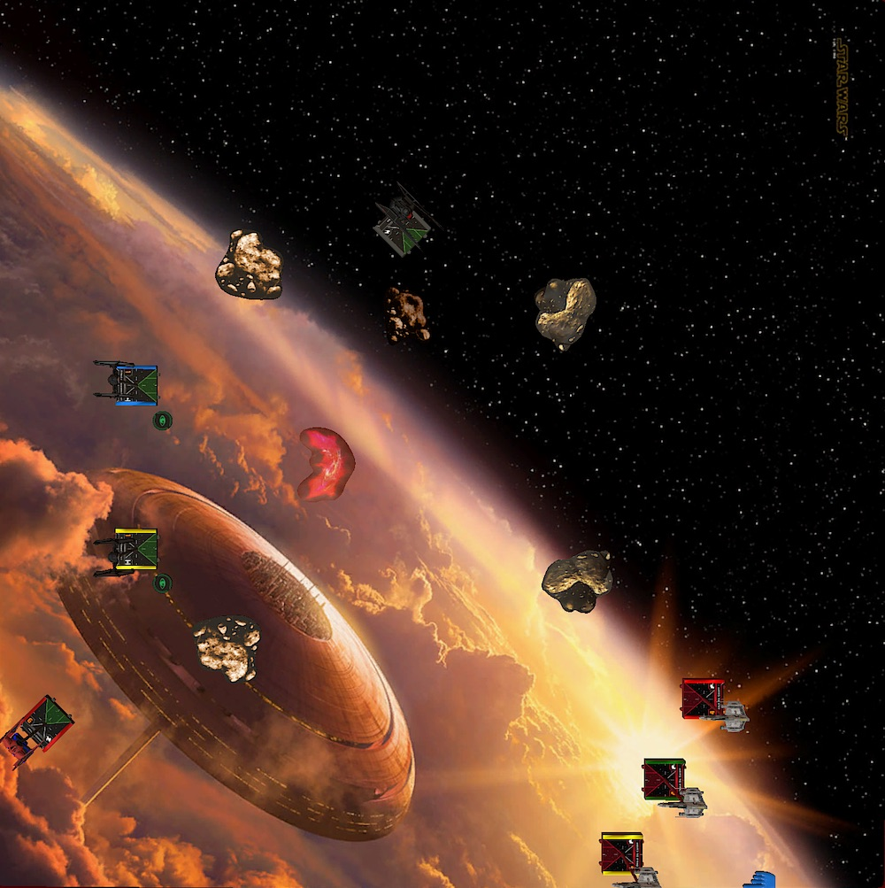
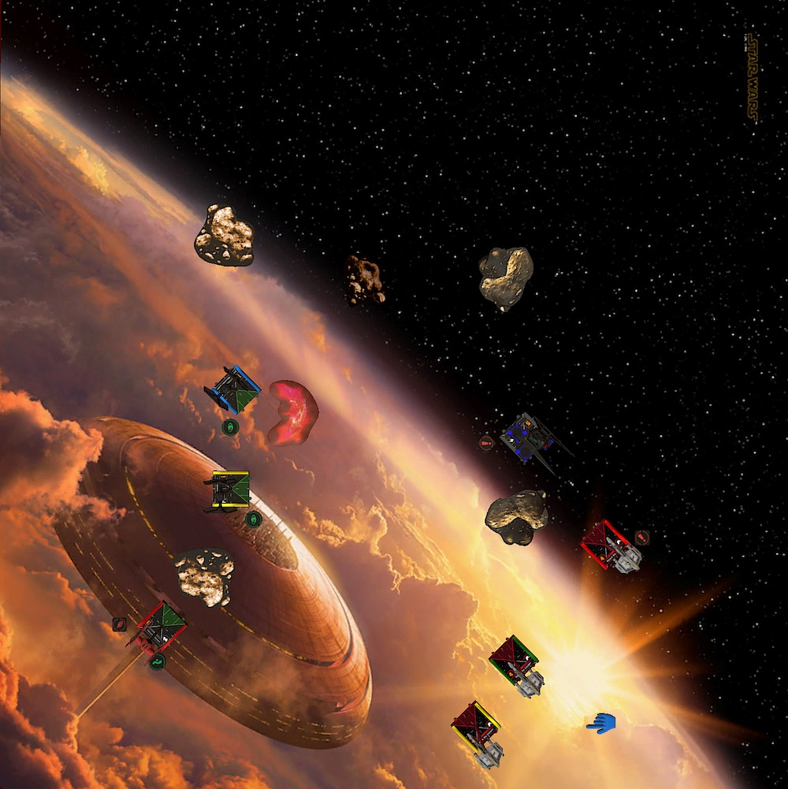
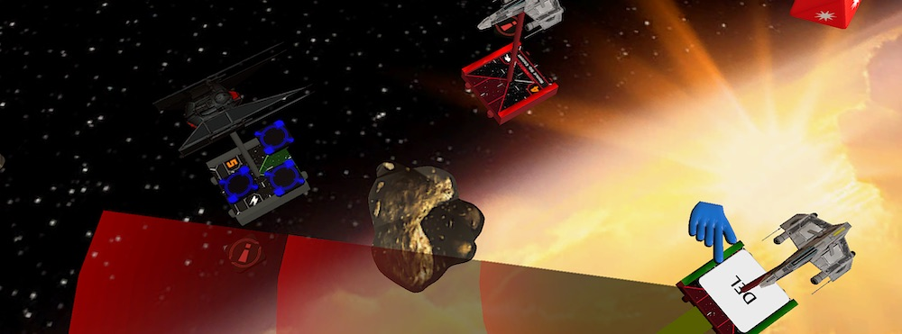
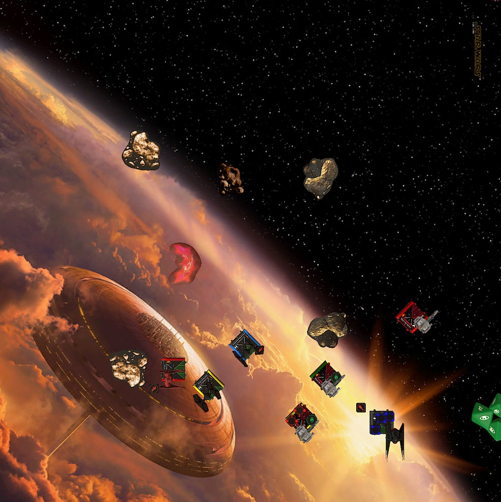
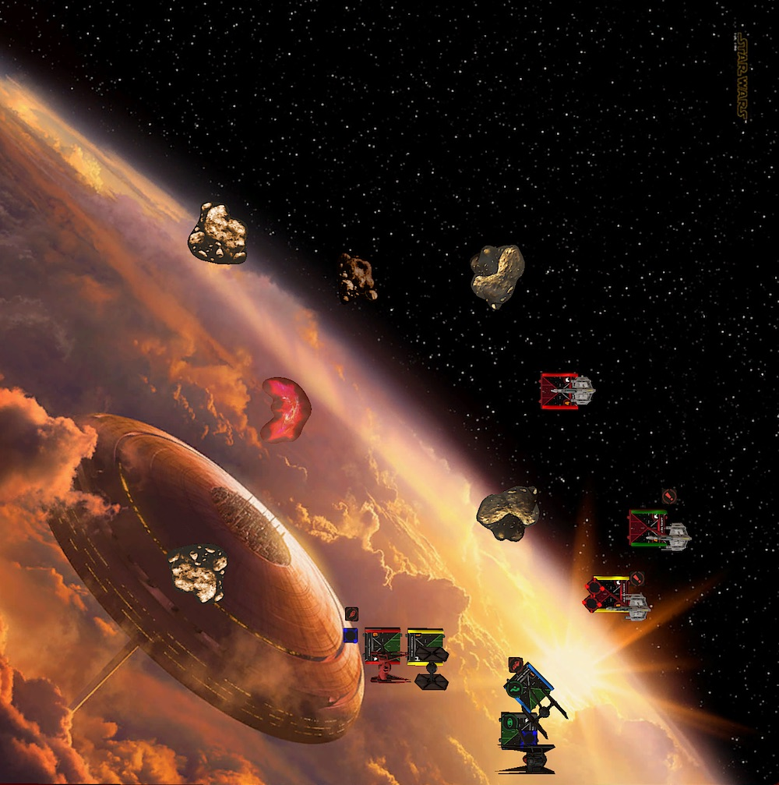
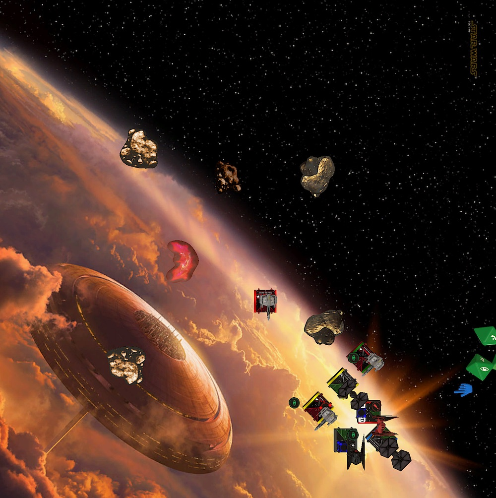
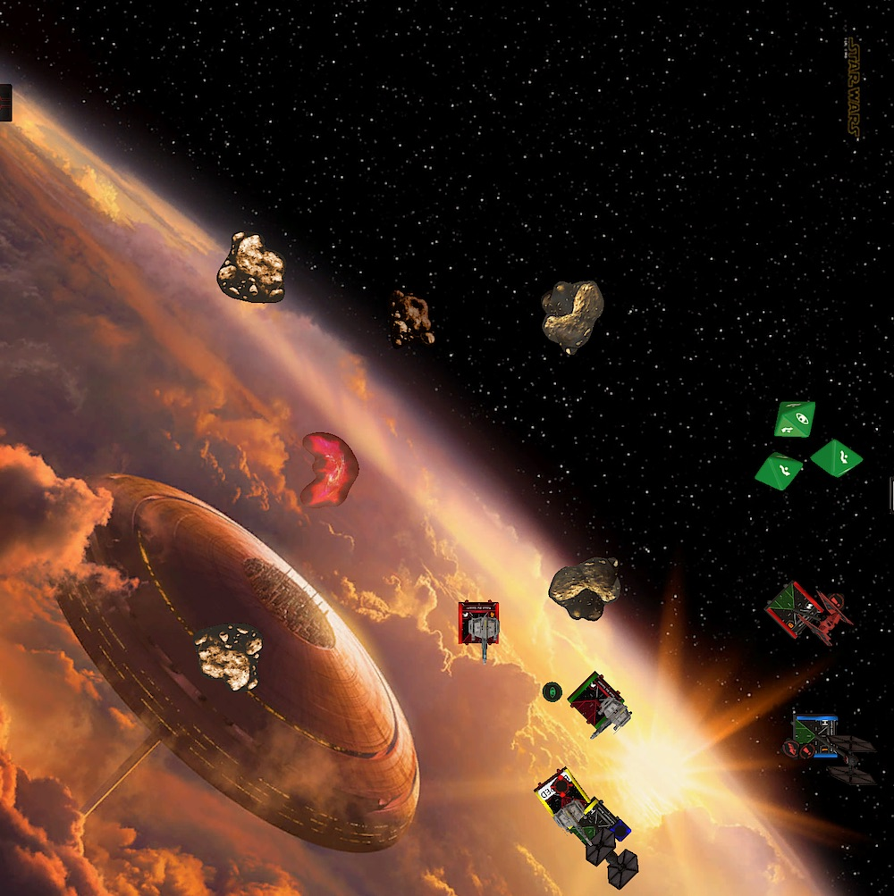
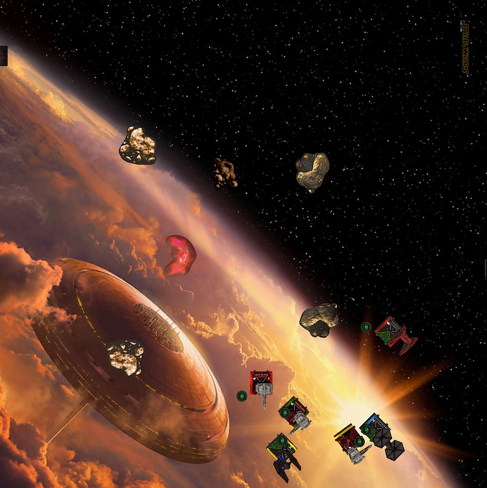

After my win last week I am now 1:2. I don't feel good or bad about my standing in particular. It's good to know this will not end in a total disaster by me winning not a single game. But is is also my first tournament, I don't expect good results.

Peter is my opponent for this week. Another friendly Bavarian. We briefly talked about the X-Wing community and its average age before our game. Yes, we're all old, but it is part of what makes games so enjoyable. We're all much more relaxed.

## List

This is my first game after the latest points update. The First Order came off mostly unscathed. In fact, the TIE/ba got cheaper. Two more points from Vonreg that can be spend otherwise. The stapled Daredevil on him is basically free now.

There is one more upgrade I wanted to test: Deuterium Power Cells. I have to bench Scorch and downgrade the second TIE/fo to a cadet for it, but I wanted to try blockers with the same initiative anyway. Two birds with one stone.

<XWS list={{"description":"","faction":"firstorder","name":"Unnamed Squadron","pilots":[{"id":"majorvonreg","name":"majorvonreg","points":66,"ship":"tiebainterceptor","upgrades":{"talent":["daredevil"],"tech":["deuteriumpowercells"]}},{"id":"kyloren","name":"kyloren","points":76,"ship":"tievnsilencer"},{"id":"epsilonsquadroncadet","name":"epsilonsquadroncadet","points":25,"ship":"tiefofighter"},{"id":"lieutenantrivas","name":"lieutenantrivas","points":27,"ship":"tiefofighter"}],"points":194,"vendor":{"yasb":{"builder":"Yet Another Squad Builder 2.0","builder_url":"https://raithos.github.io/","link":"https://raithos.github.io/?f=First%20Order&d=v8ZsZ200Z381X117W318WWY236XWWWY269XWY265XW&sn=Unnamed%20Squadron&obs=coreasteroid5,core2asteroid5,gascloud4"}},"version":"2.0.0","obstacles":["coreasteroid5","core2asteroid5","gascloud4"]}}/>

As I said over the past few week, I really enjoy flying this style of two aces and two blockers. It reminds me a lot of the two Jedi, two torrent squads from last year. 

However, the TIEs are much better blockers than the torrents. The white one hard followed by a barrel rolls allows to setup up some really excellent blocks and the shield behind three green dice make the little TIEs more durable than they look.

Delta-7B Jedi are arguably better aces than Vonreg. Kylo on the other hand is definitely on par with Obi and Plo. I gave Vonreg a hard time when I started playing him, but he grew on my. It requires some time to learn how to fly him properly ... not saying that I can.

Like his fellow Bavarian last week, Peter brought a Rebel fleet. Three E-Wing packing torps. An alpha strike squad at its finest.

<XWS list={{"description":"","faction":"rebelalliance","name":"Unnamed Squadron","pilots":[{"id":"roguesquadronescort","name":"roguesquadronescort","points":63,"ship":"ewing","upgrades":{"sensor":["firecontrolsystem"],"torpedo":["plasmatorpedoes"],"astromech":["r4astromech"]}},{"id":"roguesquadronescort","name":"roguesquadronescort","points":68,"ship":"ewing","upgrades":{"sensor":["firecontrolsystem"],"torpedo":["protontorpedoes"],"astromech":["r4astromech"]}},{"id":"roguesquadronescort","name":"roguesquadronescort","points":68,"ship":"ewing","upgrades":{"sensor":["firecontrolsystem"],"torpedo":["protontorpedoes"],"astromech":["r4astromech"]}}],"points":199,"vendor":{"yasb":{"builder":"Yet Another Squad Builder 2.0","builder_url":"https://raithos.github.io/","link":"https://raithos.github.io/?f=Rebel%20Alliance&d=v8ZsZ200Z23XW113W234W5WY23XW113W136W5WY23XW113W136W5W&sn=Unnamed%20Squadron&obs="}},"version":"2.0.0"}}/>

Torps are not really what I want to face with my squad. Especially if my opponent can preemptively acquire locks past range three. If any locked ships gets in range of the E-Wing they will just erase it. Of course, that is kind of the whole plan of an alpha strike list.

My FOs will have a hard time to deal any damage to the E-Wings because of their three defense dice. If I don't get a block of they are basically useless. Because I expect one of my aces to be range controlled with locks, I only have one ship that can deal damage to the E-Wings.

And it's not like if the E-Wing are a joke if they don't can fire their munition at you. They still have three attack dice. They easily match the firepower and durability of my aces. The only weekness they have is that they can not double reposition.

As for strategy, I want to bait the E-Wing with one of my aces and hope they turn on him so that the rest of my squad can come in and focus fire one E-Wing. The generic E-Wings with R4, FCS and torp are very expensive. The cost about the same as Vonreg with the Powercells. If I can destory one and only loose Vonreg or the TIEs I should be fine.

## Turn 0

We both seemed to have the same plan when it comes to rock placement and so most of the obstacles ended up in the center of the board. I placed the single gas cloud relativly in the middle to maybe have an additional free evade against the incomming torpedos.

I deviated from my usual setup because Peter tugged his whole squad into one side of the board. Kylo was telegraphing what is plan was. Go fast and flank. The rest of the squad got placed as usual. I put Vonreg in a 45° into my corner facing all of his E-Wings. He was the bait.

Jousting the E-Wings with my list was not an option. The two FOs got assigend the middle lanes. They could flank if the Rebels after chosing on of the aces as their first target.

## Turn 1

Vonreg and the two TIEs did the usual non-commiting two forward. Kylo dashed forward with a five straight followed by a boost. He landed in a good spot behind a rock and could flank next round or bail out with a hard one.

The E-Wings all did straights and formed a diagonal line. The yellow E-Wing, which was the one closets to the board edges moved the furthest. Red moved the least.

With this formation the Rebel ships could easily turn next rund to face Kylo even though they all locked Vonreg this turn. Because of all the locks Vonreg got and the possiblility of an incomming torpedo attack, the major rolled back to get some distance between him and the E-Wings.

## Turn 2

The positioning of the E-Wing made it hard to predict their next move. Excellent flying on Peter's side.

I chose to not fully commit yet and dialed in two speed maneuvers for the FOs and Vonreg. My idea with Vonreg was to fly a two straight and have the option to barrel roll either way, depending on the Rebel's movement.

Vonreg ended up further than I had anticipated. The barrel roll would fit and place him behind the rock. I planed to do a Daredevil boost afterwards to close in on the E-Wings. Seeing where he landed after the roll, the boost would never fit. That was a very poor decision on my part. I would have to fly him over the rock next turn, ugh.

I decided to commit with Kylo and diald in a three bank. I wasn't sure if a five straight would fit. It might have touched the north-east rock, which would have been really bad. One ships flying over a rock is bad enough.

There were two reasons I decided to get aggressiv with Kylo. First, there was a big fat rock between Kylo and the E-Wings, which would make hard turns not so great for the E-Wing. Especially becausethe hard one is red on the E-Wing's dial ... at least usually.

The other reason was that all locks were on Vonreg. Even if Peter decided to turn all his ships to Kylo I could dodge at least one or even two of the arcs and incomming shots were primary attacks, not torps.

Or so I thought. In my mind the E-Wing ability was a Jendon think, something you can do once or twice a game. I was complelty blindsided when Peter just locked Kylo this turn with all three ships.

I also forgot about the R4s, which made the one hards white. Followed by a roll, the red E-Wing landed in a perfect spot, avoided the rock. Peter outplayed me hard this round and my bad flying made this even easier for him.

On the bright side, because the other two E-Wing didn't fully commit on Kylo and only did banks instead of turns, the three bank from Kylo, followed by a double reposition got him out of the two arcs. Only the red E-Wing with the Plasma Torpedos had a shot on him.

Kylo and the red E-Wing exchanged range two shots. Spending two force, the Plasma Torpedo missed and wouldn't strip an extra shield from Kylo. Kylo didn't do any damage to red either.

## Turn 3

There was a lot of distance between the Rebels' fighting Kylo and the rest of my squad. So I tried to close it at fast as I could. Five straight for the cadet and a three bank for Rivas and Vonreg. Vonreg took a damage from flying over the rock.

This could go either way. The E-Wing could keep chasing Kylo and have my squad behind them or they could joust my squad and have Kylo behind them. I actually didn't notice this during the game, but this wasn't a too bad spot to be in. It felt otherwise back then though.

The yellow and green E-Wing turned on Kylo with some *white* one hards. I only played against E-Wings carrying R3s so far. But boy oh boy are these little droids good on them. It makes them so much more mobile.

And it also helped Red to clear his stress from last round by flying a *blue* two hard. He also tried to block Kylo's escape route with a barrel roll.

Ignoring Red, Kylo slipped right through the E-Wings with a three straight. The barrel roll and boost brought him out of all except one arc again.

Unfortunately that one arc had a double modded range one shot on Kylo. Peter spent a focus to aquire three hits and a crit, which resulted in Kylo loosing both of his shields.

Vonreg and the two FOs could only get one damage through on Yellow, even with spending two locks. It showed that the "two dice"-guns from the TIEs were no match for the three defense dice from the E-Wings.

## Turn 4

The cadet got strained from flying through the gas cloud, but I couldn't care less. He has some ships to block! Also, Peter shooting at the cadet would only be good for me, less pressure on my aces.

Rivas and Vonreg flew as slow as they could. They were in the E-Wing's back and Peter had already commited to Kylo which meant they were relativly safe. Vonreg reaquired a lock on Yellow also donating one to Rivas. This interaction is still one of my favorite things with that squad!

Kylo was still on the exit trajectory. Two bank and focusing for additional defense.

Instead of doing hard turns, the yellow and green E-Wing slooped. Good choice since Yellow's one hard would have been blocked by the cadet.

The red E-Wing was kind of out of the fight. He had to use this round to fly around the rock. Because Red aquired another past range three lock on Vonreg, the major hat to barrel roll out of his arc, depleting himself.

The deplete on Vonreg hurt, but straining wasn't an option either. He only was on three health, thanks to the rock and a lucky shot from one of the E-Wings could have blown him up. While unlikely, this happend to me too often in the past.

Neither Vonreg, nor Rivas could do any damage to yellow. Again, two attack dice against three or even four defense isn't going to do much, if any. The Rebels return shots on Rivas and Vonreg were also unsuccessful.

## Turn 5

The game still was relatively even. Peter was a little bit a head, because he was one damage away from half points on both of my aces. But hey! That's why I brought the Deuterium Power Cells right!

This turn the E-Wings would be back in the fight with some fully modded shots. Trying to prevent that, Rivas slooped to block and the cadet did a hard one. The cadet tried to barrel roll but failed, leaving him in an not so optimal position.

Seeing the positioning after turn four, I should have slooped with the cadet too. Back then I was scared of a hard one from Yellow, because I wanted Kylo to turn back to the fight. But a hard turn from Yellow would not have cleared the stress and would leave the E-Wing in an awkwards spot. The chances that Peter would to this, were zero to none.

Yes you did read that correct. I again went the aggressiv route with Kylo.

The reason is qutie simple. Kylo still had two locks from Yellow and Green. A five straight and boost would not bring him out of range if the E-Wing would go fast. So I decided to stay and rather get some range one shots than a range 3 Proton Torpedos. At least Kylo could shot back this way.

The red E-Wing finished his tour around the asteroid and joined the fight. The other two Rebel ships advanced with a one and a two bank, clearing their stress and focusing up.

Here comes another mishap by me. One that would turn the game against my favor. Are you ready!?

Knowing that Green and Yellow would have to clear their stress and thus flying directly towards Vonreg, I dialed in a 5k for him. This *would* have been a great move, if the cadet would not have blocked the maneuver. He barely blocked it ... but he did. And so Vonreg stranded in the middle of everything with no shot, no mods and a potential incomming range one shot from Green. Perfect.

Kylo's shot at Yellow resulted in stripping of the remaining two shields and even sneaking in a crit which was Damaged Sensor Array. Rivas had another range one shot on yellow. The two crits (!) missed because Peter rolled to natural evades. Didn't even had to spent the focus.

The green E-Wing fired a Proton Torpedo at Kylo. Spending the lock, Green got two hits and two crits, which were met by two blanks and only one paint from Kylo. A direct hit made sure Kylo would not survive the shot. That was brutal.

To make things worse, the red E-Wing could now fire at Plasma Torpedo at Vonreg. Because the k-turn failed the major was still in his arc and Kylo was gone already, so red had an easy choice.

This time the Plasma hit and removed the last shield from Vonreg and did an additional damage. The TIE/ba survived with one hull left.

As you probably noticed, this was the turn everything went downhill for me. *If* Vonreg's maneuver would have fit, he would have had a shot on yellow, the E-Wing most likely would have been destroyed and would make the trade for Kylo okay. Vonreg would have dodges all arcs and the red E-Wing only could have shot at Rivas at range three.

But that's a lot of "ifs". As it stands, Rebel gained the lead with 109 to 0.

## Turn 6

With only a limping damage dealer left this would be an uphil battle for the rest of the game.

To get shots on Yellow the cadet slooped this round and Rivas tried to block his escape routes, while hopefully dodging as many arcs as possible. The E-Wings closed in on Rivas. Yellow bumped, the other two had shots on him.

Vonreg could have turned 180° even though he is stressed thanks to a Daredevil boost, but it was too dangerous and so I used the Power Cells to revoer one shield. I hoped that the game will go long enough to recover another shield. This would give Peter no points for Vonreg and maybe the FOs could finish the yellow E-Wing in the meantime.

The two E-Wings could only strip of Rivas' shield. The cadet, which by the way still carried around his strain token from round two, missed Yellow.

## Turn 7

Vonreg turned his guns back to the fight. Double modding for a shot at Yellow. Rivas did a one hard, because he didn't have any other option. The cadet clearing his stress and strain two banked towards yellow.

The yellow E-Wing hat to turn to Vonreg. The other E-Wings closed in on Rivas. Why I don't know. I expected the red Rebel to turn left to face Vonreg and try to remove him.

Vonreg's double modded shot required me to spent both mods to get three hits. The green E-Wing rolled to natural evades. Didn't had to spent his focus token to survive. This is bad, because Yellow could fire back now.

Red and Green fired everything they had into Rivas, but due to some hot green dice and a focus token no damage got through.

Here comes Yellow, rolling two hits into Vonreg. Because I had to spent the focus on offense, no defense mods for this shot. But I wouldn't have mattered anyway. Three blanks meant a destroyed baron. Couldn't even spent the second charge from the Power Cells.

The cadet with his range one focused shot, could avenge Vonreg. Yellow was finally removed from the board.

142 to 68 for the Rebels.

## Turn 8

Even tough we still had one more round to play, the game was over. My TIEs would not be able to half one of the E-Wings. I tried to setup blocks and bad shots for Peter. The one unmodded shot missed Rivas.

The game ended with another loss for me. 142 to 68. This was the first time I lost both of my aces, so I would call this my worst game yet.

## Conclusion

Reexamining this match, I have to say that playing it felt much worse than it was in reality. I guess that has to do with my inexperience. It's though to evalute the board state sometimes if you are new.

I faced a semi alpha strike squad in my second game, but I don't know if I would count that because there were only two gunboats and barrage rockets aren't that scare as Proton Torpedos. The E-Wing's loadout definitely catched me off guard. I underestimated their mobility. 

I didn't underestimate their fire power and durability though. Over the past few games I noticed that my squad has issues destroying ships with lots of green dice or health. This is especially true if of the damage dealers, Kylo or Vonreg, has to run for his life and can not participate in the fight.

Adding Deuterium Power Cells is definitely a mistake. Vonreg shouldn't get shot in the first place. The regen doesn't add anything to the strengh of the list. On the contrary, Vonreg not being able to shot is bad. You can not afford not to shoot with him. You need his damage output.

The squad from my last two games clearly is the better combination and it even dropped two points. You can either have a very strong seven point bid or add Crack Shot/Fanatical on Scorch if you want.

<XWS list={{"description":"","faction":"firstorder","name":"Unnamed Squadron","pilots":[{"id":"majorvonreg","name":"majorvonreg","points":57,"ship":"tiebainterceptor","upgrades":{"talent":["daredevil"]}},{"id":"kyloren","name":"kyloren","points":76,"ship":"tievnsilencer"},{"id":"scorch","name":"scorch","points":33,"ship":"tiefofighter"},{"id":"lieutenantrivas","name":"lieutenantrivas","points":27,"ship":"tiefofighter"}],"points":193,"vendor":{"yasb":{"builder":"Yet Another Squad Builder 2.0","builder_url":"https://raithos.github.io/","link":"https://raithos.github.io/?f=First%20Order&d=v8ZsZ200Z381X117WWWY236XWWWY262XWWY265XW&sn=Unnamed%20Squadron&obs=coreasteroid5,core2asteroid5,gascloud4"}},"version":"2.0.0"}}/>

Adding more points to the TIEs isn't that great and it don't think it helps much. There was a leak last week with an upgrade that might by great for the squad though!

> **Evasive Maneuvers:** While you perform a boost action , you may spend 1 force to use the turn template instead.

If this is correct and not too pricy, it will make Kylo even better than he already is. Having two aces that can Daredevil looks amazing! 🙏

So far three-quarters of my opponents brought munition. Two of them even had munition as their primary damage output. I hope I can get a break next time ... or should I join them?