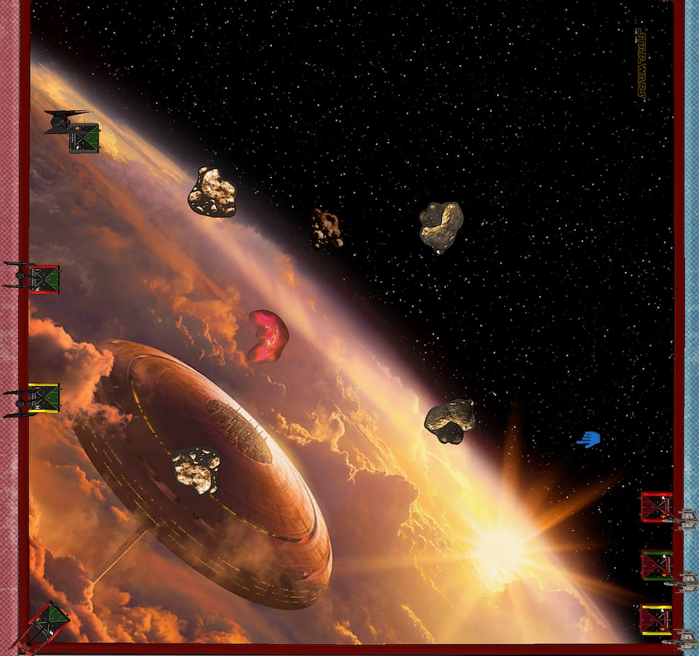

After my win last week I am now 1:2. I don't feel good or bad about my standing in particular. It's good to know this will not end in a total disaster by me winning not a single game. But is is also my first tournament, I don't expect good results.

Peter is my opponent for this week. Another friendly Bavarian. We briefly talked about the X-Wing community and its average age before our game. Yes, we're all old, but it is part of what makes games so enjoyable. We're all much more relaxed.

## List

This is my first game after the latest points update. The First Order came off mostly unscathed. In fact, the TIE/ba got cheaper. Two more points from Vonreg that can be spend otherwise. The stapled Daredevil on him is basically free now.

There is one more upgrade I wanted to test: Deuterium Power Cells. I have to bench Scorch and downgrade the second TIE/fo to a cadet for it, but I wanted to try blockers with the same initiative anyway. Two birds with one stone.

<XWS list={{"description":"","faction":"firstorder","name":"Unnamed Squadron","pilots":[{"id":"majorvonreg","name":"majorvonreg","points":66,"ship":"tiebainterceptor","upgrades":{"talent":["daredevil"],"tech":["deuteriumpowercells"]}},{"id":"kyloren","name":"kyloren","points":76,"ship":"tievnsilencer"},{"id":"epsilonsquadroncadet","name":"epsilonsquadroncadet","points":25,"ship":"tiefofighter"},{"id":"lieutenantrivas","name":"lieutenantrivas","points":27,"ship":"tiefofighter"}],"points":194,"vendor":{"yasb":{"builder":"Yet Another Squad Builder 2.0","builder_url":"https://raithos.github.io/","link":"https://raithos.github.io/?f=First%20Order&d=v8ZsZ200Z381X117W318WWY236XWWWY269XWY265XW&sn=Unnamed%20Squadron&obs=coreasteroid5,core2asteroid5,gascloud4"}},"version":"2.0.0","obstacles":["coreasteroid5","core2asteroid5","gascloud4"]}}/>

As I said over the past few week, I really enjoy flying this style of two aces and two blockers. It reminds me a lot of the two Jedi, two torrent squads from last year. 

However, the TIEs are much better blockers than the torrents. The white one hard followed by a barrel rolls allows to setup up some really excellent blocks and the shield behind three green dice make the little TIEs more durable than they look.

Delta-7B Jedi are arguably better aces than Vonreg. Kylo on the other hand is definitely on par with Obi and Plo. I gave Vonreg a hard time when I started playing him, but he grew on my. It requires some time to learn how to fly him properly ... not saying that I can.

Like his fellow Bavarian last week, Peter brought a Rebel fleet. Three E-Wing packing torps. An alpha strike squad at its finest.

<XWS list={{"description":"","faction":"rebelalliance","name":"Unnamed Squadron","pilots":[{"id":"roguesquadronescort","name":"roguesquadronescort","points":63,"ship":"ewing","upgrades":{"sensor":["firecontrolsystem"],"torpedo":["plasmatorpedoes"],"astromech":["r4astromech"]}},{"id":"roguesquadronescort","name":"roguesquadronescort","points":68,"ship":"ewing","upgrades":{"sensor":["firecontrolsystem"],"torpedo":["protontorpedoes"],"astromech":["r4astromech"]}},{"id":"roguesquadronescort","name":"roguesquadronescort","points":68,"ship":"ewing","upgrades":{"sensor":["firecontrolsystem"],"torpedo":["protontorpedoes"],"astromech":["r4astromech"]}}],"points":199,"vendor":{"yasb":{"builder":"Yet Another Squad Builder 2.0","builder_url":"https://raithos.github.io/","link":"https://raithos.github.io/?f=Rebel%20Alliance&d=v8ZsZ200Z23XW113W234W5WY23XW113W136W5WY23XW113W136W5W&sn=Unnamed%20Squadron&obs="}},"version":"2.0.0"}}/>

Torps are not really what I want to face with my squad. Especially if my opponent can preemptively acquire locks past range three. If any locked ships gets in range of the E-Wing they will just erase it. Of course, that is kind of the whole plan of an alpha strike list.

My FOs will have a hard time to deal any damage to the E-Wings because of their three defense dice. If I don't get a block of they are basically useless. Because I expect one of my aces to be range controlled with locks, I only have one ship that can deal damage to the E-Wings.

And it's not like if the E-Wing are a joke if they don't can fire their munition at you. They still have three attack dice. They easily match the firepower and durability of my aces. The only weekness they have is that they can not double reposition.

As for strategy, I want to bait the E-Wing with one of my aces and hope they turn on him so that the rest of my squad can come in and focus fire one E-Wing. The generic E-Wings with R4, FCS and torp are very expensive. The cost about the same as Vonreg with the Powercells. If I can destory one and only loose Vonreg or the TIEs I should be fine.

## Turn 0

We both seemed to have the same plan when it comes to rock placement and so most of the obstacles ended up in the center of the board. I placed the single gas cloud relativly in the middle to maybe have an additional free evade against the incomming torpedos.

I deviated from my usual setup because Peter tugged his whole squad into one side of the board. Kylo was telegraphing what is plan was. Go fast and flank. The rest of the squad got placed as usual. I put Vonreg in a 45° into my corner facing all of his E-Wings. He was the bait.

Jousting the E-Wings with my list was not an option. The two FOs got assigend the middle lanes. They could flank if the Rebels after chosing on of the aces as their first target.

## Turn 1

---

Power cells are bad, can not afford to NOT shoot if you behind. feels like a win more.

However, I notice that I start to feel fatigued. Being commited to play each week is more taxing than I thought. It feels different than arranging a game two or three days in advance every week to play. My motivation definitely dropped since the last week.

What a way to start a battle report ... sorry about that.

3/4 of opp suqds hat munition. two of them had this as their primary theme