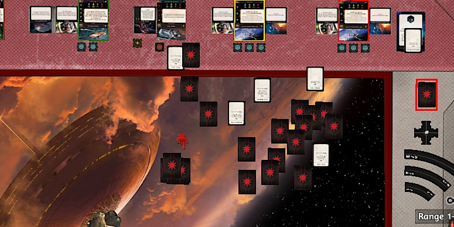
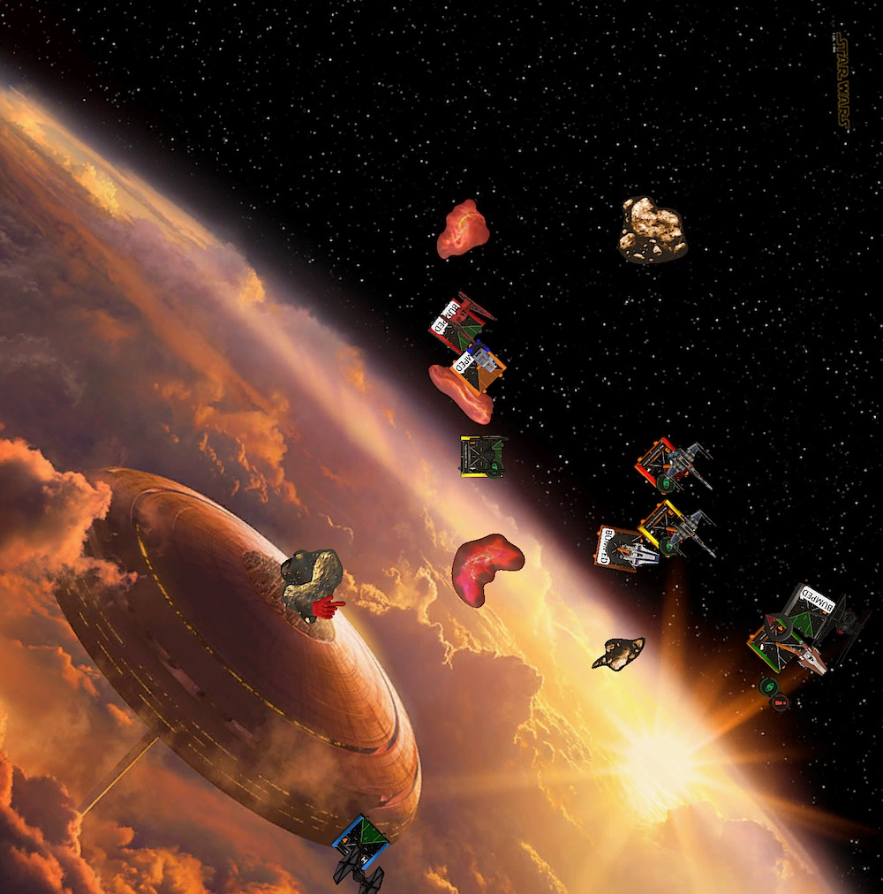
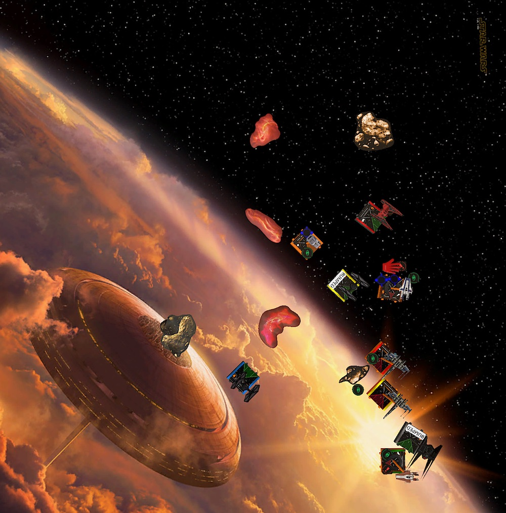
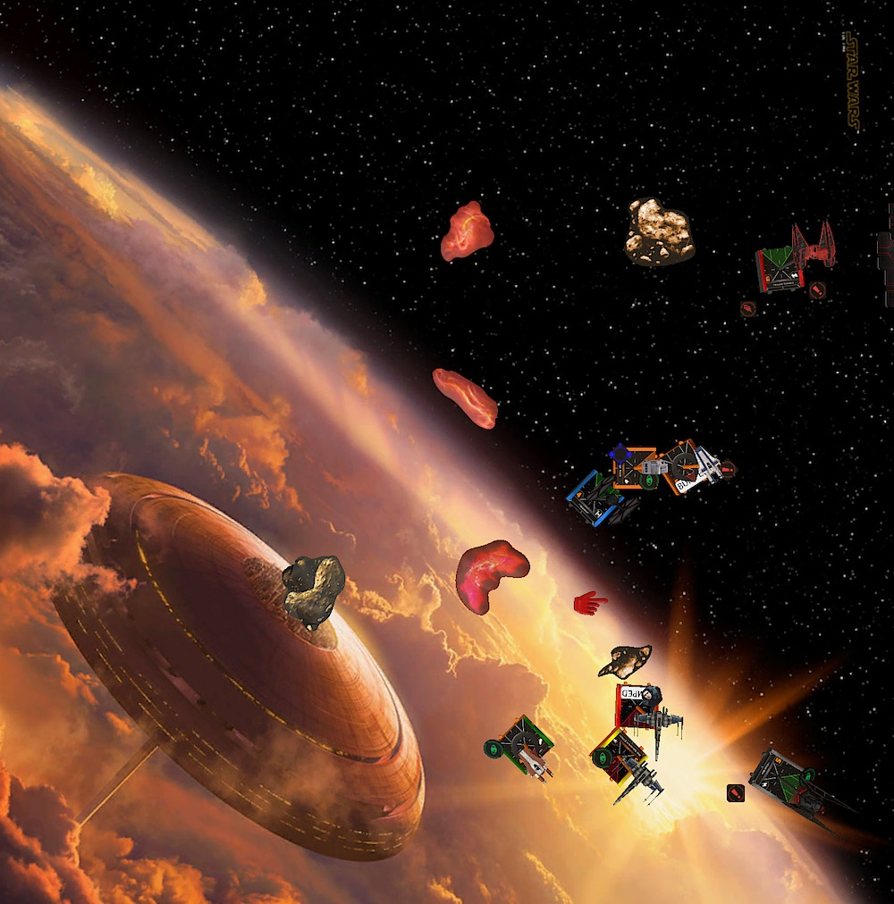
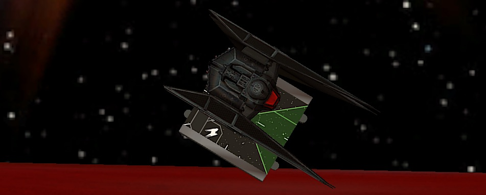

We currently have a scorching 35°C heatwave in southern Germany. I usually enjoy this kind of weather, especially if I can lie at the pool with a cold beverage in hand. But to play X-Wing in front of a computer? Not a fan.

Fortunately my opponents are usually very happy to play late in the evening when the kids are asleep. And so Philipp, my opponent for this week, and I met when the climate is tolerable, after 9 pm.

## Lists

Last week I felt exhausted flying the same list for over a month and I wanted to fly something different for a change. But due to the waaaay to hot weather and some private matters I didn't really had time and energy to prepare a new list for this week.

And even though I am losing a lot with the list, it is the only way to get better at flying aces. Thus I am sticking with Vonreg and Kylo. Maybe even for the rest of the tournament.

I tried Deuterium Power Cells in my last league match and it was really underwhelming. That's why I decided to give another underwhelming thing a chance, Scorch. He still feels expensive (33 points) for being an I4 cadet most of the time. His ability looks great on paper, but the additional dice is only great if you have mods.

Maybe he rather wants to be in an efficiency list than to be a blocker in a ace-y list. I don't know. I'll give him another chance. And because I am only at 193, he will also get a Crack Shot.

<XWS list={{"description":"","faction":"firstorder","name":"Unnamed Squadron","pilots":[{"id":"majorvonreg","name":"majorvonreg","points":57,"ship":"tiebainterceptor","upgrades":{"talent":["daredevil"]}},{"id":"kyloren","name":"kyloren","points":76,"ship":"tievnsilencer"},{"id":"scorch","name":"scorch","points":35,"ship":"tiefofighter","upgrades":{"talent":["crackshot"]}},{"id":"lieutenantrivas","name":"lieutenantrivas","points":27,"ship":"tiefofighter"}],"points":195,"vendor":{"yasb":{"builder":"Yet Another Squad Builder 2.0","builder_url":"https://raithos.github.io/","link":"https://raithos.github.io/?f=First%20Order&d=v8ZsZ200Z381X117WWWY236XWWWY262X116WWY265XW&sn=Unnamed%20Squadron&obs=coreasteroid5,core2asteroid5,gascloud4"}},"version":"2.0.0","obstacles":["coreasteroid5","core2asteroid5","gascloud4"]}}/>

Philipp brought a Resistance list that wants to joust. I must say I am very intrigued by his list. Two generic I3 T-70s plus Rose in the pod form a great tanky block with lots of fire power. Flying Rose behind the X-Wings will at least give her two re-rolls for offense.

Depending on the opposing squad, the two A-Wing can help with the joust or flank. A-Wings are also annoyingly efficient with their rotation arc and Advanced Optics. There is basically no way that they won't have a shot each round that results in two hits.

The list looks like quantity is king. But those five ships are very effective *and* efficient. Three of the five ships, Rose and the A-Wings, will always deliver at least two hits. The X-Wings are the backbone of the squad and can also dish out some real hurt.

<XWS list={{"description":"","faction":"resistance","name":"Unnamed Squadron","pilots":[{"id":"redsquadronexpert","name":"redsquadronexpert","points":45,"ship":"t70xwing","upgrades":{"talent":["heroic"],"configuration":["integratedsfoils"]}},{"id":"redsquadronexpert","name":"redsquadronexpert","points":45,"ship":"t70xwing","upgrades":{"talent":["heroic"],"configuration":["integratedsfoils"]}},{"id":"rosetico","name":"rosetico","points":28,"ship":"resistancetransportpod","upgrades":{"talent":["crackshot"]}},{"id":"greersonnel","name":"greersonnel","points":41,"ship":"rz2awing","upgrades":{"talent":["heroic"],"tech":["advancedoptics"]}},{"id":"tallissanlintra","name":"tallissanlintra","points":41,"ship":"rz2awing","upgrades":{"talent":["heroic"],"tech":["advancedoptics"]}}],"points":200,"vendor":{"yasb":{"builder":"Yet Another Squad Builder 2.0","builder_url":"https://raithos.github.io/","link":"https://raithos.github.io/?f=Resistance&d=v8ZsZ200Z257X172WWW175WWWY257X172WWW175WWWY345X116WWWY270X172WWW186Y240X172WWW186&sn=Unnamed%20Squadron&obs="}},"version":"2.0.0"}}/>

Against this squad, obstacle placement is key with my fragile list. I really need to try to make a tight obstacle field so that there are no easy lanes for Rose and her two bodyguards. If it is possible I want to avoid fighting them and instead go after the A-Wings.

This is not going to be easy for Kylo and Vonreg. There are a lot of arcs to dodge. My aces certainly will be under fire, especially from the A-Wings. And despite the A-Wing only having four total health, it is behind a three green dice defense. I need modded shots at them to get damage through.

## Turn 0

I won the bid since Philipp's squad came in at 200. I let him be first player so Kylo can move after Talli and Scorch after Greer. The latter is not really important and may even be bad, since the two TIEs are blockers and distraction rather than aces.

Philipp brought two clouds and a small rock. I have my usual two large rocks and the croissant cloud.

The first obstacle, one of the rocks, is placed on my side of the board at range 2 of the board edges. 

With his jousting list, Philipp is obviously trying to have the obstacles scattered all over the board. Thus the first large rock gets placed on my side of the board at range 2 of the board edges. While we take turns putting down obstacles I try to prevent easy lanes and create a dense area in the middle of the board. We end up with the following battle field:

Turn 0 didn't turn out that bad for me. I actually got what I wanted. I would rather have rocks in the middle of the board instead of clouds, but at least there are obstacles in the Resistance's jousting lanes.

Philipp put down the two X-Wings and Rose so that they could fly between the northern gas clouds, the A-Wings protecting their flank. This is a really good and scary setup for me. I basically have only one way in.

Because I had to put down Rivas before all the Resistance ships, he was kinda stranded in the middle of nowhere. And so was Scorch. Both have a lot of no man's land in front of them with no cover from obstacles. It would be tough to set up blocks without getting shot first.

I set up Kylo to play bait as usual. I deploy him facing the A-Wings. Vonreg gets to do his favorite thing, flank.

## Turn 1

Before we deployed our forces my plan was to get Talli or Greer and ignore the rest of the squad as good as possible but the way Philipp setup his ships would make that really difficult.

I definitely didn't want to joust the whole Resistance squad at once. I wanted them to spread out first and then try to catch either one of the groups.

This meant letting the Resistance squad come to me. Two straights for everyone. The First Order version of the Rebel's one straights. Vonreg advanced further with an additional boost.

Rose and her escort started their way towards the middle of the board with a three straight. The A-Wings moved a bit faster and even boosted further down the northern board edge. Seeing that I chose to barrel roll Kylo away from the A-Wings.

## Turn 2

The Resistance's movement suggested that they would try to collapse somewhere between the two gas clouds and the upper left rock. Thus I wanted to avoid this zone as much as possible with the FOs.

Because both of the FOs were in a spot where they couldn’t land a block they turned away from the "No FO Zone". To not get shot at, Rivas even tried to be an aces and barrel rolled after a three straight behind a cloud. He would have to fly around the cloud next turn.

Vonreg rushed forward and used a double reposition to land in the lane between the southern rock and gas cloud. Philipp was a little bit caught off guard how fast the little interceptor could close in on his squad.

Now to the hard part. The part I really struggle with. *What ... to ... do  ... with Kylo?!*

During the game I saw two options for Kylo.

1. *Run!* Fly along my own board edge because I am scared of the A-Wings doing another fast straight maneuver allowing them to shoot at Kylo.
1. *Show them who's boss!* Do a hard one to fight Talli and Greer head on.

I was thinking about both options so hard and long that I felt I was taking too long to set dials. So I decided to go with option 3. Just dial in a five straight. That is something in between my options and the dumbest thing I could have done.

Writing this battle report and looking at the board state, turning in on the A-Wings with a hard one would have been the best option for Kylo. At least in my very inexperienced opinion.

Here is why:

- The Resistance's main damage dealers, Rose and the T-70s, are far away. The fastest they can go is a three straight because of Rose. There is no way Philipp would leave her behind this early in the game.
- Even if the A-Wings would have gone fast again, Kylo moves after both and with a barrel roll and boost he still could have arc dodged at least one of them.
- If the A-Wings go fast and close in on Kylo, shooting at range one at things with Kylo is good. Really good.
- If the A-Wings don't fly towards Kylo and rather turn into the "No FO Zone". Even better. Kylo would have free rein on them.
- There are plenty of escape routes for Kylo next round. A five straight most certainly will get him out of trouble.

All scenarios are very acceptable. But at the time I forgot how limited Philip’s movement was because of the pod and I also was more afraid of the A-Wings than I should have been

Of course RZ-2s are no joke, but they are great because of their maneuverability and consistent damage output. Kylo is too! Plus he can tank a shot or two. Something an A-Wing is not good at.

... anyway, back to the game. So, what did Philipp do!?

Rose and escort flew another three straight and the A-Wings both three banked and boosted to perfectly fit into the space between the gas cloud and the rock.

Flipping that five straight with Kylo felt horrible. Especially because I had to barrel roll towards my board edge and take a focus to compensate the incoming fire.

Fortunately I still dodged most of the arcs with Kylo. Only Greer and the yellow X-Wing had some range three shots. Spending the focus and a force prevented any damage.

In return, Vonreg had a shot at Yellow but missed.

## Turn 3

Now that Kylo survived the first round of fire thanks to some paint on defense (finally! I am really good at rolling blanks for him), the question became how fast Philipp will turn in.

Either way, Kylo would not push his luck any further and fly along my board edge this time. Scorch was trying to get out of trouble with a five straight. Rivas ignored the cloud and three banked over it to get some shots or maybe get some blocks the next turn.

There was also the option to do a hard turn towards the "No FO Zone" with Kylo. This would have been very bad if Rose and the T-70s flew straight, but again, this would leave Philipp in a very awkward spot *if* Kylo wasn't turning in. Turning right was his only good option, especially because flying straight would also block most of the maneuvers from the A-Wings.

Vonreg was in a very prime position. Another fast straight maneuver would not allow Philipp to shoot at him and allow Vonreg to get another shot thanks to a Daredevil boost.

Trying to cover any angle, the T-70s and Rose banked right. Rose landed on the cloud, straining herself. Greer and Talli flew straight, tailing Scorch and blocking Kylo's five straight. Greer even boosted and turned his arc backwards.

I originally didn't want to shoot Rose because even though she has only four total health and two agility her rerolls make it hard to get damage through. She basically evades two damage all the time.

Having said that, she was strained and Vonreg could get a single modded shot at her. I couldn't pass up that chance.

Using the lock, Vonreg acquired two hits and a crit. Rose was left with one hull and fuel leak. Rivas also had a shot at Rose, yet only two attack dice against Rose meant no damage.

Rose and Talli shot at Scorch. Scorch had five dice for defense due to range three and obstruction. The Resistance pilots couldn't get any damage through. The same was true for the red T-70. The only one with a shot at Kylo.

Since Kylo didn't lose any force this round, I assigned [ISYTDS](https://xwing-miniatures-second-edition.fandom.com/wiki/I'll_Show_You_The_Dark_Side) to the red T-70. Finding a Panicked Pilot was a real struggle...

And so, after round three I was in the lead with a whopping 14 points! 

## Turn 4

New turn, same story. Kylo had to run. It started to bother me that I didn't take any of the options I had the last two turns. This turn there was no option to turn and engage with Kylo. He also was running out of room to run.

Kylo would try a two bank instead of going straight. There was a high chance that he would get blocked but this maneuver would give me better options the turn after.

Vonreg and Rivas only had the option to hard one towards the Resistance squad. I expected Vonreg to get blocked though and not have a follow up shot at Rose. This was exactly the reason I didn't want to shoot at her in the first place.

Scorch k-turned to get back into the fight next turn and have a shot at the A-Wings if they chose to follow him.

Philipp smartly bumped Rose into the T-70S in front of here. What an awesome move! Vonreg would bump into her, leaving her in none of my arcs.

The T-70s dashed forwards with a four straight, narrowing down the window for Kylo. Greer did a two hard plus boost. He landed in a great spot to block Kylo. Talli bumped into the T-70s with a three hard.

Kylo would be under even heavier fire than last turn. Philipp had three range 2 shots at him. This was meant to happen sooner or later and with the bank maneuver Kylo dodged at least the shot from Greer.

A two hard may have fit and left Kylo between the T-70s and Greer. Maybe, juuuust maybe, a barrel roll plus boost would have gotten him out of the Resistance's arcs. Then again, the rock may have prevented that plan.

Tallie started the series with two natural hits. No need for optics or a focus. Kylo countered with evade plus an eyeball which was converted into another evade. No damage.

It was time for the two T-70s of which both had a modded range two shot at Kylo. I was in this situation with Kylo a couple of times in my previous league games. I tend to roll a lot of blanks in this situation and lose Kylo. So you can imagine that I was amazed that I rolled a lot of paint this time. Kylo had to spend his last force, but only lost one shield.

That ended up way better than I anticipated. If you believe in math and the dice calculator [this was actually a very likely outcome](http://xwing.gateofstorms.net/2/multi/?d=IwAAAAAAAAAE&a1=IQAAAAAAAAAA&a2=MQgAAAAAAAAA&a3=MQgAAAAAAAAA).

The Rest of the combat was uneventful. Vonreg and Rivas failed to do any damage to the T-70s and Rose's shot through the cloud at Rivas and even with three rerolls removed only one shield.

## Turn 5

Kylo survived the last round almost unscathed, however he wasn't out of trouble yet. [Unlike Baby](https://www.youtube.com/watch?v=ypKSbnYOrwE), Kylo let the Resistance put him in a corner. I considered going slow with a two straight or fast with a five straight.I chose the latter.

Rivas and Vonreg tried to get closer to the fight and catch an A-Wing. I chose to ignore Rose for now, because it would be very hard to get a good shot at her. Scorch was far from any action and stressed. A three straight was the fastest he could go to clear his stress.

Rose flew another straight one, which got her right behind Rivas. The sad Lieutenant bumped into a T-70 and had no mods. Even his slowest maneuver was too fast.

The T-70s did a one hard and three hard respectively. The red X-Wing would have to fly over the rock next turn.

Greer set up a block for the five straight from Kylo, none of the T-70s had him in arc. Only Tallie, who turned away from Kylo, would have a shot at him. Phew.

Besides an uncontested Rose, my ships were all in an okay position. Vonreg and Rivas both had a locked Tallie in range one. Kylo was only at range three of Tallie and even Scorch could dodge one of the T-70s. He would still receive two shots at range three though.

Vonreg pinged off a shield from Tallie. His four hits were no match for the A-Wings three-paint defense. Scorch's attack missed and so did Tallie's.

Greer and the red T-70 halved Scorch. It turns out unmodded green dice aren't that great…

Rivas shared that experience with Scorch. The range one shot from Rose removed him from the table. I blanked out and so the remaining three hull vanished.

This was really bad, since there was no second shot at Tallie anymore and Philipp got the lead with half points on Scorch and a destroyed Rivas.

14 to 45.

## Turn 6

To crawl my way back into this game, I had to either remove Tallie or half her and remove Rose. With only three ships left and a limited amount of time playing catch with an A-Wing is not an easy task.

Tallie had good options to escape. She could either bank to the left or turn to the right. Even a straight followed by a barrel roll and boost would get her out of the fight.

To get rid of the strain and cover any northern exit routes, Vonreg did a one hard.

Scorch was the only other gun available, so he flew straight through the cloud and covered any maneuvers towards my board edge from Tallie. Sadly that maneuver bumped him into Rose, so his shot would be unmodded.

To my surprise Philipp accidently didn't do a blue maneuver with Tallie. He dialed in a one hard which made the A-Wing bump into Rose.

It was time to finally get Kylo out of trouble with a hard one followed by a barrel roll. I also focused because I was afraid of the incoming shots. Half points on Kylo would mean game over.

Fortunately for me, Philipp anticipated another fast maneuver from Kylo. Greer and the T-70s tried to catch Kylo fleeing along the southern board edge.

Tallie and Greer were the only ones with shots and Kylo but failed to do any damage. Scorch activated. the four unmodded dice resulted in two hits. Not enough to get any damage on the A-Wing.

## Turn 7

This was the last round and I was behind 31 points. Time to take some risks. A common theme in my games as it seems.

Halving Tallie and destroying Rose would be enough to get me in the lead.

Rose turned towards Kylo. The T-70s also tried to get Kylo back in their arcs by doing talon rolls. Greer was too far away to do anything meaningful this round.

Scorch did a one hard, trying to catch Tallie on her way out. Vonreg one-banked.

Tallie flew a blue bank this time and landed directly in front of Scorch. Even Vonreg would have a shot through the rock at her thanks to a Daredevil boost.

And the dark lord Kylo? Well ... he was really stuck in the corner and stressed.

I wasn't 100% sure that a two hard would fit. I could play it safe and dial in a hard one, hoping Rose would fly into Kylo’s arc. The problem was that Philipp was already in the lead and this was my last chance to get some points.

Potentially flying Kylo off the board and donating additional 76 points to my opponent doesn’t matter in this situation. We aren’t playing for MOV. There is only a win or a loss.

So I dialed in the two hard, hoping it would fit.

Well … the two hard didn’t fit. Kylo was out of the game.

Scorch was able to ping off the last shield from Tallie. With Rose still alive and Kylo gone, this didn’t matter anymore.

I never ever thought that Rose would fly towards Kylo. Because if I did, the one hard even without any actions from Kylo would have been a good chance to remove her from the board.

The game ended with a deserved win for Philipp, 121 to 35.

## Conclusion

The points don’t reflect that, this was another close and very awesome game. I really like Philipp’s list and I had a lot of fun flying against it. There were many hard decisions to make. I mostly decided poorly, yet it feels like I learned a lot from this game. Especially about flying Kylo.

Over the last few games I noticed that Kylo didn't really contribute much to my game, except from running. This game I was able to create some opportunities for him to be relevant. I now have to learn to seize them. Easier said than done, I guess.

Philipp and I talked a bit after the game. He pointed out that he expected me to be more aggressive with the FOs and set up blocks in the "No FO Zone". Funny how different the experience throughout a game is.

I have to agree with him though. Setting up some blocks in this area could have been very favorable for me. It most certainly would have given Scorch more shots. I flew him more like an ace, where he really is more like Quickdraw's little brother. He wants to brawl and activate as much as possible before he dies.

Also, turn 0 turned out really good for me. I like the combination of obstacles for that list: the two largest rocks and the croissant cloud.

Even though I have to add another loss to my league record, this match really had a silver lining for me. I feel like I finally know what I do wrong and can now improve on it.