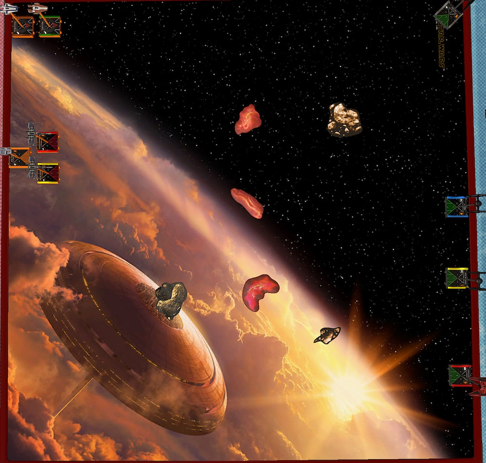
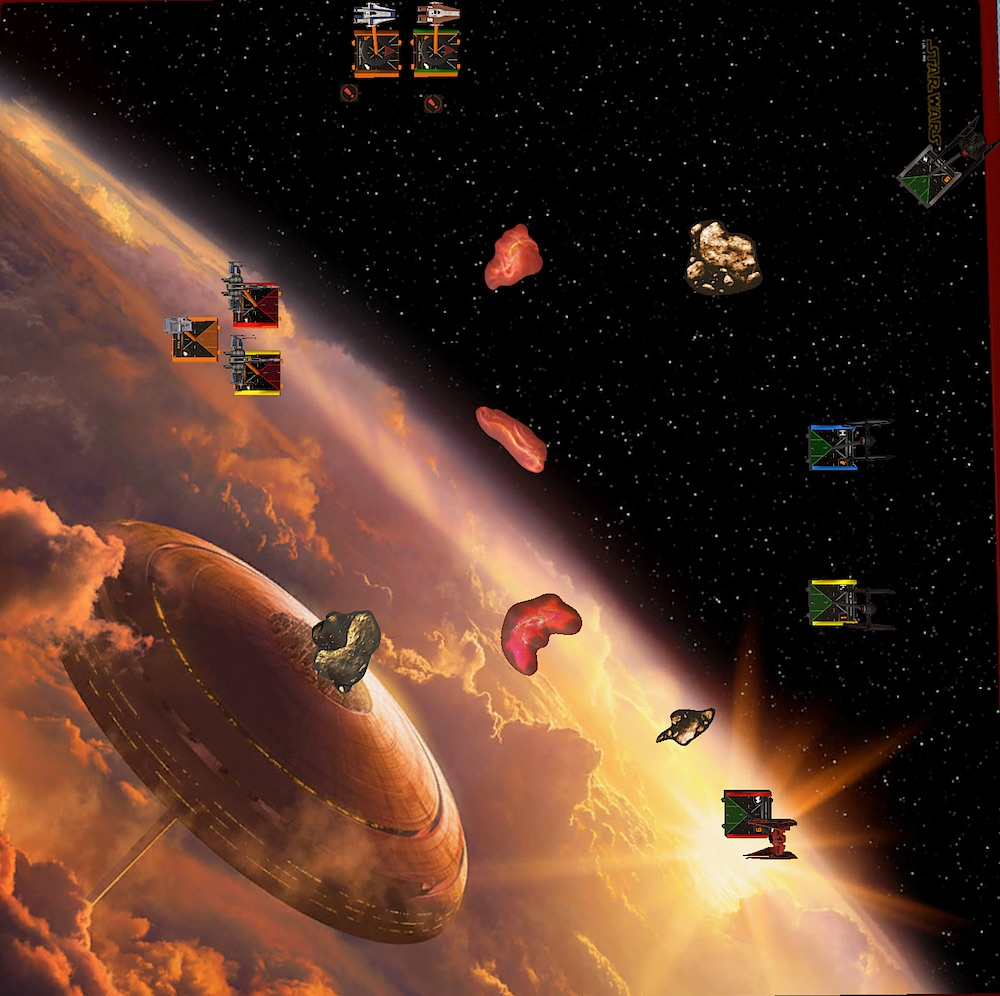
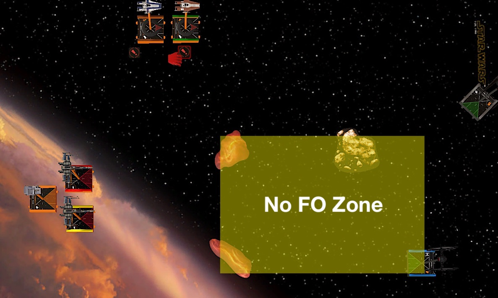
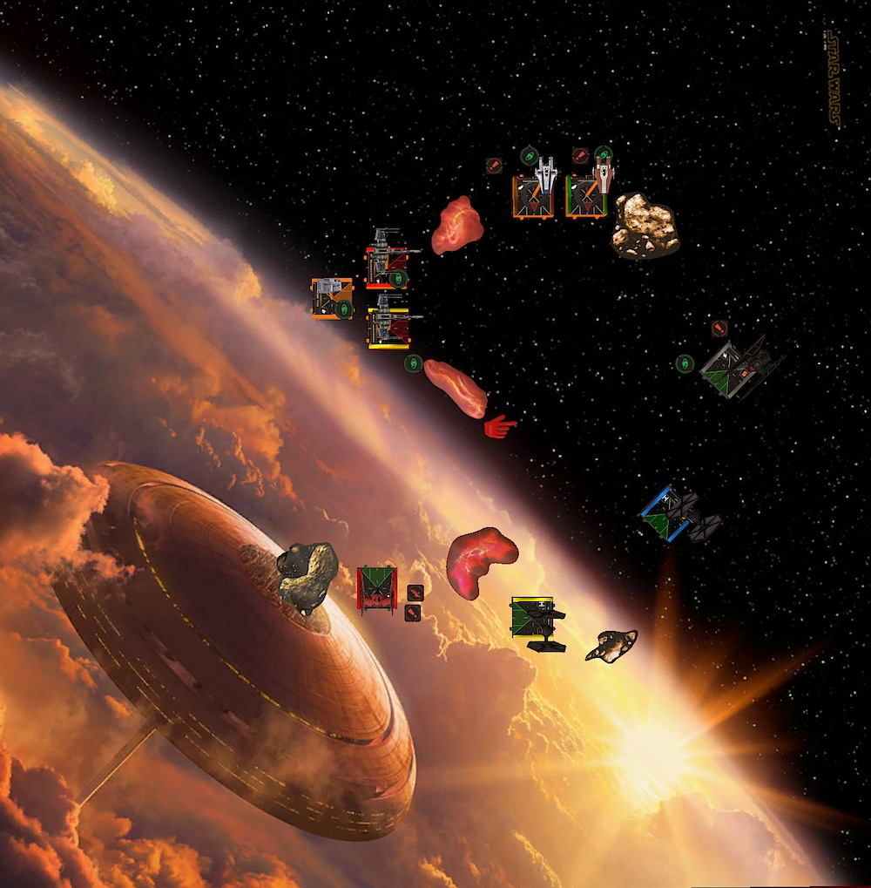
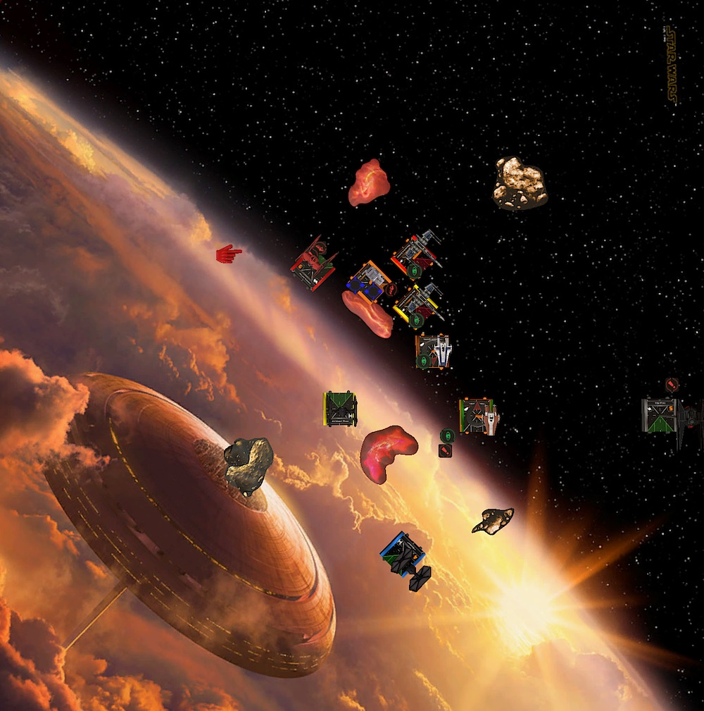

We a currently have a scorching 35°C heatwave in southern Germany. I usually enjoy this kind of weather. Especially if I can lie at the pool with a cold beverage in hand. But to play X-Wing in front a computer? Not a fan.

Fortunately my opponents are usually very happy to play late in the evening when the kids are asleep. And so Philipp, my opponent for this week, and I met when the climate is tolerable after 9 pm.

## Lists

Because of the way too hot weather and some private matters I didn't really had time and energy to prepare a new list for this week. I still enjoy flying the "two aces backed up by two blockers" style of list, but wanted to try something different for a change. Last week I feld a bit exhausted flying the list and made some really bad decissions.

On the other hand, even though I am losing a lot with the list, flying it is the only way to get better at flying aces. Thus I am sticking with it, maybe even for the rest of the tournament.

I tried Deuterium Power Cells last week, which was really underwhelming. That's why I decided to give another underwhelming thing a chance, Scorch. He still feels expensive (33 points) for being an I4 cadet most of the time. His ability looks great on paper, but the additional dice is only great if you have mods.

Maybe he rather wants to be in a efficieny list than to be a blocker in a ace-y list. I don't know. I'll give him another chance. And because I am at 193, he will also get a Crack Shot.

<XWS list={{"description":"","faction":"firstorder","name":"Unnamed Squadron","pilots":[{"id":"majorvonreg","name":"majorvonreg","points":57,"ship":"tiebainterceptor","upgrades":{"talent":["daredevil"]}},{"id":"kyloren","name":"kyloren","points":76,"ship":"tievnsilencer"},{"id":"scorch","name":"scorch","points":35,"ship":"tiefofighter","upgrades":{"talent":["crackshot"]}},{"id":"lieutenantrivas","name":"lieutenantrivas","points":27,"ship":"tiefofighter"}],"points":195,"vendor":{"yasb":{"builder":"Yet Another Squad Builder 2.0","builder_url":"https://raithos.github.io/","link":"https://raithos.github.io/?f=First%20Order&d=v8ZsZ200Z381X117WWWY236XWWWY262X116WWY265XW&sn=Unnamed%20Squadron&obs=coreasteroid5,core2asteroid5,gascloud4"}},"version":"2.0.0","obstacles":["coreasteroid5","core2asteroid5","gascloud4"]}}/>

Philipp brought a Resistance list that wants to joust. I must say I am very intrigued by his list. Two generic I3 T-70s plus Rose in the pod form a great tanky block with a lot of fire power. Flying Rose behind the X-Wings will give her at least to re-rolls.

Depending on the opposing squad, the two A-Wing can help with the joust or flank. A-Wing are also annoyingly efficient with their rotation arc and Advanced Optics. There is basically no way that they won't have a shot with two hits.

The list looks like quantitiy is king. But that five ships are very effective and efficient. Three of the five ships, Rose and the A-Wings, will always deliver at least two damage. The X-Wings are the back bone of the squad and can also dish out some real hurt. You definitely don't want to land in front of them.

<XWS list={{"description":"","faction":"resistance","name":"Unnamed Squadron","pilots":[{"id":"redsquadronexpert","name":"redsquadronexpert","points":45,"ship":"t70xwing","upgrades":{"talent":["heroic"],"configuration":["integratedsfoils"]}},{"id":"redsquadronexpert","name":"redsquadronexpert","points":45,"ship":"t70xwing","upgrades":{"talent":["heroic"],"configuration":["integratedsfoils"]}},{"id":"rosetico","name":"rosetico","points":28,"ship":"resistancetransportpod","upgrades":{"talent":["crackshot"]}},{"id":"greersonnel","name":"greersonnel","points":41,"ship":"rz2awing","upgrades":{"talent":["heroic"],"tech":["advancedoptics"]}},{"id":"tallissanlintra","name":"tallissanlintra","points":41,"ship":"rz2awing","upgrades":{"talent":["heroic"],"tech":["advancedoptics"]}}],"points":200,"vendor":{"yasb":{"builder":"Yet Another Squad Builder 2.0","builder_url":"https://raithos.github.io/","link":"https://raithos.github.io/?f=Resistance&d=v8ZsZ200Z257X172WWW175WWWY257X172WWW175WWWY345X116WWWY270X172WWW186Y240X172WWW186&sn=Unnamed%20Squadron&obs="}},"version":"2.0.0"}}/>

For my list, obstacle placement is key. I really need to try to make a tight obstacle field so that there are no easy lanes for Rose and her two body guards. If it is possible I want to avoid fighting them and instead go after the A-Wings.

This is not going to be easy for Kylo and Vonreg. There are a lot of arcs to dodge. My aces certainly will be under fire, especially from the A-Wings. And despite the A-Wing only have 4 total health, it is behind a three green dice defense. I need modded shots at them to do damage.

## Turn 0

I win the bid since Philipp's squad comes it at a 200. I let him be first player so Kylo can move after Talli and Scorch after Greer. The later is not really important and maybe even bad, since the two TIEs are blockers and distraction rather than aces.

Philipp brought two clouds and a small rock. I have my usual two large rocks and the croissant cloud. The first obstacle, one of the rocks, is placed on my side of the board at range 2 of the board edges. 

With his jousting list, Philipp is of course trying to have the obstacles scattered all over the board. I try to prevent easy lanes and create a dense area in the middle of the board.

I put the last obstale right next to the first placed rock, which creates a vertical line of clouds in the middle and rocks on opposing sides of the board.

Turn 0 didn't turned out to be bad for me. I actually got what I wanted. I would rather have rocks in the middle of the board instead of clouds, but at least there are obstacles in the Resistance's way.

Philipp put the two X-Wings and Rose so that they can fly between the nothern gap of two gas clouds. The A-Wing protecting the flank. This is a really good and scary setup for me. I bascially have only one way in.

Because I had to put down Rivas before all the Resistance ships, he was kinda stranded in the middle of nowhere. And so was Scorch. Both have a lot of no mans land in front of them with no cover from obstacles.

I expected Philipp to put down his ball of death, Rose and her T-70 escort, on one of the sourthern lanes. Either all the way down, with the northern flank protected by the three obstacles, or to take the gap between the southern and middle gas cloud.

Kylo plays bait as usual. I deploy him facing the A-Wings. Vonreg gets to do his favorite thing, flank.

## Turn 1

Before we deployed our forces my plan was to get Talli or Greer and ignore the rest of the squad as good as possible but the way Philipp setup his ships would make that really hard.

I definitely didn't want to joust the whole Resistance squad at once. Hence I had to try to deceive the Ristance to spread out first and then try to catch either one of the groups.

This meant letting the Resistance come to me. Two straights for everyone. The First Order version of the Rebel's one straights. Only Vonreg advanced further with a follow up boost.

Rose and escort started their way towards the middle of the board with a three straight. The A-Wings on the other hand move a bit faster and even boosted down further.

Seeing that I chose to barrel roll away from the A-Wings with Kylo. He could go either way next turn. Flee or face the A-Wings.

## Turn 2

The Resistance's movement suggested that they would try to collapse somewhere between the two gas clouds and the upper left rock. So my plan was to avoid this zone as much as possible with the FOs.

Because both of the FOs where in a spot where they could land a block they turned away from the "No FO Zone". To not the shot at, Rivas even tried to be an aces and barrel rolled after a three straight behind a cloud. He would have to make his way around the cloud next turn.

Vonreg rushed forward and used a double reposition to land in the lane between the sourtern rock and gas cloud. Philipp was a little bit caught of guard how fast the little interceptor could close in on his squad.

Now to the hard part. The part I really struggle with. *What ... to ... do  ... with Kylo?!*

During the game I saw two options for Kylo.

1. *Run!* Fly along my own board edge because I am scared of the A-Wings doing another fast straight maneuver allowing them to shot at Kylo.
1. *Show them who's boss!* Do a hard one to fight Talli and Greer head on.

I was thinking about both options so hard and long that I felt I was taking too long to set dials. So I decided to go with option 3. Just dial in a five straight. That is something in between my options and the dumbest thinkg I could have done.

Writing this battle report and seeing the positions on the board, turning in on the A-Wings with a hard one is the best option for Kylo here. At least in my very inexperienced opinion.

Let my explain why I think there is no argument for doing another maneuver with Kylo here:

- The Resistance's main damage dealers, Rose and the T-70s, are far away. The fastest they can go is a three straight because of Rose. There is no way Philipp would leave her behind.
- Even if the A-Wings would have gone fast again, Kylo moves after both and with a barrel roll and boost he still could have arc dodged at least one of them. Only have one incoming range one shot.
- If the A-Wings go fast and close in on Kylo, shooting at range one at things with Kylo is good. Really good.
- If the A-Wings don't fly towards Kylo and rather turn into the "No FO Zone". Even better. Kylo would have free rein on them.
- There are plenty of escape routes for Kylo next round. A five straight most certainly will get him out of trouble.

All scenarios are very acceptable. But at the time I forgot who slow pods are and I was more afraid of the A-Wings than I should have been. Of course they are no joke, but RZ-2s are great because of their meuverability and consistent damage out put. Kylo is too! Plus he can tank a shot or two. Something an A-Wing is not good at.

... anyway, back to the game. So, what did Philipp do!?

Rose and escort flew another three straight and the A-Wings both three banked and boosted to perfectly fit into the space between the gas cloud and the rock.

Flipping that five straight with Kylo felt horrible. Especially because I had to barrel roll towards my board edge and take a focus for additional safety.

Fortunately I still dodged most of the arcs with Kylo. Only Greer and the yellow X-Wing had some range three shots at him. Spending the focus and a force prevented any damage.

In return, Vonreg had a shot at Yellow but missed.

## Turn 3

Now that Kylo survived the first round of shots thanks to finally some paint on defense (I am really good at rolling blanks for Kylo), the question became how fast Philipp will turn in.

Either way, Kylo would not push his luck any further and fly along my board edge. Scorch was trying to get out of trouble with a five straight. Rivas ignored the cloud and three banked over it to get some shots and maybe get some blocks in next turn.

Vonreg was in a very prime position. Another fast straight maneuver would not allow Philipp to shot at him and furthermore allow Vonreg to get another shot thanks to a Daredevil boost.

Trying to cover any angle, the T-70s and Rose banked right. Rose landed on the cloud, straining herself. Greer and Talli flew straight, tailing Scorch and blocking Kylo's five straight. Greer even boosted and turned his arc backwards.

I originally didn't want to shot Rose because even though she has only four total health and two agility her rerolls make it hard to get damage through. She basically evades two damage all the time.

Having said that, she was strained and Vonreg could get a single modded shot at her. I couldn't up that chance.

With the target lock Vonreg acquired two hits and a crit. Rose was left with one hull left and fuel leak. Rivas had also a shot at Rose. Although only two attack dice against Rose means no damage.

Rose and Talli shot at Scorch. Scorch hat five dice for defense due to range three and obstruction. The Resistance pilots couldn't get any damage through. The same was true for the red T-70. The only one with a shot at Kylo.

And so, after round three I was in the lead with a whopping 14 points! 

## Turn 4