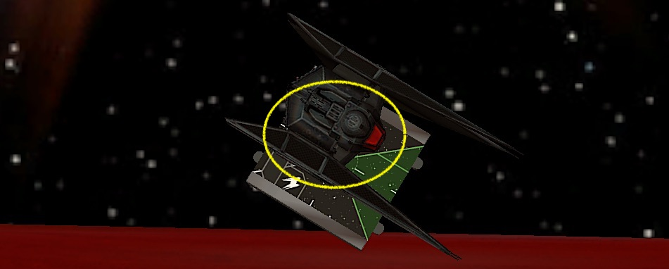

We a currently have a scorching 35°C heatwave in southern Germany. I usually enjoy this kind of weather. Especially if I can lie at the pool with a cold beverage in hand. But to play X-Wing in front a computer? Not a fan.

Fortunately my opponents are usually very happy to play late in the evening when the kids are asleep. And so Philipp, my opponent for this week, and I met when the climate is tolerable after 9 pm.

## Lists

Because of the way too hot weather and some private matters I didn't really had time and energy to prepare a new list for this week. I still enjoy flying the "two aces backed up by two blockers" style of list, but wanted to try something different for a change. Last week I feld a bit exhausted flying the list and made some really bad decissions.

On the other hand, even though I am losing a lot with the list, flying it is the only way to get better at flying aces. Thus I am sticking with it, maybe even for the rest of the tournament.

I tried Deuterium Power Cells last week, which was really underwhelming. That's why I decided to give another underwhelming thing a chance, Scorch. He still feels expensive (33 points) for being an I4 cadet most of the time. His ability looks great on paper, but the additional dice is only great if you have mods.

Maybe he rather wants to be in a efficieny list than to be a blocker in a ace-y list. I don't know. I'll give him another chance. And because I am at 193, he will also get a Crack Shot.

<XWS list={{"description":"","faction":"firstorder","name":"Unnamed Squadron","pilots":[{"id":"majorvonreg","name":"majorvonreg","points":57,"ship":"tiebainterceptor","upgrades":{"talent":["daredevil"]}},{"id":"kyloren","name":"kyloren","points":76,"ship":"tievnsilencer"},{"id":"scorch","name":"scorch","points":35,"ship":"tiefofighter","upgrades":{"talent":["crackshot"]}},{"id":"lieutenantrivas","name":"lieutenantrivas","points":27,"ship":"tiefofighter"}],"points":195,"vendor":{"yasb":{"builder":"Yet Another Squad Builder 2.0","builder_url":"https://raithos.github.io/","link":"https://raithos.github.io/?f=First%20Order&d=v8ZsZ200Z381X117WWWY236XWWWY262X116WWY265XW&sn=Unnamed%20Squadron&obs=coreasteroid5,core2asteroid5,gascloud4"}},"version":"2.0.0","obstacles":["coreasteroid5","core2asteroid5","gascloud4"]}}/>

Philipp brought a Resistance list that wants to joust. I must say I am very intrigued by his list. Two generic I3 T-70s plus Rose in the pod form a great tanky block with a lot of fire power. Flying Rose behind the X-Wings will give her at least to re-rolls.

Depending on the opposing squad, the two A-Wing can help with the joust or flank. A-Wing are also annoyingly efficient with their rotation arc and Advanced Optics. There is basically no way that they won't have a shot with two hits.

The list looks like quantitiy is king. But that five ships are very effective and efficient. Three of the five ships, Rose and the A-Wings, will always deliver at least two damage. The X-Wings are the back bone of the squad and can also dish out some real hurt. You definitely don't want to land in front of them.

<XWS list={{"description":"","faction":"resistance","name":"Unnamed Squadron","pilots":[{"id":"redsquadronexpert","name":"redsquadronexpert","points":45,"ship":"t70xwing","upgrades":{"talent":["heroic"],"configuration":["integratedsfoils"]}},{"id":"redsquadronexpert","name":"redsquadronexpert","points":45,"ship":"t70xwing","upgrades":{"talent":["heroic"],"configuration":["integratedsfoils"]}},{"id":"rosetico","name":"rosetico","points":28,"ship":"resistancetransportpod","upgrades":{"talent":["crackshot"]}},{"id":"greersonnel","name":"greersonnel","points":41,"ship":"rz2awing","upgrades":{"talent":["heroic"],"tech":["advancedoptics"]}},{"id":"tallissanlintra","name":"tallissanlintra","points":41,"ship":"rz2awing","upgrades":{"talent":["heroic"],"tech":["advancedoptics"]}}],"points":200,"vendor":{"yasb":{"builder":"Yet Another Squad Builder 2.0","builder_url":"https://raithos.github.io/","link":"https://raithos.github.io/?f=Resistance&d=v8ZsZ200Z257X172WWW175WWWY257X172WWW175WWWY345X116WWWY270X172WWW186Y240X172WWW186&sn=Unnamed%20Squadron&obs="}},"version":"2.0.0"}}/>

For my list, obstacle placement is key. I really need to try to make a tight obstacle field so that there are no easy lanes for Rose and her two body guards. If it is possible I want to avoid fighting them and instead go after the A-Wings.

This is not going to be easy for Kylo and Vonreg. There are a lot of arcs to dodge. My aces certainly will be under fire, especially from the A-Wings. And despite the A-Wing only have 4 total health, it is behind a three green dice defense. I need modded shots at them to do damage.

## Turn 0

I win the bid since Philipp's squad comes it at a 200. I let him be first player so Kylo can move after Talli and Scorch after Greer. The later is not really important and maybe even bad, since the two TIEs are blockers and distraction rather than aces.

Philipp brought two clouds and a small rock. I have my usual two large rocks and the croissant cloud. The first obstacle, one of the rocks, is placed on my side of the board at range 2 of the board edges. 

With his jousting list, Philipp is of course trying to have the obstacles scattered all over the board. I try to prevent easy lanes and create a dense area in the middle of the board.

I put the last obstale right next to the first placed rock, which creates a vertical line of clouds in the middle and rocks on opposing sides of the board.

Turn 0 didn't turned out to be bad for me. I actually got what I wanted. I would rather have rocks in the middle of the board instead of clouds, but at least there are obstacles in the Resistance's way.

Philipp put the two X-Wings and Rose so that they can fly between the nothern gap of two gas clouds. The A-Wing protecting the flank. This is a really good and scary setup for me. I bascially have only one way in.

Because I had to put down Rivas before all the Resistance ships, he was kinda stranded in the middle of nowhere. And so was Scorch. Both have a lot of no mans land in front of them with no cover from obstacles.

I expected Philipp to put down his ball of death, Rose and her T-70 escort, on one of the sourthern lanes. Either all the way down, with the northern flank protected by the three obstacles, or to take the gap between the southern and middle gas cloud.

Kylo plays bait as usual. I deploy him facing the A-Wings. Vonreg gets to do his favorite thing, flank.

## Turn 1

Before we deployed our forces my plan was to get Talli or Greer and ignore the rest of the squad as good as possible but the way Philipp setup his ships would make that really hard.

I definitely didn't want to joust the whole Resistance squad at once. Hence I had to try to deceive the Ristance to spread out first and then try to catch either one of the groups.

This meant letting the Resistance come to me. Two straights for everyone. The First Order version of the Rebel's one straights. Only Vonreg advanced further with a follow up boost.

Rose and escort started their way towards the middle of the board with a three straight. The A-Wings on the other hand move a bit faster and even boosted down further.

Seeing that I chose to barrel roll away from the A-Wings with Kylo. He could go either way next turn. Flee or face the A-Wings.

## Turn 2

The Resistance's movement suggested that they would try to collapse somewhere between the two gas clouds and the upper left rock. So my plan was to avoid this zone as much as possible with the FOs.

Because both of the FOs where in a spot where they could land a block they turned away from the "No FO Zone". To not the shot at, Rivas even tried to be an aces and barrel rolled after a three straight behind a cloud. He would have to make his way around the cloud next turn.

Vonreg rushed forward and used a double reposition to land in the lane between the sourtern rock and gas cloud. Philipp was a little bit caught of guard how fast the little interceptor could close in on his squad.

Now to the hard part. The part I really struggle with. *What ... to ... do  ... with Kylo?!*

During the game I saw two options for Kylo.

1. *Run!* Fly along my own board edge because I am scared of the A-Wings doing another fast straight maneuver allowing them to shot at Kylo.
1. *Show them who's boss!* Do a hard one to fight Talli and Greer head on.

I was thinking about both options so hard and long that I felt I was taking too long to set dials. So I decided to go with option 3. Just dial in a five straight. That is something in between my options and the dumbest thinkg I could have done.

Writing this battle report and seeing the positions on the board, turning in on the A-Wings with a hard one is the best option for Kylo here. At least in my very inexperienced opinion.

Let my explain why I think there is no argument for doing another maneuver with Kylo here:

- The Resistance's main damage dealers, Rose and the T-70s, are far away. The fastest they can go is a three straight because of Rose. There is no way Philipp would leave her behind.
- Even if the A-Wings would have gone fast again, Kylo moves after both and with a barrel roll and boost he still could have arc dodged at least one of them. Only have one incoming range one shot.
- If the A-Wings go fast and close in on Kylo, shooting at range one at things with Kylo is good. Really good.
- If the A-Wings don't fly towards Kylo and rather turn into the "No FO Zone". Even better. Kylo would have free rein on them.
- There are plenty of escape routes for Kylo next round. A five straight most certainly will get him out of trouble.

All scenarios are very acceptable. But at the time I forgot who slow pods are and I was more afraid of the A-Wings than I should have been. Of course they are no joke, but RZ-2s are great because of their meuverability and consistent damage out put. Kylo is too! Plus he can tank a shot or two. Something an A-Wing is not good at.

... anyway, back to the game. So, what did Philipp do!?

Rose and escort flew another three straight and the A-Wings both three banked and boosted to perfectly fit into the space between the gas cloud and the rock.

Flipping that five straight with Kylo felt horrible. Especially because I had to barrel roll towards my board edge and take a focus for additional safety.

Fortunately I still dodged most of the arcs with Kylo. Only Greer and the yellow X-Wing had some range three shots at him. Spending the focus and a force prevented any damage.

In return, Vonreg had a shot at Yellow but missed.

## Turn 3

Now that Kylo survived the first round of shots thanks to finally some paint on defense (I am really good at rolling blanks for him), the question became how fast Philipp will turn in.

Either way, Kylo would not push his luck any further and fly along my board edge this time. Scorch was trying to get out of trouble with a five straight. Rivas ignored the cloud and three banked over it to get some shots and maybe get some blocks in next turn.

There was also the option to do a hard turn towards the "No FO Zone" with Kylo. This would have been very bad if Rose and the T-70s fly straight, but again, this would leave Philipp in a very awkward spot *if* Kylo wasn't turning in. Turning right was his only good option, especially because flying straight would also block most of the maneuvers from the A-Wings.

Vonreg was in a very prime position. Another fast straight maneuver would not allow Philipp to shot at him and furthermore allow Vonreg to get another shot thanks to a Daredevil boost.

Trying to cover any angle, the T-70s and Rose banked right. Rose landed on the cloud, straining herself. Greer and Talli flew straight, tailing Scorch and blocking Kylo's five straight. Greer even boosted and turned his arc backwards.

I originally didn't want to shot Rose because even though she has only four total health and two agility her rerolls make it hard to get damage through. She basically evades two damage all the time.

Having said that, she was strained and Vonreg could get a single modded shot at her. I couldn't up that chance.

With the target lock Vonreg acquired two hits and a crit. Rose was left with one hull left and fuel leak. Rivas had also a shot at Rose. Although only two attack dice against Rose means no damage.

Rose and Talli shot at Scorch. Scorch had five dice for defense due to range three and obstruction. The Resistance pilots couldn't get any damage through. The same was true for the red T-70. The only one with a shot at Kylo.

Since Kylo didn't lost any force this round, I used one charge to assign [ISYTDS](https://xwing-miniatures-second-edition.fandom.com/wiki/I'll_Show_You_The_Dark_Side) to the red T-70. Finding a Panicked Pilot was a real struggle.

And so, after round three I was in the lead with a whopping 14 points! 

## Turn 4

New turn, same story. Kylo had to run. It started to bother me that I didn't take any of the options the last two turns because this turn there was no option to turn and engage with Kylo. He also was running out of good options.

Kylo would try a two bank instead of going straight. There was a good chance that he would get blocked but this maneuver would give me better options the turn after this one, assuming Kylo would still live.

Vonreg and Rivas only had the option to hard one towards the Resistance squad. This would certainly leave them in almost no arcs. I expected Vonreg to get blocked though and not have a follow up shot at Rose. This was excalty the reason I didn't want to shoot at her in the first place.

Scorch k-turned to get into the fight next turn and have a shot at the A-Wings if they chose to follow him.

Philipp smartly bumped Rose into the T-70S in front of here. What an awesome move! Vonreg would bump into her, leaving her in none of my arcs.

The T-70s dashed fowards with a four straight, narrowing down the window for Kylo. Greer did a two hard plus boost. He landed in a great spot to block Kylo. Talli bumped into the T-70s with a three hard.

Kylo would be under even heavier fire than last turn. Philipp had three range 2 shots at him. This was meant to happen sooner or later and with the bank maneuver Kylo dodged at least the shot from Greer.

A two hard may have fit and leave Kylo between the T-70s and Greer. Maybe, juuuust maybe, a barrel roll plus boost would have get him out of the Resistance's arcs. Then again, the rock may have prevented that plan.

Tallie started the series with to natural hits. No need for optics or a focus token. Kylo countered with evade plus an eyeball which was converted into another evade.

It was time for the two T-70s of which both had a focus token and a range two shot at Kylo. I was in this situation with Kylo a couple of times in my league games. I tend to roll a lot of blanks in this situation and loose Kylo. To my amazement I rolled a lot of paint this time. Kylo had to spent his last force, but only lost *one* shield from the encounter.

That ended up way better than I aniticipated. If you believe in math and the dice calculator [this was actually the a very likely outcome](http://xwing.gateofstorms.net/2/multi/?d=IwAAAAAAAAAE&a1=IQAAAAAAAAAA&a2=MQgAAAAAAAAA&a3=MQgAAAAAAAAA). Huh, is Kylo usually harder to kill than I think?!

The Rest of the combat wasn't that eventful. Vonreg and Rivas failed to do any damage on the T-70s and Rose's shot through the cloud, even with three rerolls, only removed Riva's shield.

## Turn 5

Kylo survived the last round almost unscathed, however he wasn't out of trouble yet. Unlike Baby, Kylo let the Resistance put him in a corner. I considered going slow with a two straight or fast with a five straight. I chose the later.

I feared that Philipp would bank with the T-70s to get around the rock and with Greer undoubtedly setting up another block, Kylo would be staying to close to the X-Wings. Greer could also block the fast maneuver, but at least it would leave more distance between Kylo and his tail.

Beause time was running out and I expected to loose some points from Kylo, Rivas and Vonreg tried to get closer to the fight and catch an A-Wing. I chose to ignore ROse for now, because it would be very hard to get a good shot at her.

Scorch was far from any action and stressed. A three straight was the fasted he could go to clear his stress.

Rose flew another straight one, which got her right behind Rivas. The sad lieutenant bumped into a T-70 and hat no mods. Even his slowest maneuver was too fast.

The T-70s did a one hard and three hard respectively. The red X-Wing would have to fly over the rock next turn.

Greer set up a block for the five straight from Kylo, none of the T-70s had him in arc. Phew. Only Tallie, who turned away from Kylo, would have a shot at him. Phew.

Besides an uncontested Rose, my ships where all in an okay position. Vonreg and Rivas both had locked Tallie and in range one of her. Kylo was only at range three of one ship and even Scorch could dodge one of the T-70s. He would still receive two shots at range three though.

Vonreg pinged of a shield from Tallie. His four hits were no match for the A-Wings three-paint defense. Scorch's attack missed and so did Tallie's.

Greer and the red T-70 halfed Scorch. Unmodded green dice aren't that great. Rivas also made this experience. The range one shot from Rose removed him from the table. I blanked out and so the remaining three hull vanished.

This was real bad, since there was no second shot at Tallie anymore and Philipp got the lead with half points on Scorch and a destroyed Rivas.

14 to 45.

## Turn 6

To crawl my way back into this game, I had to destroy Tallie now. With only three ships left and limited amount of time playing catch with an A-Wing is not an easy task.

Tallie hat good options to escape. She could either bank to the left or turn to the right. Even a straight followed by a barrel roll and boost would get her out of the fight.

To get rid of the strain and cover any exit northern exit routes, Vonreg did a one hard.

Scorch was the only other gun available, so he flew straight through the cloud and covered any maneuvers towards my board edge from Tallie. Sadly that maneuver bumped him into Rose, so any shot would be unmodivied.

To my suprise and on accident, Philipp didn't do a blue maneuver with Tallie. He dialed in a one hard that also made the A-Wing bump into Rose.

It was time to finally get Kylo out of trouble with a hard one followed by a barrel roll. I also focused because I was afraid of incoming shots. Half points on Kylo would mean game over.

Fortunately for me, Philipp aniticipated another fast maneuver from Kylo. Greer and the T-70s tried to catch Kylo fleeing along the southern board edge, which he didn't.

The red T-70 also had to fly over the rock. He almost triggered ISYTDS for the first time in my X-Wing carrier!

Tallie and Greer were the only ones with shots and Kylo but failed to do any damage. Scorch activated. the four unmodded dice resulted in two hits. Not enought for the unmodded defense of an A-Wing.

## Turn 7

This was the last round and I was behind 31 points. Time to take some risks. Halfing Tallie and destorying Rose would be enough to get me the lead.

Rose turned towards Kylo. The T-70s also tried to get Kylo back in arc. They both did talon rolls. Greer on the other hand was too far away to do anything meaningful this round.

Scorch did a one hard, trying to catch Tallie on her way out. Vonreg did the same with a one bank. Tallie did a blue bank this time and landed directly in front of Scorch. Even Vonreg would have a shot through the rock at her thanks to a Daredevil boost.

And the dark lord Kylo? Well ... he was really stuck in the corner and stressed. The safe choice would be doing a hard one in the hopes that Rose would fly into his arc.

Unfortunately there was no time to play it safe. Philipp was in the lead and this was my last chance to get some points. A two hard from Kylo would clear his stress and definitely would bring Rose in range. I didn't expect her to fly towards Kylo at all.

I wasn’t a 100% sure that the two hard would fit, yet I felt that flying Kylo of the board in that situation wouldn't be that catastrophic. Philipp would stay ahead, if Kylo couldn't remove Rose. I saw my best chance for that to happen in it getting as close as I could to her last known location.

A dead Kylo doesn't matter if Rose would be out of range and we aren’t playing for MOV. It’s a binary outcome. Either I win or I loose. There is nothing in between.

So I dialed in the two hard, hoping it would fit.

[Womp, womp, womp.](https://www.youtube.com/watch?v=tKdcjJoXeEY) The two hard didn’t fit.

Scorch was able to ping of the last shield from Tallie. With Rose still alive this wouldn't matter though.

The game finished with a deserved 121 to 35 for Philipp. 

## Conclusion

