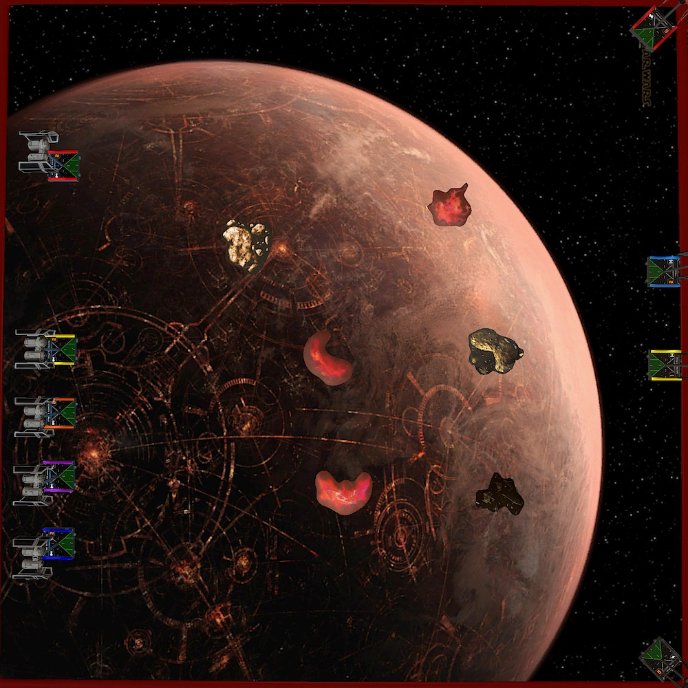
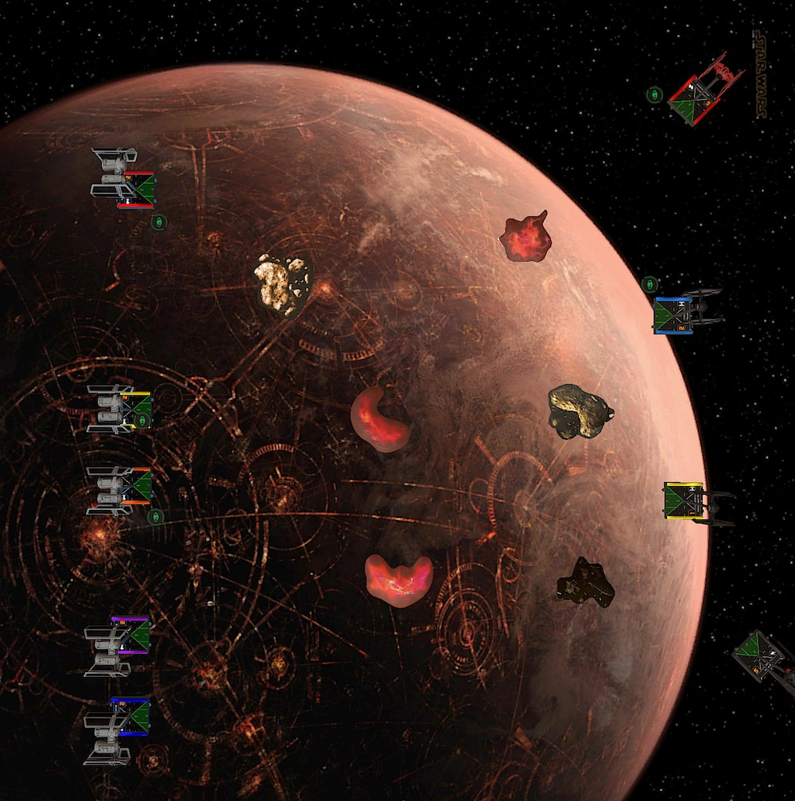
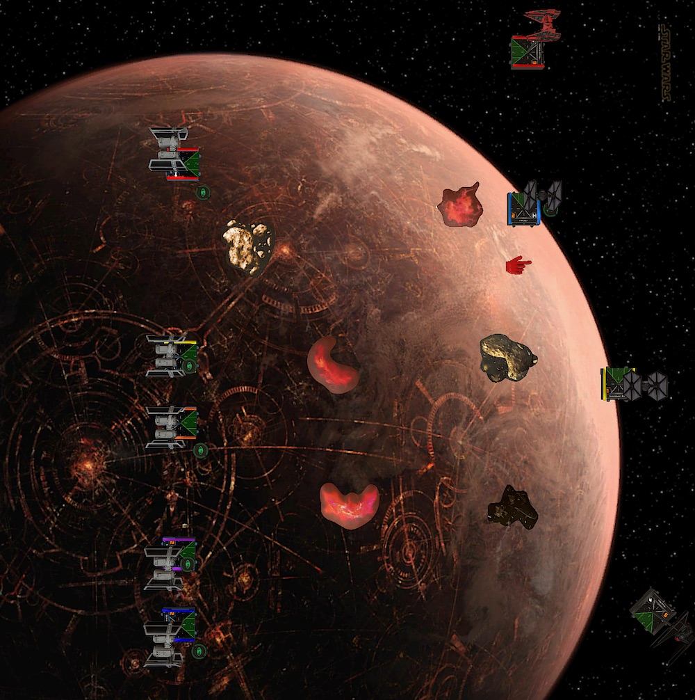
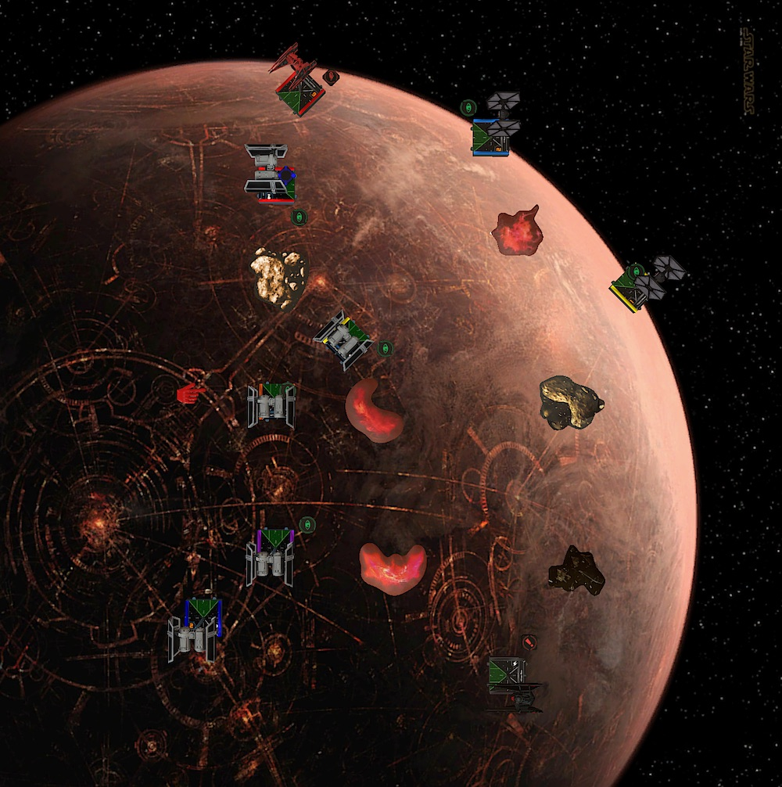
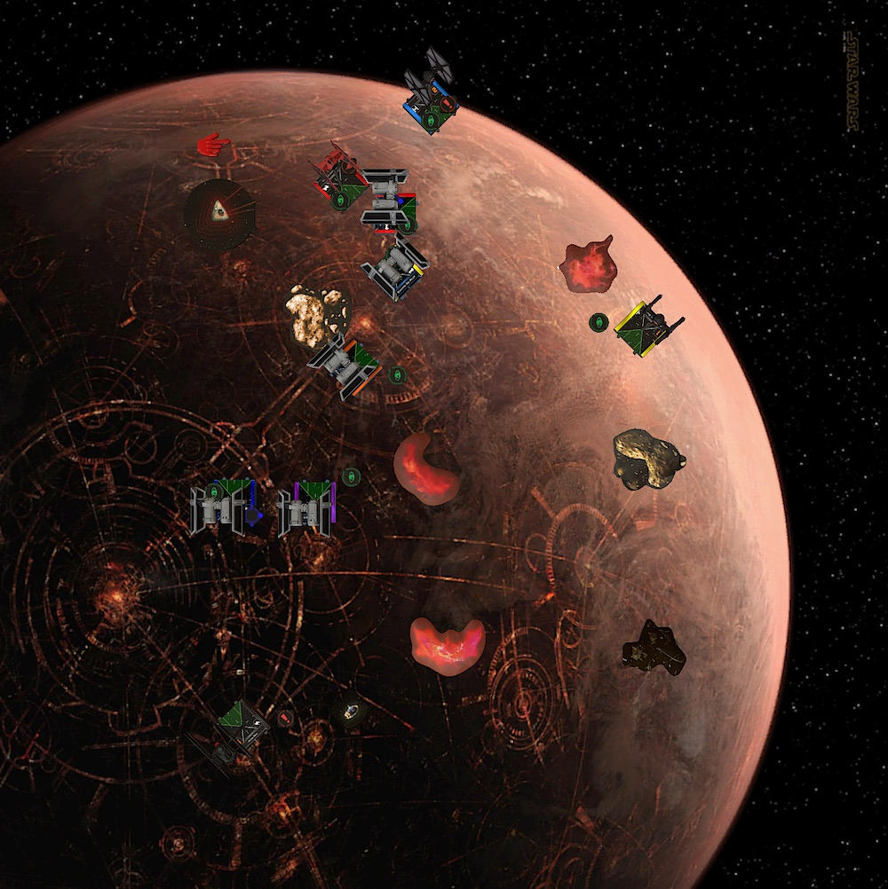
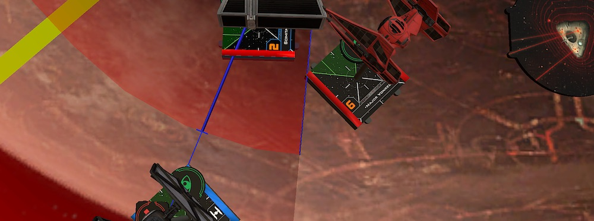
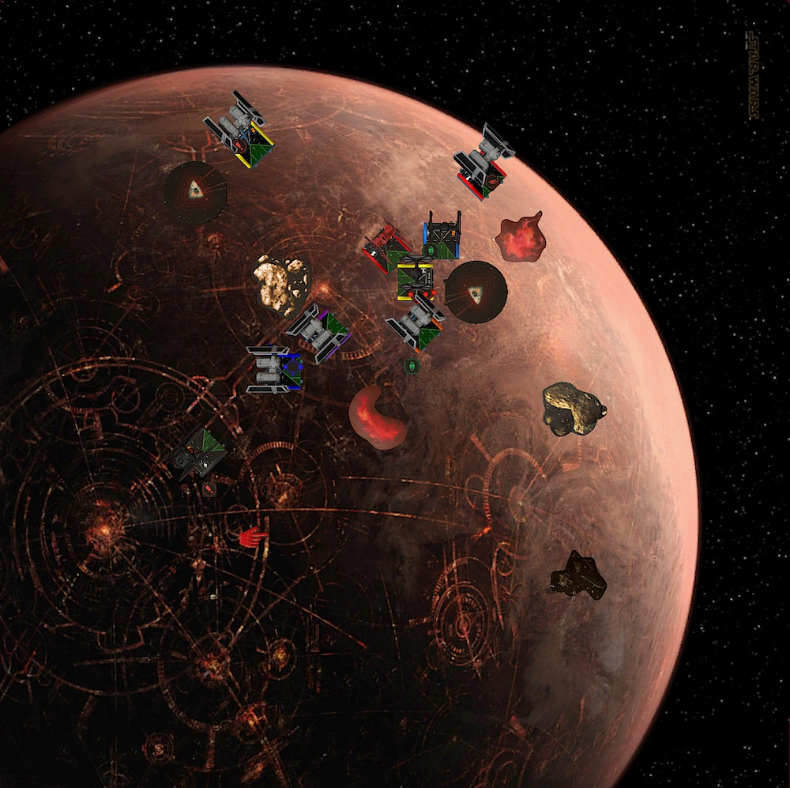
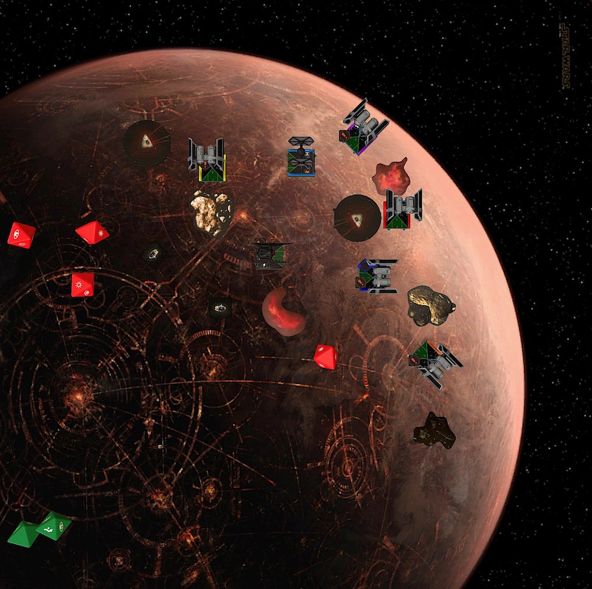

This week I have the pleasure to play against Sven, a pal from way up north. That's more than a 10 hour drive from where I live. We are basically located on opposite ends of Germany. There is no way we would ever have played X-Wing together. It would have been a pity to not met this cheerful and welcoming fellow.

## Lists

I am still committed to play Kylo, Vonreg and two TIE/fos. While it certainly isn't a top-tier squad, Kylo plus stuff seems to be the best the First Order has to offer. Besides, I want to get better at flying the Sith. The last couple of games showed me that I am really bad using him effectively.

For this week, Scorch gets benched again and Muse will take his place. She is a pretty self sufficient ship and with Proud Tradition she becomes even better. At least in theory.

She doesn't pack the occasional three to four dice punch that Scorch has, but the FOs in my list play more of a support role and, with the lower initiative, Muse will hopefully be a better blocker than Scorch. The focus while stressed is a nice bonus and hopefully will keep here alive longer if she sloops or k-turns.

The rest of the list stays the same. I wrote a lot about this list over the past couple weeks, so I am not going to repeat myself here.

<XWS list={{"description":"","faction":"firstorder","name":"Unnamed Squadron","pilots":[{"id":"majorvonreg","name":"majorvonreg","points":57,"ship":"tiebainterceptor","upgrades":{"talent":["daredevil"]}},{"id":"kyloren","name":"kyloren","points":76,"ship":"tievnsilencer"},{"id":"muse","name":"muse","points":32,"ship":"tiefofighter","upgrades":{"talent":["proudtradition"]}},{"id":"lieutenantrivas","name":"lieutenantrivas","points":27,"ship":"tiefofighter"}],"points":192,"vendor":{"yasb":{"builder":"Yet Another Squad Builder 2.0","builder_url":"https://raithos.github.io/","link":"https://raithos.github.io/?f=First%20Order&d=v8ZsZ200Z381X117WWWY236XWWWY235X319WWY265XW&sn=Unnamed%20Squadron&obs=coreasteroid5,core2asteroid5,gascloud4"}},"version":"2.0.0","obstacles":["coreasteroid5","core2asteroid5","gascloud4"]}}/>

Sven plays five TIE bombers. Loaded with mines and missiles. Munitions again, yay ... While I am not that concerned about the Cluster Missiles, but should have been, I already had the pleasure [in week two](../tts-league-s2-g2/) to experience Barrage Rockets. And I don’t like them!

<XWS list={{"description":"","faction":"galacticempire","name":"Unnamed Squadron","pilots":[{"id":"scimitarsquadronpilot","name":"scimitarsquadronpilot","points":44,"ship":"tiesabomber","upgrades":{"missile":["barragerockets"],"gunner":["skilledbombardier"],"device":["proximitymines"],"modification":["delayedfuses"]}},{"id":"scimitarsquadronpilot","name":"scimitarsquadronpilot","points":44,"ship":"tiesabomber","upgrades":{"missile":["barragerockets"],"gunner":["skilledbombardier"],"device":["proximitymines"],"modification":["delayedfuses"]}},{"id":"scimitarsquadronpilot","name":"scimitarsquadronpilot","points":44,"ship":"tiesabomber","upgrades":{"missile":["barragerockets"],"gunner":["skilledbombardier"],"device":["proximitymines"],"modification":["delayedfuses"]}},{"id":"scimitarsquadronpilot","name":"scimitarsquadronpilot","points":34,"ship":"tiesabomber","upgrades":{"missile":["clustermissiles"],"device":["seismiccharges"]}},{"id":"scimitarsquadronpilot","name":"scimitarsquadronpilot","points":34,"ship":"tiesabomber","upgrades":{"missile":["clustermissiles"],"device":["seismiccharges"]}}],"points":200,"vendor":{"yasb":{"builder":"Yet Another Squad Builder 2.0","builder_url":"https://raithos.github.io/","link":"https://raithos.github.io/?f=Galactic%20Empire&d=v8ZsZ200Z208XW97WW88W70WW236Y208XW97WW88W70WW236Y208XW97WW88W70WW236Y208XW98WWW71WWY208XW98WWW71WW&sn=Unnamed%20Squadron&obs="}},"version":"2.0.0"}}/> 

Facing a lot of munitions doesn't feel great with my squad. Except Kylo, all my ships have four total health and I usually need a turn to set up blocks with the FOs. If they get halved before they block, they most likely evaporate the next round.

Like the FOs, Vonreg can just pop by a long range missile shot. Because he is so fragile, I have to be extra careful with him. Barrage Rockets only require a focus to be fired. No extra setup needed. I absolutely don't want Vonreg to end up in range three of any focused bomber.

And as if this wasn't enough, even if I can dodge the missile attacks, the bombers can just plant prox mines behind them. Thanks to the Skilled Bombardiers even drop them at range two, with the bank templates. Ugh.

Sadly this also means that there most likely will be no cool Muse action. If I turn her behind a bomber she'll likely pop the next turn from a prox mine.

So the name of the game is range control. If I mess this up, I'll lose. Easy ...

Because of all the zoning Sven could enforce, my game plan was to try to catch one or two bombers and sacrifice my FOs in the process. Losing any of my aces would be real bad. There is just not enough time to catch up again.

## Turn 0

Letting Sven be the first player was the first mistake of the game. I am so used to playing Scorch that I forgot that Muse has the same initiative as the bombers. Yes, moving here after the bomber would let me do a turn maneuver plus focus thanks to Proud Tradition, but it would also mean that my only blocker is Rivas.

Because Sven brought Seismic Charges. I wanted to hide behind obstacles to soften the missile attacks. Thus we both wanted to have a tight obstacle field and so we ended up with two vertical lines of obstacles in the middle of the board.

I put down my squad the usual way. Kylo took the flank with the majority of the bombers. Vonreg took the opposite board edge.

Sven deployed his bombers in a row, occupying a lot of board space.

## Turn 1

Sven slowly walzed forward with his bombers. I did two straight with all of my ships. Kylo rolled back.

## Turn 2

Again, Sven dialed in one-straights for his bombers. Slowly but steadily closing in. Waiting for me to make a move.

I banked Vonreg and followed up with a barrel roll to threaten the flank. Both TIEs turned right to eventually support Vonreg and make room for Kylo.

The Sith did a one hard, followed by another roll back. He was hanging in the corner, waiting to pounce.

## Turn 3

The first two turns were very exciting and eventful, I know! But I tried to set up a flank for Kylo and/or Vonreg. That was maybe a little bit too ambitious, especially because my TIEs telegraphed where they wanted to go. They could not easily turn ... or could they?

I find it very interesting, seeing the board state a few days later, knowing what I did. Revisiting that turn now as a relatively neutral observer, it seems very obvious to me that my opponent knew what I could do and what not.

Besides Kylo, all my forces are facing north or, in Vonreg's case, are located at the northern board edge. It is very easy for my opponent to anticipate my next move or at least the trajectory of my ships.

And while I wanted my opponent to respond to my movement, because I wanted to open up Sven's formation for Kylo, it is not a great idea to follow through with it.

So let's first go ahead and find out what I did this turn and aferwards I'll share my foughts why this was dumb.

Both of my FOs tried to close the distance between them and the bombers. I expected the FOs to be under some fire, but I needed a turn to set up blocks. Muse tried to cover for Vonreg and flew a three-hard. Rivas did a three bank, landing in an awkward spot behind a gas cloud. Should have done a three hard with him instead.

Sven turned all his forces north to support the red bomber. Exactly what I expected. There were a few obstacles in his way, so even the nimble bombers would need one or two turns to close in on the northern flank and Vonreg.

Vonreg dashed forward with a five straight, followed by a boost and a lock on the red bomber for a deplete. The orange bomber might be in range to fire a barrage rocket at Vonreg so I didn't want to take any risks.

Kylo three banked, boosted and barrel rolled to get in range of the purple and blue bomber. Sven wisely barrel rolled the blue bomber towards his own board edge, but it wasn't enough he was still in range three of Kylo.

Vonreg's depleted range one shot resulted in two damage on the red bomber. He had no incoming shots in return. Orange was just barely not in range.

Instead Red and Yellow fired two Barrage Rockets into Muse, which halved her. She even got a Fuel Leak.

Kylo had a shot on purple. Two eyeballs and one blank wasn't that great of an outcome. I spent a force but nimble as he is, the bomber easily evaded the shot.

**The alternative Turn 3**

Now that we all know what I've done, here is what I, in my humble opinion, should have done.

*Because* I clearly advertised that I wanted to fly northbound with my squad, I should have just bailed. Sloop the FOs and one-hard Vonreg to fly all of them southbound along my board edge.

Not flanking with Vonreg and staying on my side of the board would have been fine either way.

If Sven would do one-straights again, he still had to fly through the obstacle field. There would have been enough time for my ships to react.

If Sven would have turned his forces facing Kylo, I would already have my ships turned in the correct direction and could help out Kylo with them. Vonreg could still flank and Kylo was protected by the gas cloud and the distance.

And if Sven would have turned his squad towards Vonreg, like he did, he would have to use the next turn to adjust the trajectory of his ships.

Wouldn't that have been awesome!?

...okay, back to the game. Let's see how I tried to dig myself out of this mess.

## Turn 4

Now that my aces closed in on the Imperial Squad, it was time for some bombs. Vonreg kept his distance from the red bomber, so I had two options. Any straight maneuver would for sure fly Vonreg over a prox mine. This left me with either a right or left turn.

A right turn would put Vonreg behind enemy lines, but leave him without any further shots at the red bomber, which was one hull away from half points. Doing a hard left on the other hand would give me another shot at the bomber and Vonreg was not in danger from a mine.

So I dialed in a hard left for Vonreg and Rivas. This maneuver would get the Lieutenant into position to cut off the incoming bombers next turn. And to get out of the red bomber's way, Muse would do a sloop in the hope that she would get the bomber in her arc.

Choosing Kylo's maneuver was easy since neither the blue nor the purple bomber had prox mines. They both had seismics and a five straight would leave Kylo far enough from any obstacle.

Before the ships activated it was time to drop the first bombs. As expected the red Bomber planted a Proximity Mine and Purple threw down a Seismic Charge.

Afterwards the red bomber slow-rolled again with a one straight. Yellow did a two hard, which just fit and didn't bumb the red bomber. Orange banked to get around the rock and the two Cluster Missiles carriers, blue and purple, flew a two straight.

I absolutely underestimated the quickness of the Imperial bombers. I didn't expect them to be able to surround Vonreg this turn. I thought they would need another turn to threaten him.

This was really bad. Even a reposition couldn't help. The barrel roll left was blocked by Muse and on the right side waited a prox mine to detonate. He was stuck in the middle of the bombers.

And to make things worse, every bomber except Red had a shot at him. Yes, even Orange had him in arc.

Before the havoc begins, Vonreg and Kylo fired at Red and Blue respectively. Vonreg acquired two hits and a crit on Red. With natty evades only the crit got through (Hull Breach). Kylo's results weren't any better thanks to some good defense dice. He only got one damage on Blue.

The FOs couldn't add any damage either. Muse didn't have the red bomber in her arc. Only Rivas had a shot at the orange bomber but missed.

When Sven started shooting at Vonreg I thought that this would be it for the baron, but to my astonishment he lived! I felt really sorry for Sven. My green dice were on fire this turn. With three regular shots and one Barrage Rockets the TIE bombers couldn't even get one damage on Vonreg. Phew.

## Turn 5

However this didn't mean that Vonreg was out of trouble. Because the red TIE only flew a one straight he could plant a prox mine directly under Vonreg. This would at least half the Baron and he still would have to escape from all the converging enemies.

Not fully recognizing the board state, something I really have to work on, I saw only one way out: flying a straight maneuver, even though this would most likely be blocked by the orange bomber.

What I didn't notice at the time is that a one hard left could not have been blocked by the yellow bomber. This would have been the better escape path. Second time I chose the wrong way to disengage.

Muse and Rivas only could fly towards the Imperial bombers. Rivas tried to set up a block and hopefully eat a prox mine for Vonreg, if the yellow bomber would drop any. Kylo chased the blue bomber.

The TIE bombers all tried to get their guns on Vonreg again. Yellow did a k-turn, Blue and Purple squeezed themself between the rock and the gas cloud. Only Red was a bit shy and flew towards my board edge. He had to avoid the prox mine.

Instead of the FOs being annoying and in the Imperial's way, three of the bombers had another perfect shot at Vonreg and besides Kylo all of my ships were surrounded by the TIE bombers. This was very inconvenient because the two bombers with the Cluster Missiles arrived.

It was bound to happen. Vonreg, already halved from the Proximity Mine, took both of the secondary attacks from the Cluster Missiles and popped.

Sven's primary target with the missiles was a very healthy Rivas. But he couldn't sustain the combined fire power. He lost all but one hull from the attack and suffered a Console Fire. His last hitpoint was lost to that crit. No more shots for him.

Kylo and Muse did their best to make up for the brutal loss. Kyo scored another three damage on the blue bomber. Muse, who was completely ignored this round, did one damage to Orange.

## Turn 6

With 100 to 39 and no time left I was out of the game. But the First Order doesn't surrender. Let's try to make the best out of the rest of this game.

The two bombers that carried the seismics were directly in front of Kylo. So chasing the blue bomber any further would mean damage from bombs. I was okay with that.

Muse, already at two hull, had no choice but to turn right. The prox mine ahead prevented any other maneuver.

Blue, Purple and Orange all k-turned to get turn their guns on Kylo and Muse. Red and Yellow still needed to avoid their own proximity Mines and couldn't really participate in the fight.

Kylo finally removed Blue from the board and because the bombers only had unmodded shots at Kylo, nothing stuck. Purple finished off Muse with an unmodded range one shot, though. Bad green dice. In return, Muse fired one last shot at Orange. All three hits landed and thanks to another damage from the Seismic Charge, I got half points for Yellow.

The game ended 116 to 78.

## Conclusion

This was my first game against TIE bomber and I must say that I completely underestimated them. The second green dice makes a big difference compared to a Y-Wing. I expected them to take damage easier.

They also have a good dial for ordnance carriers. I hoped that the obstacle field would occupy them more. I didn't assume they could close in that fast on Vonreg. He was surrounded in no time *and* I did a really bad job getting him out of there.

I was way too greedy with Vonreg. Because I only got two damage on the red bomber, one away from half, I wanted to stay on him. I rather should have left him alone and tried to get more damage on the hurt bomber with Rivas or Muse.

This game showed me the importance of knowing when to disengage. Especially with the TIE/ba, choosing poorly results in a dead baron. I had options to disengage. I just didn't use them.

Congratulations to Sven for being such a great opponent and overall nice guy ... and of course winning!