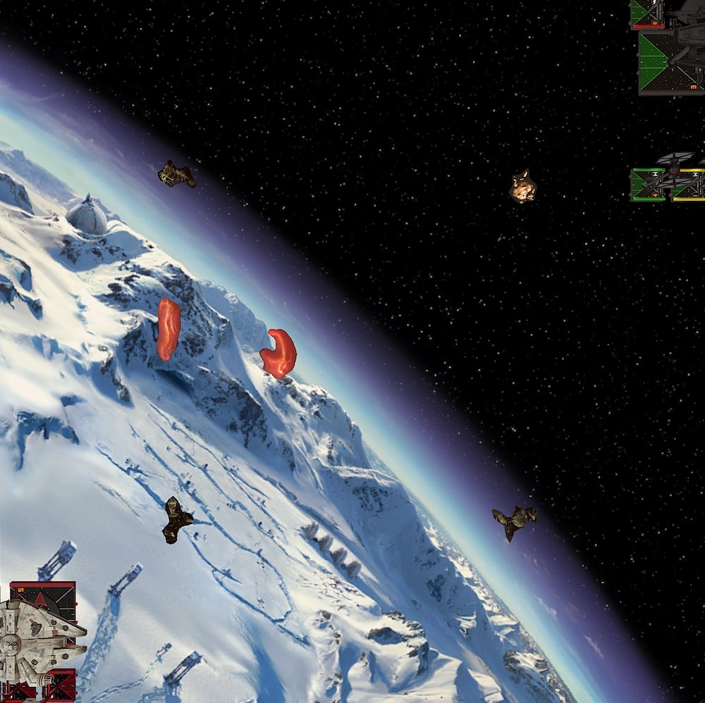
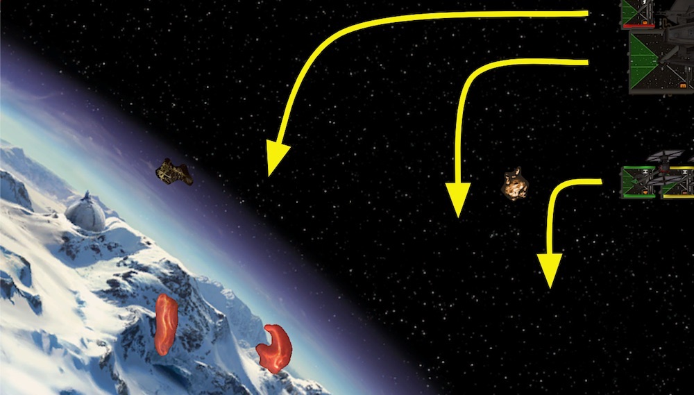
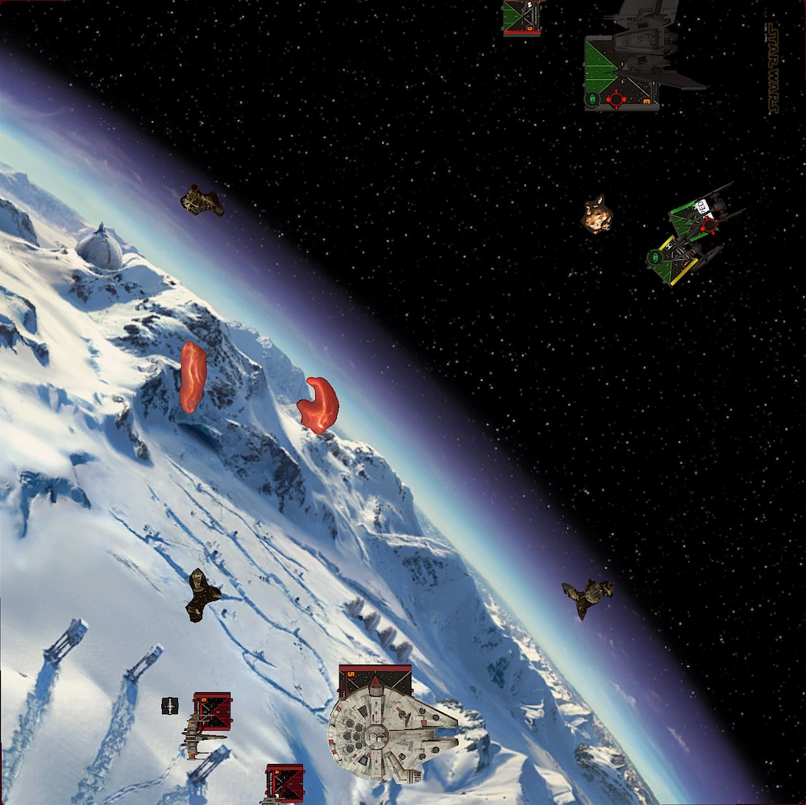
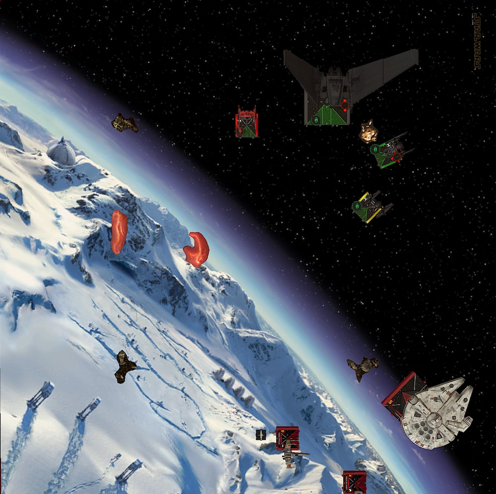

In the second to last week of the German TTS League my opponent, Torsten, comes from the German X-Wing capital Brunswick/Salzgitter. All the big events, like the German Grand Championship, takes place there. I on the other hand would have to drive over eight hours to get there. Must be nice, to live so close where all the X-Wing in Germany happens!

## Lists

For all my previous league games I played Kylo, Vonreg plus two FOs and had less than mediocre results. Partially because I am not a great pilot but also because the matchups I ran into weren't that great for the squad either.

Having to fight against lots of ordnance carriers and high health squads with a combined health of 18 is almost always an uphill battle. It is thought to do enough damage if you have to arc-dodge all the time and if one wrong move can lose you the game.

In addition, the list only has two real damage dealers in Kylo and Vonreg. One of them is always on the run since they are the only threats for the opponent. Sure the two FO blockers are annoying and can help the fleeing ace, but this also means that there is only one ship that deals damage.

You need a lot of X-Wing knowledge with the squad, considering that it doesn't have the punch to destroy a lot of the opponents ships in the given time. You only can take out a certain amount of peaces and have to trade accordingly. I just don't have the experience necessary to make those decission (yet).

So I did take a look at my short list of squads I wanted to try. With the Xi on the horizon I wanted to give the Upsilon another try. I played it when I started out playing X-Wing. Back then it was all about Tavson, Kylo and Quickdraw. A squard you don't really see this days anymore.

Tavson and Quickdraw apparently have fallen out of favor of most of the players, including myself. However Tavson is one of two Upsilon shuttles that are playable at the moment. Unlike other large base ships the Upsilons didn't saw any price reductions in the last points change.

Why FFG? Why!?

Besides Tavson, Thanisson popped up here and there. With Phasma as crew she defintely has potenital. The list I had in mind paired her with Daredevil Vonreg and three FOs.

<XWS list={{"description":"","faction":"firstorder","name":"Unnamed Squadron","pilots":[{"id":"majorvonreg","name":"majorvonreg","points":57,"ship":"tiebainterceptor","upgrades":{"talent":["daredevil"]}},{"id":"pettyofficerthanisson","name":"pettyofficerthanisson","points":65,"ship":"upsilonclassshuttle","upgrades":{"tech":["biohexacryptcodes"],"crew":["captainphasma"]}},{"id":"lieutenantrivas","name":"lieutenantrivas","points":27,"ship":"tiefofighter"},{"id":"epsilonsquadroncadet","name":"epsilonsquadroncadet","points":25,"ship":"tiefofighter"},{"id":"epsilonsquadroncadet","name":"epsilonsquadroncadet","points":25,"ship":"tiefofighter"}],"points":199,"vendor":{"yasb":{"builder":"Yet Another Squad Builder 2.0","builder_url":"https://raithos.github.io/","link":"https://raithos.github.io/?f=First%20Order&d=v8ZsZ200Z381X117WWWY281X202WW183WWWWWY265XWY269XWY269XW&sn=Unnamed%20Squadron&obs=core2asteroid2,gascloud2,gascloud3"}},"version":"2.0.0","obstacles":["core2asteroid2","gascloud2","gascloud3"]}}/>

While the list looks solid and the three FOs can make up for the Upsilon's greates weakness, flying past her, I am a little bit worried about all the single modded two-dice shots from the FOs. Even four dice when only single modded can have a lot of variance. 

Besides Tavson, the action economy of the Upsilon is really poor and so I am not confident that THanisson poses a big enough threat in that list.

Thanks to the [X-Wing discord server](https://discord.gg/Vg8gg7) I stumbled over Dave's Tavson/Phasma squad last month. That's Phasma *in the SF* not as a crew! I immediately was intrigued to try that combo.

<XWS list={{"description":"","faction":"firstorder","name":"Unnamed Squadron","pilots":[{"id":"majorvonreg","name":"majorvonreg","points":57,"ship":"tiebainterceptor","upgrades":{"talent":["daredevil"]}},{"id":"lieutenanttavson","name":"lieutenanttavson","points":64,"ship":"upsilonclassshuttle"},{"id":"captainphasma","name":"captainphasma","points":50,"ship":"tiesffighter","upgrades":{"talent":["fanatical"],"gunner":["specialforcesgunner"]}},{"id":"lieutenantrivas","name":"lieutenantrivas","points":27,"ship":"tiefofighter"}],"points":198,"vendor":{"yasb":{"builder":"Yet Another Squad Builder 2.0","builder_url":"https://raithos.github.io/","link":"https://raithos.github.io/?f=First%20Order&d=v8ZsZ200Z381X117WWWY289XWWWWWWWY385X181WWW182WWY265XW&sn=Unnamed%20Squadron&obs=core2asteroid2,gascloud2,gascloud3"}},"version":"2.0.0","obstacles":["core2asteroid2","gascloud2","gascloud3"]}}/>

A week ago there was also an [article by him](http://stayontheleader.blogspot.com/2020/08/first-order-orientation-what-to-fly.html), where he explains the squad:

> What I love most about this squad [..] is that it's got a bit of everything in it. I've got a blocker in Rivas, I've got an ace in Vonreg, I've got a jouster in Phasma and I've got a big gun shuttle in Tavson. But I've also got coordinate tricks, synergies to unlock between Phasma's ability and Tavson's ability, extra dice mods for Rivas and Vonreg, surprising Coordinate moves or Jam actions. It's only ever been a fun list to put on the table and just whizz about with and in the key Phasma/Tavson axis there's a real core of steel to the squad as well.

The squad presents a real puzzle for the opponent to crack. There is no obvious target.

Do you really want to waste shots at Rivas? Do you want to give Tavson free actions? No? But then you can't shoot a Phasma either ... so Vonreg? Eh, try to catch him while you been followed by nine red dice.

Instead of me having to come up with a good plan, I'll let my opponent agonize over the squad. That's nice for a change.

On the other side of the table, Torsten set up a Rebel list which I am quite familiar with. One of my locals, who put me up to participate in the league, plays a very similar squad. 

<XWS list={{"description":"","faction":"rebelalliance","name":"Unnamed Squadron","pilots":[{"id":"wedgeantilles","name":"wedgeantilles","points":57,"ship":"t65xwing","upgrades":{"talent":["crackshot"],"configuration":["servomotorsfoils"]}},{"id":"landocalrissian-modifiedyt1300lightfreighter","name":"landocalrissian-modifiedyt1300lightfreighter","points":86,"ship":"modifiedyt1300lightfreighter","upgrades":{"crew":["niennunb"],"title":["millenniumfalcon"]}},{"id":"roguesquadronescort","name":"roguesquadronescort","points":56,"ship":"ewing","upgrades":{"sensor":["firecontrolsystem"],"astromech":["r3astromech"]}}],"points":199,"vendor":{"yasb":{"builder":"Yet Another Squad Builder 2.0","builder_url":"https://raithos.github.io/","link":"https://raithos.github.io/?f=Rebel%20Alliance&d=v8ZsZ200Z5X116WWWW142Y43XWWW52WWWW154Y23XW113WW4W&sn=Unnamed%20Squadron&obs="}},"version":"2.0.0"}}/>

Wedge is a glass canon. Hits hards but dies fast under concentrated fire. Even though he is a I6, T-65s are good at jousting not arc dodgers since they don't have access to double repositions.

Since my game against three E-Wings I am really scared by them. This one doesn't carry any torps though. He will go in the fights with double mods, by aquiring locks before hand, but after the initial strike the ship isn't that intimidating anymore.

Sitting behind three defense dice with three health and shield, isn't something that goes down easily. Like Wedge, brinding down the Rogue Squadron will require me to focus him down.

The linchpin of the list is Lando. With Nien crew he will pass out actions to his fellow Rebels a lot. Blocking him and denying free actions is important. I don't want to deal with a double modded Wedge or a turtled E-Wing.

I know from experience that if an E-Wing has a focus and an evade, it is almost impossible to get damage through.

My priority target will be Wedge. I can not let him dish out damage uncontested. Besides blocking, Lando will be ignored for the most part. A healthy Falcon in the endgame is scary, but I hope that I can take out his wingmates fast enough, so that I still have enough fire power to deal with him later.

## Turn 0

I asked Dave (SOTL) what he brings as obstacles, so I just followed his advice and brought two small gas clouds and a small rock. The Upsilon needs space to fly and turn around. Unlike with my previous list, I don't want any obstacles cluttered around the center of the board.

Torsten packed three debris fields and had to start placing obstacles. I gave him first player so Vonreg would move after Wedge. This also means that Phasma will shoot after the E-Wing and potentially can have an additional mod thanks to a coordinate from Tavson, if everything works out as planned.

While we took turns placing down our obstacles I tried to create some lanes for the Upsilon by spreading out the obstacles and also "block" the board center with a gas cloud. A cloud in the middle of the board would make it easier to turn with the Upsilon.

I was very happy with the resulting obstacle field. There was enough room for my squad to fly where ever it wanted. The real obstacles, rocks and debris fields, were all located in the corners.

The Rebels were deployed in the south-west corner after I put down my squad in the opposite corner. I tugged Vonreg behind Tavons. The baron would take the long route and fly towards the gas clouds. If need be, he coul take cover there.

Tavson would occupy the middle of the board with Phasma and Rivas covering his left flank.

This formation should make it harder for the Rebels to fly past my shuttle and give me the maximum flexibility to react to their movement. Having more than one Rebel ship behind me was the worst case scenario.

## Turn 1

Tavson and Vonreg flew along the northern board edge. Tavson needed two turns to fly around the little rock so Rivas blocked Phasma to slow down my approach.

Unlike me slow rolling Torsten boosted forward with all his Rebels. The Falcon was leading the pack, already advancing halfway to my board edge. All ships were in a position to either turn in using the middle lane or to further fly down the southern board edge.

Using his Experimental Scanners the E-Wing aquired locks on Phasma and Tavson. No target lock on Vonreg? Nice!

## Turn 2

Expecting the Rebels to turn in and joust me, Phasma and Rivas turned their arcs towards the middle of the map. Tavson completed his trip around the rock, staring down the middle lane. Vonreg took the long road with a three bank and covering Tavons right flank.

To my suprise Torsten had no intention of joining me in the middle of the map. His whole squad flew further down the southern board edge, trying to circle around my ships. Lando even boosted to get into a better position for next round.

## Turn 3

- landos move is obvious, bank and hit my ships while flying by
- e-wing was next to the board edge, he can turn in but would land behind lando
- wedge is the only one with options, but a hard two wouldn't land himd behind the debris field. Would have to barrel roll, thus following lando is the post likely move

-> vr goes fast to flank
-> tavson one forward for victory (maximize his time on target)
-> phasma and Rivas turn, Rivas can not block, but maybe next time, also loosing him is not relevant, rather have shots on him than on Vonreg
-> phasma in front of tavson not ideal for the following turns but this is the only way she gets the rebels in arc and stays close to her damage sink