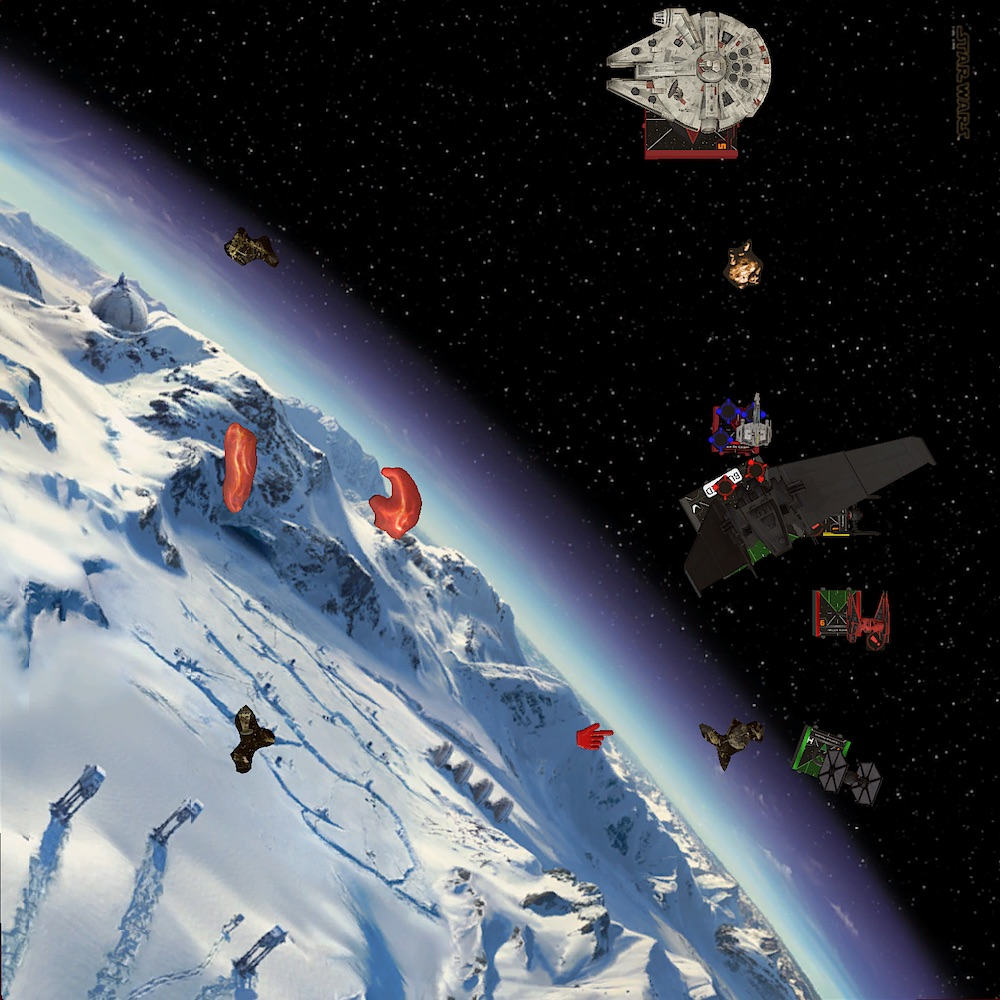

In the second to last week of the German TTS League my opponent, Torsten, comes from the German X-Wing capital Brunswick/Salzgitter. All the big events, like the German Grand Championship, takes place there. I on the other hand would have to drive over eight hours to get there. Must be nice, to live so close where all the X-Wing in Germany happens!

## Lists

For all my previous league games I played Kylo, Vonreg plus two FOs and had less than mediocre results. Partially because I am not a great pilot but also because the matchups I ran into weren't that great for the squad either.

Having to fight against lots of ordnance carriers and high health squads with a combined health of 18 is almost always an uphill battle. It is thought to do enough damage if you have to arc-dodge all the time and if one wrong move can lose you the game.

In addition, the list only has two real damage dealers in Kylo and Vonreg. One of them is always on the run since they are the only threats for the opponent. Sure the two FO blockers are annoying and can help the fleeing ace, but this also means that there is only one ship that deals damage.

You need a lot of X-Wing knowledge with the squad, considering that it doesn't have the punch to destroy a lot of the opponents ships in the given time. You only can take out a certain amount of peaces and have to trade accordingly. I just don't have the experience necessary to make those decission (yet).

So I did take a look at my short list of squads I wanted to try. With the Xi on the horizon I wanted to give the Upsilon another try. I played it when I started out playing X-Wing. Back then it was all about Tavson, Kylo and Quickdraw. A squard you don't really see this days anymore.

Tavson and Quickdraw apparently have fallen out of favor of most of the players, including myself. However Tavson is one of two Upsilon shuttles that are playable at the moment. Unlike other large base ships the Upsilons didn't saw any price reductions in the last points change.

Why FFG? Why!?

Besides Tavson, Thanisson popped up here and there. With Phasma as crew she defintely has potenital. The list I had in mind paired her with Daredevil Vonreg and three FOs.

<XWS list={{"description":"","faction":"firstorder","name":"Unnamed Squadron","pilots":[{"id":"majorvonreg","name":"majorvonreg","points":57,"ship":"tiebainterceptor","upgrades":{"talent":["daredevil"]}},{"id":"pettyofficerthanisson","name":"pettyofficerthanisson","points":65,"ship":"upsilonclassshuttle","upgrades":{"tech":["biohexacryptcodes"],"crew":["captainphasma"]}},{"id":"lieutenantrivas","name":"lieutenantrivas","points":27,"ship":"tiefofighter"},{"id":"epsilonsquadroncadet","name":"epsilonsquadroncadet","points":25,"ship":"tiefofighter"},{"id":"epsilonsquadroncadet","name":"epsilonsquadroncadet","points":25,"ship":"tiefofighter"}],"points":199,"vendor":{"yasb":{"builder":"Yet Another Squad Builder 2.0","builder_url":"https://raithos.github.io/","link":"https://raithos.github.io/?f=First%20Order&d=v8ZsZ200Z381X117WWWY281X202WW183WWWWWY265XWY269XWY269XW&sn=Unnamed%20Squadron&obs=core2asteroid2,gascloud2,gascloud3"}},"version":"2.0.0","obstacles":["core2asteroid2","gascloud2","gascloud3"]}}/>

While the list looks solid and the three FOs can make up for the Upsilon's greates weakness, flying past her, I am a little bit worried about all the single modded two-dice shots from the FOs. Even four dice when only single modded can have a lot of variance. 

Besides Tavson, the action economy of the Upsilon is really poor and so I am not confident that THanisson poses a big enough threat in that list.

Thanks to the [X-Wing discord server](https://discord.gg/Vg8gg7) I stumbled over Dave's Tavson/Phasma squad last month. That's Phasma *in the SF* not as a crew! I immediately was intrigued to try that combo.

<XWS list={{"description":"","faction":"firstorder","name":"Unnamed Squadron","pilots":[{"id":"majorvonreg","name":"majorvonreg","points":57,"ship":"tiebainterceptor","upgrades":{"talent":["daredevil"]}},{"id":"lieutenanttavson","name":"lieutenanttavson","points":64,"ship":"upsilonclassshuttle"},{"id":"captainphasma","name":"captainphasma","points":50,"ship":"tiesffighter","upgrades":{"talent":["fanatical"],"gunner":["specialforcesgunner"]}},{"id":"lieutenantrivas","name":"lieutenantrivas","points":27,"ship":"tiefofighter"}],"points":198,"vendor":{"yasb":{"builder":"Yet Another Squad Builder 2.0","builder_url":"https://raithos.github.io/","link":"https://raithos.github.io/?f=First%20Order&d=v8ZsZ200Z381X117WWWY289XWWWWWWWY385X181WWW182WWY265XW&sn=Unnamed%20Squadron&obs=core2asteroid2,gascloud2,gascloud3"}},"version":"2.0.0","obstacles":["core2asteroid2","gascloud2","gascloud3"]}}/>

A week ago there was also an [article by him](http://stayontheleader.blogspot.com/2020/08/first-order-orientation-what-to-fly.html), where he explains the squad:

> What I love most about this squad [..] is that it's got a bit of everything in it. I've got a blocker in Rivas, I've got an ace in Vonreg, I've got a jouster in Phasma and I've got a big gun shuttle in Tavson. But I've also got coordinate tricks, synergies to unlock between Phasma's ability and Tavson's ability, extra dice mods for Rivas and Vonreg, surprising Coordinate moves or Jam actions. It's only ever been a fun list to put on the table and just whizz about with and in the key Phasma/Tavson axis there's a real core of steel to the squad as well.

The squad presents a real puzzle for the opponent to crack. There is no obvious target.

Do you really want to waste shots at Rivas? Do you want to give Tavson free actions? No? But then you can't shoot a Phasma either ... so Vonreg? Eh, try to catch him while you been followed by nine red dice.

Instead of me having to come up with a good plan, I'll let my opponent agonize over the squad. That's nice for a change.

On the other side of the table, Torsten set up a Rebel list which I am quite familiar with. One of my locals, who put me up to participate in the league, plays a very similar squad. 

<XWS list={{"description":"","faction":"rebelalliance","name":"Unnamed Squadron","pilots":[{"id":"wedgeantilles","name":"wedgeantilles","points":57,"ship":"t65xwing","upgrades":{"talent":["crackshot"],"configuration":["servomotorsfoils"]}},{"id":"landocalrissian-modifiedyt1300lightfreighter","name":"landocalrissian-modifiedyt1300lightfreighter","points":86,"ship":"modifiedyt1300lightfreighter","upgrades":{"crew":["niennunb"],"title":["millenniumfalcon"]}},{"id":"roguesquadronescort","name":"roguesquadronescort","points":56,"ship":"ewing","upgrades":{"sensor":["firecontrolsystem"],"astromech":["r3astromech"]}}],"points":199,"vendor":{"yasb":{"builder":"Yet Another Squad Builder 2.0","builder_url":"https://raithos.github.io/","link":"https://raithos.github.io/?f=Rebel%20Alliance&d=v8ZsZ200Z5X116WWWW142Y43XWWW52WWWW154Y23XW113WW4W&sn=Unnamed%20Squadron&obs="}},"version":"2.0.0"}}/>

Wedge is a glass canon. Hits hards but dies fast under concentrated fire. Even though he is a I6, T-65s are good at jousting not arc dodgers since they don't have access to double repositions.

Since my game against three E-Wings I am really scared by them. This one doesn't carry any torps though. He will go in the fights with double mods, by aquiring locks before hand, but after the initial strike the ship isn't that intimidating anymore.

Sitting behind three defense dice with three health and shield, isn't something that goes down easily. Like Wedge, brinding down the Rogue Squadron will require me to focus him down.

The linchpin of the list is Lando. With Nien crew he will pass out actions to his fellow Rebels a lot. Blocking him and denying free actions is important. I don't want to deal with a double modded Wedge or a turtled E-Wing.

I know from experience that if an E-Wing has a focus and an evade, it is almost impossible to get damage through.

My priority target will be Wedge. I can not let him dish out damage uncontested. Besides blocking, Lando will be ignored for the most part. A healthy Falcon in the endgame is scary, but I hope that I can take out his wingmates fast enough, so that I still have enough fire power to deal with him later.

## Turn 0

I asked Dave (SOTL) what he brings as obstacles, so I just followed his advice and brought two small gas clouds and a small rock. The Upsilon needs space to fly and turn around. Unlike with my previous list, I don't want any obstacles cluttered around the center of the board.

Torsten packed three debris fields and had to start placing obstacles. I gave him first player so Vonreg would move after Wedge. This also means that Phasma will shoot after the E-Wing and potentially can have an additional mod thanks to a coordinate from Tavson, if everything works out as planned.

While we took turns placing down our obstacles I tried to create some lanes for the Upsilon by spreading out the obstacles and also "block" the board center with a gas cloud. A cloud in the middle of the board would make it easier to turn with the Upsilon.

I was very happy with the resulting obstacle field. There was enough room for my squad to fly where ever it wanted. The real obstacles, rocks and debris fields, were all located in the corners.

The Rebels were deployed in the south-west corner after I put down my squad in the opposite corner. I tugged Vonreg behind Tavson. The baron would take the long route and fly towards the gas clouds. If need be, he coul take cover there.

Tavson would occupy the middle of the board with Phasma and Rivas covering his left flank.

This formation should make it harder for the Rebels to fly past my shuttle and give me the maximum flexibility to react to their movement. Having more than one Rebel ship behind me was the worst case scenario.

## Turn 1

Tavson and Vonreg flew along the northern board edge. Tavson needed two turns to fly around the little rock so Rivas blocked Phasma to slow down my approach.

Unlike me slow rolling Torsten boosted forward with all his Rebels. The Falcon was leading the pack, already advancing halfway to my board edge. All ships were in a position to either turn in using the middle lane or to further fly down the southern board edge.

Using his Experimental Scanners the E-Wing aquired locks on Phasma and Tavson. No target lock on Vonreg? Nice!

## Turn 2

Expecting the Rebels to turn in and joust me, Phasma and Rivas turned their arcs towards the middle of the map. Tavson completed his trip around the rock, staring down the middle lane. Vonreg took the long road with a three bank and covering Tavons right flank.

To my suprise Torsten had no intention of joining me in the middle of the map. His whole squad flew further down the southern board edge, trying to circle around my ships. Lando even boosted to get into a better position for next round.

## Turn 3

The downside of flying along the board edge was that the Rebel's movement became predictable this turn.

Lando had to bank and use his side arc to fire at my squad. The E-Wing sat next to the end of the playing field. He had to fly left with a two or three hard. This would land him behind the Falcon and most certainly out of range of anything.

Only Wedge had two options. A two hard left would land him just before the debris field. He might have to barrel roll after the maneuver to get into better position for next round though. Thus the most likely move is to follow Lando.

Anticipating this movement, I dialed in a four straight with Vonreg to clear the deplete. I depleted him the previous turn to get him into a better position after seeing the Rebels flying alongside the board edge.

Tavson flew a one straight. Flying him slow should maximize his time on target. He coordinated Phasma in the hopes that she would get a good double modded shot at a Rebel ship.

The women in the shining armor did a three hard left to get in front of Tavson. She also locked Lando, the only Rebel ship in Range, donating another lock to Rivas in the progress.

Having Phasma sitting in front of Tavson is not ideal since bumping into Phasma would deny him actions. Then again, bumping into Phasma means not moving much and this would keeping his guns on the Rebels for a longer time. I rather have unmodded four dice shots than no shot at all with him.

Like Phasma, Rivas flew a three hard to make room for his other teammates. He also presented himself as an easy target for the Rebels. The little FOs are more durable than they look, espeically with an evade.

Moving him ahead so much also would allow me to be annyoing with him the following rounds and restrict the Rebel's movement a bit.

The Rebels landed right were I expected them. All of my ships had good or even great shots at them.

It was Wedges turn to start the combat. And what a start he had. Without spending his focus he rolled two hits and a crit into Rivas. Fortunately for me his foils were closed from boosting, so Torsten could only roll three dice. Rivas, with only two defense dice, got an evade plus an eyeball. Spending the evade token meant that the crit only pinged of the shield.

Vonreg's single-modded returning fire on Wedge missed. The Rebel didn't even had to spent his focus.

Lando chose also to fire at Rivas. With double mods this should had a chance to remove the FO from the game, but it was Rivas turn to have some hot dice. Only one damage got through.

The unmodded range three shot from the E-Wing couldn't put any additional damage into Rivas. It was time for the First Order to fire back.

Phasma had two great targets: Wedge and Lando. As mentioned before, I planned to get rid of Wedge first, but since Phasma and Rivas had both a lock on the Falvon and Tavson was not in a position to shoot Wedge, I decided to fire everything I got into Lando.

With her double mods Phasma put three damage into Lando. The long range shot from Tavson added another which left Lando with one shield left before Rivas regenge shot. I noticed that over the course of the last couple of games. If the FOs live and can shoot at range one, they have a good chance to deal some relevant damage.

I rolled two crit and one hit for Rivas. While this was great for me, I felt embarrassed for that way too good result. Without any defensive mods, Lando could prevent one of damage but the remaining two crits stripped of the last shield from the Falvon and caused a Stunned Pilot.

The crit wasn't that relevant for now but trading two damage on Rivas for six damage on the Falcon definitely felt good.

## Turn 4

Even though I almost halved Lando, a fast maneuver would bring him out of most of my arcs. I couldn't risk to follow Lando with Wedge and the E-Wing in my back. Instead I returned to the original plan: Remove Wedge!

Of course it isn't ideal having a half-destroyed Falcon espace. However, getting that much damage into him would mean that he isn't that big of a late game threat anymore. Hopefully I would have time after dealing with the other two Rebels to finish him off.

Rivas tried to block slow maneuvers from Wedge and Lando. Phasma accidentally bumped into Rivas. My plan was to barrel roll left with her after a one bank to block a four straight by Wedge.

Tavson and Vonreg turned their arcs eastwards, attempting to get a shot at athe fleeing Wedge. The Upsilon didn't move that much again, because I let it bumped into Phasma.

Unsurprisingly the Faclon moved as fast as he could, with a blue three straight, along my board edge. Wedge, still stressed from last rounds boost and focus, tried to get out of trouble with a four straight. It perfectly fitted. He landed right behind Phasma.

My misjudgement and letting the SF bump into Rivas cleared an exit path for Wedge. However he was still in range of Vonreg and Tavson.

The E-Wing flew a one straight and focussed.

Wedge only had a shot at Tavson, was still stressed and had no mods. He was a stitting duck. Torsten decided to fire a lost round of shots into Tavson.

I didn't quite understand this decision. Torsten anticipated Wedge not suriving this round, but not shooting at Tavson would give the Upsilon mods and would certainly seal the fate of the X-Wing. Without mods the five dice from Tavson had a chance of failing.

Even if Wedge would only survive on one hull, he still could have done some work. In the next round there would be no incomming shot from the Upsilon and I also would have to turn my ships to finish of Wedge, leaving the E-Wing uncontested.

Without being allowd to roll any defense dice, Wedge stripped two shields from the Upsilon. I used the free actions to lock Wedge and take a focus. Landos shot stripped another shield from the Upsilon.

Vonreg's double modded range one shot removed all three shields from Wedge. Tavons had the honor to finish of the Rebel with a double modded five dice attack.

The E-Wing decided to not shoot at Rivas anymore and rather use his previously aquired lock. The double modded shot at Phasma pinged off one shield. The other damage got passed to Rivas, which remained on one health.

I could have given the damage to Tavson, but it seemed like Torsten had given up on killing the FO, so I wanted to offer him incentive to waste more shots on the little TIE.

Rivas compensated for his great shot last round and missed the fleeing Lando. Phasma had not shot.

## Turn 5

With Wedge gone, my next target was the E-Wing. Lando was already to far away. The Rogue Squadron Escort was al allone, ready to eaten up by my squad.

Tavons did a stop and Rivas slooped. I dialed in a two hard for Phasma, expeting the E-Wing to do like his Rebel friends and dash forward with a five straight. The E-Wing only did a one straight, which made Phasma land pixels in front of him.

The one straight allowed Vonreg to deplete and double mod himself. He donated a target lock to Rivas.

Lando one-banked around the rock, locking Tavson and taking a focus for his free action.

Not flying fast, the E-Wing was in a really bad spot. Every First Order gun was pointed at him.

Vonreg got 2 hits and crit. Only three dice because of the deplete. The E-Wing nattied out. No ... damage. That was a bad start in this turn of combat.

Lando put two additional damage into Tavson. This time the there were no free actions for the Upsilon since he was stressed.

Before receiving more incomming fire, the E-Wing shot at Phasma resulting in two damage. One damage was passed to Vonreg. Ups. I knew flying him that aggressive would cost me sooner or later. Yet, the additional shots from him made it worth in my opinon.

After Vonreg's miss, Phasma finally dealt some damage to the E-Wing. She removed two of his shields. Tavson got another three damage into the E-Wing due to a bad defensive roll. Rivas spend his target lock to acquire hit/crit, the E-Wing dodged that shot without needed any mods.

The Rebel survived with one hull left.

This round of combat felt very lopsided at the time. Like my rolls were incredible good, while Torsten dice failed him. 

[Feeding the battle to the dice calculator](http://xwing.gateofstorms.net/2/multi/?d=gwAAAAAAAAAA&a1=MwgAAAAAAAAA&a2=QQgAAAAAAAAA&a3=QQAAAAAgAAAA&a4=IwAAAAAAAAAA) shows that dealing five damage to the E-Wing wasn't that unlikely. I rolled 11 red dice this round. Seems like you really won't to get focus fired by this squad.

## Turn 6

At the start of this round I was in the lead with 85 to 14. I was able to spead the damage between all of my ships. Rivas was on one hull. Vonreg, Phasma and Tavons were all one shield away from giving up half points. The tables could still turn if I wasn't careful.

With all my ships convering on the E-Wing last round, the Rebel had a good chance to slip through this round.

I bumped Tavson again, clearing his stress and trying to block the five straight from the E-Wing. Rivas tried the same with a one hard. This meant he would keep his stress though. I couldn't barrel roll him to set up a better block.

The five straight from the E-Wing only just was enough to fly over Tavson and Rivas. The one hard followed by a Daredevil boost from Vonreg and a one straight from Phasma ensured I had shots at the E-Wing this round.

Han continued his trip around the rock.

Because the E-Wing barrel rolled behind Tavson after the five straight he was left without any defensive mods. Vonreg's single-modded shot was enough to deal the last damage.

Meanwhile Han put another two damage in the Upsilon. With five hull left, Torsten had worked half his way through Tavson.

113 to 46 was the new standing.

## Turn 7

With only Lando left and him half way across the map, I used this round to regroup my squad. Neither of us had a shot.

## Turn 8

The last time I had to hunt down a Falcon the clock prevented me from finishing the job. I wanted to got him this time.

Lando tried to run for cover behind the clouds, but all my ships turned towards him, leaving him no room to escape.

Vonreg had double modds and spending lock and focus resulted in two hits and a crit. The Falcon rolled two natural evades, so that only the crit got though (Damaged Sensor Array).

The follow up shot by Tavson put another two damage and a crit, in form a Loose Stabilizer, into the Falvon.

Rivas didn't had the chance to fire at Lando. The General of the Alliance finally removed him from the game.

## Turn 9

Because of all the crits on the Falvon (Stunned Pilot, Damaged Sensor Array, Loose Stabilizer), he only could fly straight onto a gas cloud. Thus I turned my remaining three ships in that direction.

The first shot from Vonreg was enough to deal the last damage to the Falcon. The game ended 200 to 59.

## Conclusion

I definitely had some favorable dice in this game which made it much more one-sided than it should have been. Nevertheless, the key to this game was the first engagement.

My squad had a very good time on target and even could focus fire one Rebel ship after another. In fact, Tavson even had two more rounds of fire than Phasma! He was a central force behind this victory. Rolling five dice with double mods feels very nice.

Other than that, I really have to learn how to fly the Upsilon. Bumping it into another ship is nice for time on target, but I would also like to get some more (coordinate) actions.

The same is true for flying Phasma alongside Tavson. Ideally you want the SF on one of flanks not in front of the Upsilon. I need to think about how to better deploy the squad.

Overall I had a lot of fun flying the squad. The love synergie between Tavson and Phasma is better than I expected. Even if you can not dispatch damage to Tavson, distributing the damage between all ships is great for holding onto points.
