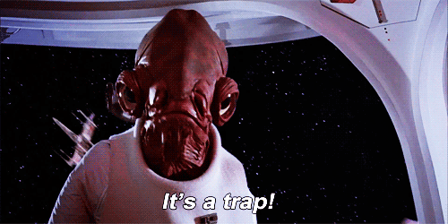
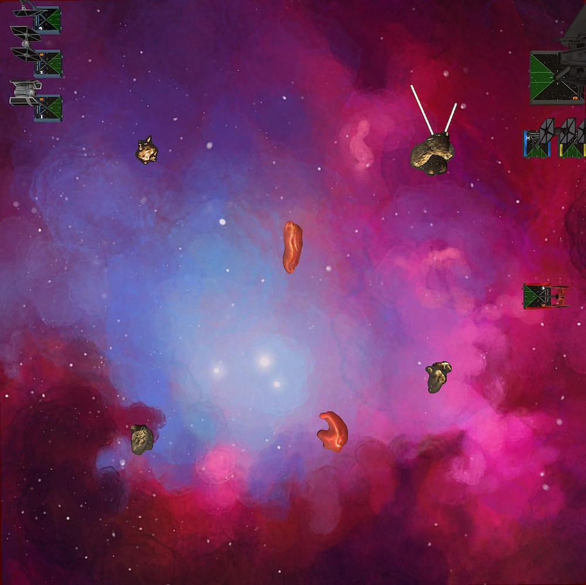
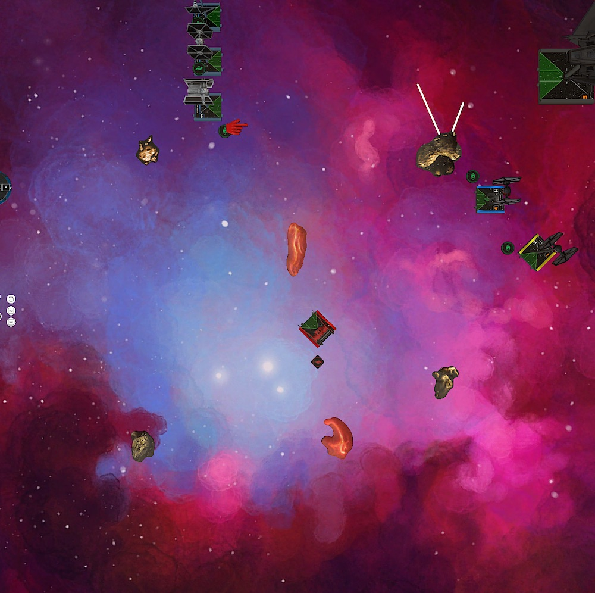
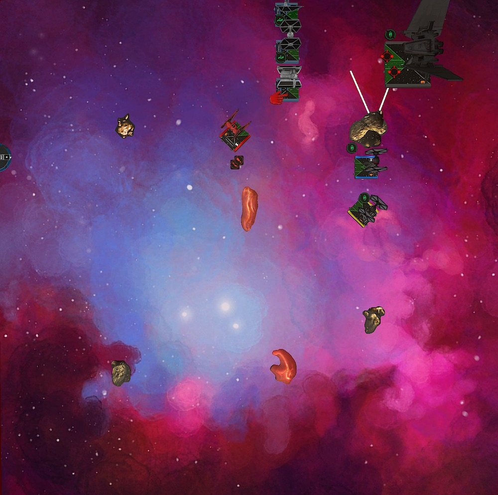
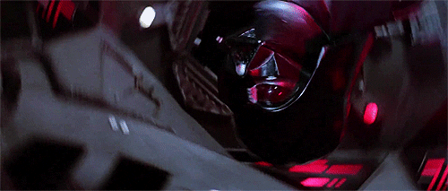
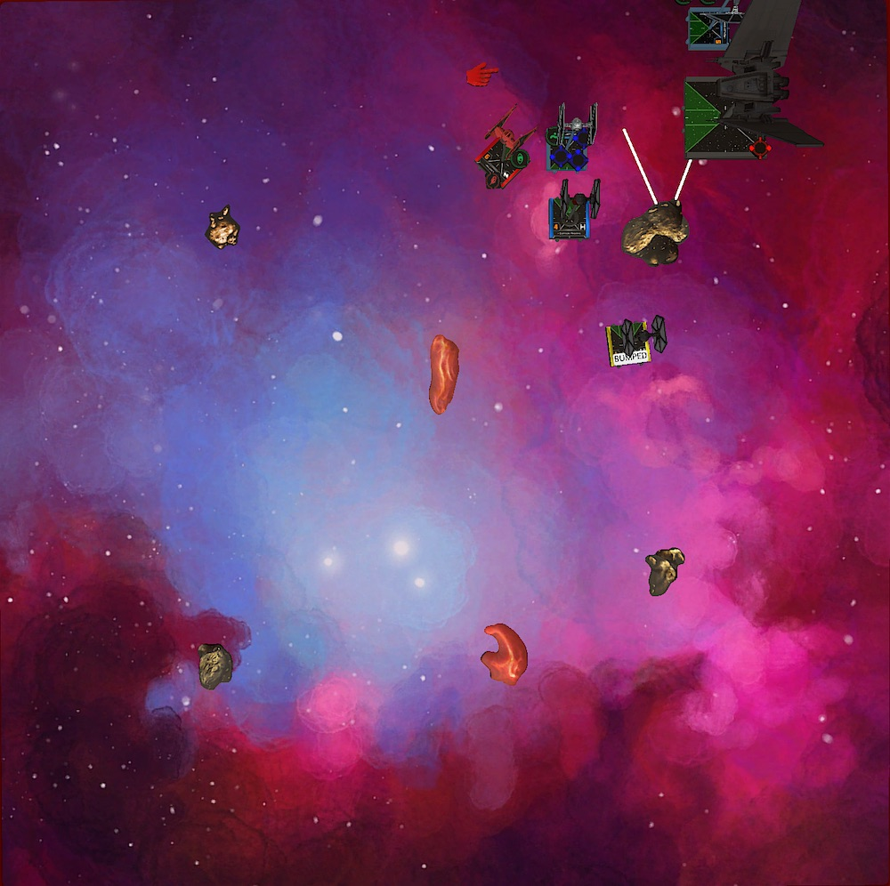
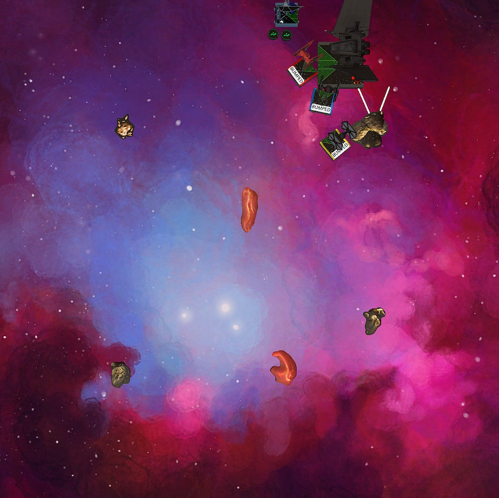
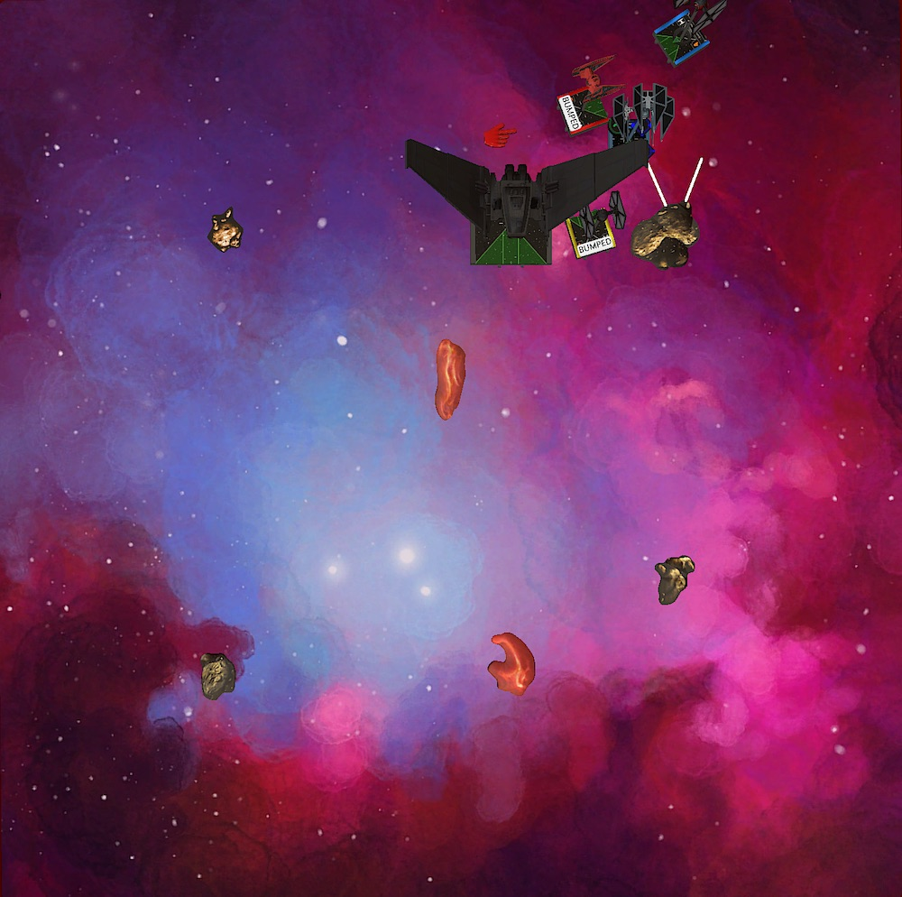
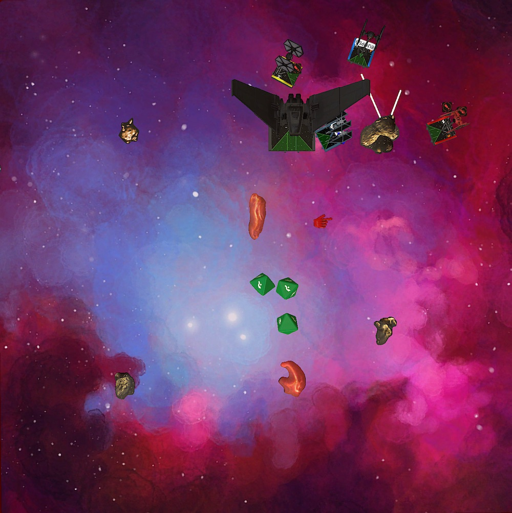
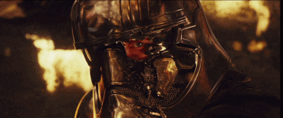

We reached the last swiss round in the second season of the German TTS league. I am 2:5 before the match so this will be my last match. It was a lot of fun meeting X-Wing players from all over the country and I will definitely try to come back for a feature season.

If you like me and want to dip your toe into tournament play, I really can recommend league play. It is much less exhausting than a regular tournament and there is lots of time after a match to talk with your opponent about the match. So you can learn and get better at moving plastic ships around the table.

## Lists

After enjoying [Dave's Phasma list](http://stayontheleader.blogspot.com/2020/08/first-order-orientation-what-to-fly.html) last week, I decided to play it one more time. Playing Tavson is much more fun than I remembered from last year when I put him on the table.

In addition, Phasma is the perfect wingwoman for him. Well, maybe it is the other way around. I can't think of a better ship to pass off damage than to Tavson.

Vonreg and Rivas complete the squad. I played both in my previous squad. In my mind, Rivas is the best FO. He is a perfect blocker and with a TIE/ba in the squad he more often than not gets a free target lock. Ignore him and he will surprise you with double modded attacks and dish out some real damage.

This might be an unpopular opinion, but I find that the Red Baron can be as threatening as Kylo. Yes, it is much easier to scare him off but for 19 points less than Kylo I wonder if Daredevil Vonreg isn't the better choice most of the time.

<XWS list={{"description":"","faction":"firstorder","name":"Unnamed Squadron","pilots":[{"id":"majorvonreg","name":"majorvonreg","points":57,"ship":"tiebainterceptor","upgrades":{"talent":["daredevil"]}},{"id":"lieutenanttavson","name":"lieutenanttavson","points":64,"ship":"upsilonclassshuttle"},{"id":"captainphasma","name":"captainphasma","points":50,"ship":"tiesffighter","upgrades":{"talent":["fanatical"],"gunner":["specialforcesgunner"]}},{"id":"lieutenantrivas","name":"lieutenantrivas","points":27,"ship":"tiefofighter"}],"points":198,"vendor":{"yasb":{"builder":"Yet Another Squad Builder 2.0","builder_url":"https://raithos.github.io/","link":"https://raithos.github.io/?f=First%20Order&d=v8ZsZ200Z381X117WWWY289XWWWWWWWY385X181WWW182WWY265XW&sn=Unnamed%20Squadron&obs=core2asteroid2,gascloud2,gascloud3"}},"version":"2.0.0","obstacles":["core2asteroid2","gascloud2","gascloud3"]}}/>

Mark is my opponent for this week. He brought an Imperial ace squad: Vader, Rexler and Mauler. I understand the first two, but I am confused by Mauler. Especially because of the Stealth Device and Marksmanship. He is a cheap I5 but I doubt that he will work in a three ship list. Getting him into range one and not dying immediately seems almost impossible. He needs support like Iden Versio.

Vader and Rexler are still scary though. The Seatlh Device on Vader makes him harder to kill. Most people prefer Afterburners on him. Not getting shot is better than being able to roll one more dice I guess and the burners costs two points less.

Rexler doesn't really need any upgrades. Some people play Juke on the defenders. The base model is already pretty point intensive.

<XWS list={{"description":"","faction":"galacticempire","name":"Unnamed Squadron","pilots":[{"id":"darthvader","name":"darthvader","points":77,"ship":"tieadvancedx1","upgrades":{"sensor":["firecontrolsystem"],"modification":["stealthdevice"]}},{"id":"rexlerbrath","name":"rexlerbrath","points":82,"ship":"tieddefender","upgrades":{"talent":["marksmanship"],"sensor":["firecontrolsystem"],"cannon":["jammingbeam"]}},{"id":"maulermithel","name":"maulermithel","points":40,"ship":"tielnfighter","upgrades":{"talent":["marksmanship"],"modification":["stealthdevice"]}}],"points":199,"vendor":{"yasb":{"builder":"Yet Another Squad Builder 2.0","builder_url":"https://raithos.github.io/","link":"https://raithos.github.io/?f=Galactic%20Empire&d=v8ZsZ200Z173XW113WW166Y196X125W113W12WY219X125W166&sn=Unnamed%20Squadron&obs="}},"version":"2.0.0"}}/>

As for my strategy, the TIE/ln is the obvious target. *If* I can get him in a few arcs at the same time, he shouldn't be able to survive. Vader without Afterburners is also a bit more predictable, since he has only one reposition (barrel roll). Punching through his three force and four defense dice seems a lot of work. Similar to Mauler, *if* I can shoot him, I only can do damage *if* he is in more than one arc.

Rexler will do defener things. I doubt that I can catch him before any other of the Imperial ships is removed from the game. I will try to limit the damage he does, while I mostly ignore him.

While that's the plan, I anticipate that it will not work out that way. Against an ace squad you have to reevaluate your win condition after every round. The aces will out fly you. We'll see how much Tavson can do against this immensely mobile squad.

The only good thing is that Mark's squad comes in at 199. I win the bid and Vonreg can move after Vader. Maybe Vonreg can do some work and force or bait the Imperials in a position I can take advantage of.

## Turn 0

My goal is to spread the obstacles as much as possible and have the gas clouds in the middle. This way there is enough room for the Upsilon to turn around and not much possibilities for the Imperials to hide behind rocks.

We ended up with an open field. Just what I wanted.

I deployed Rivas, Phasma and Tavson in the north-east corner. Tavson is facing Mark's board edge. Phasma and Rivas face southbound.

Because Mark didn't place any of his ships yet I wanted to cover both angles with my jousting block. Depending on his deployment I can go either way. Gathering Tavson, Phasma and Rivas would require one or two rounds. They would have to fly past the rock.

Surprise! Mark lined up his squad on the other side of the table, staring down Tavson. Ready to joust.

I never expected that. Was he really going to joust me with his aces? Or is this a trap?

Still confused about Mark's setup I deployed Vonreg in center so that he can rush behind the gas cloud in the middle and cut off the aces' escape path if Mark would really turn away.

*PS: Get used to the white lines on the rock. TTS sometimes does that.* 😄

## Turn 1

Let's think this through. If Mark dashes forward and jousts, he most likely tries to catch Tavson off guard. As mentioned, I need some time to group up.

Because of Vader and Mauler he can "only" do a five straight. Rexler is the only one that can add a boost. Thus, doing a stop with Tavson is the safest move and will give the rest of my squad time to support him. 

Rivas does a three bank and Phasma flies a two hard. Vonreg five-straights and follows it up with a barrel roll and boost.

The Imperials all do a five straight.

## Turn 2

Huh! He is really doing it. Or is he? I mean he still could bail and go after Vonreg. Either way I can definitely get some pod shots at the Imperials.

I decided to be careful here and not commit yet.

Vonreg flies a three straight to potentially fly past the Imperials should they turn in. Phasma and Tavson one-straight. Rivas flies a three hard.

The Imperials fly a four straight. Vader and Rexler lock Tavson. Mauler evades.

We got a lot faster into combat than I expected. A straight joust should favor my squad thought. And the positioning is great for me too. My whole squad can focus fire on Vader.

Vader initiates this round of combat. With a target lock he is able to strip two shields off of Tavson.

I could have reinforced with Tavson to mitigate the incoming damage. I, however, chose violence. Focusing with Tavson plus the two additional actions thanks to the damage he would suffer, gives me two double modded shots.

With the first extra action, Tavson locks Vader. The second action is a coordinate for Phasma. She also takes a lock on Vader.

The other two Imperial pilots only can put one more damage into Tavson. Mauler with his two dice guns and no mods misses due to an evade from Tavson.

Shooting at Vader first wasn't the plan, but with Phasma positioning he was the only ship that was in all four of my arcs.

Vonreg used his ship ability and a Daredevil boost to get into range one of Vader. With some very hot dice, the Baron put one damage into the Sith. The Stealth Device was gone already. He would have to defend the remaining shots without an additional green dice.

Phasma acquired two hits and a crit by spending both her mods. Vader said nope and nattied. No damage.

Tavson spent lock and focus to get three hits and a crit. Vader had less luck this time. He evaded two damage, but one damage and the crit (Weapons Failure) got through.

The last shot this round came from Rivas. Single-modded and range three. Using his focus the FO pilot got two hits. Exactly the amount of hull left on Vader. Mark rolled for Vader's defense. Blank, blank, blank and another blank. Vader was gone.

Going into combat I never anticipated that outcome. Blanking out with Vader in this spot feels incredibly bad. On the other hand, I threw 13 red dice in a single round at Vader. Two attacks were double modded.

What tipped that engagement into my favor was the first attack with Vonreg. I only had a [25% chance to remove the Stealth Device](http://xwing.gateofstorms.net/2/multi/?d=MwAACAAAAAAG&a1=QQAAAAAAAAAA). After that [the likelihood to remove Vader](http://xwing.gateofstorms.net/2/multi/?d=IwAAAAAAAAAG&a2=MwgAAAAAAAAA&a3=QwgAAAAAAAAA&a4=IQgAAAAgAAAA) was almost a coin flip.

Even if I hadn't removed Vader. Three shields from Tavson for three or even four damage into Vader is a trade I will take every day.

## Turn 3

Mark's plan to catch the Upsilon unguarded didn't work and his board position wasn't great either. Both of his remaining ships were trapped between Tavson and the rest of my squad.

I let Rivas bump into Phasma with a one hard so that she could close in on Mauler with a two hard. Tavson did a stop to prevent k-turns from the TIE/ln. I couldn't do anything about the incoming white 4k from Rexler. The maneuver would land him side by side with Tavson, which meant no additional damage into the Upsilon.

Mauler flew an one hard, landing directly in front of Phasma. Rexler did the Defender's trademark 4k.

Vonreg did a two straight. He took a target look on Mauler for a deplete and focused.

Vonreg's shot into Mauler missed, but stripped the evade token from the TIE. I only spent the lock and kept the focus, since Rexler had a shot on Vonreg and I didn't want to give up points easily.

Mauler with his unmodded shot failed to do any damage to Phasma. Rexler acquired a hit/crit on Vonreg. Fortunately I saved the focus to neutralize the attack.

By spending her lock, Phasma finally got one damage through the Stealth Device. With no defensive modes and only two hull left, Tavson and Rvias finished the job and removed Mauler from the game.

I extended the lead 117 to 0.

## Turn 4

My squad was basically untouched. Only Tavson was missing three of his shields. Rexler was still trapped in a very awkwards spot. He could do another 4k or hope that a three hard would fit.

Don't get my wrong here. Even though my squad was very healthy, a Defender is nothing to mess with. There was still a chance that Rexler single-handedly took out my squad.

Because Tavson was in everybody's way, I decided to just bump everyone. This would block the three hard and with a 4k Rexler would only have a shot at Tavson. A Tavson with two energy mind you!

Rexler fired at Tavson, stripping off the remaining three shields.

With his two bonus actions Tavson took a focus and jammed the evade off of Rexler. Due to the orange token, Rivas got a free target lock on Rexler.

Vonreg didn't have the Defender in arc, so Phasma had the honor to open fire on Rexler. She removed one shield.

Tavson had double mods again. The five dice attack did result in four hits. Rexler was down to two hull. Rivas couldn't add any damage though. Rexler dodged the attack.

## Turn 5

Rivas had to bump into a friendly ship for the third time in a row. Tavson could finally clear the way with a two hard. He coordinated Vonreg, who locked Rexler. Rivas got a free lock again.

This gave Phasma some options. I decided to block the 4k with Phasma, which also was a good opportunity to sloop and have Phasma turned into the right direction if Rexler would do a turn maneuver.

Vonreg bumped into Rexler because the Defender flew a three hard. Only Phasma and Rivas would have a shot this round.

Rexler switched targets and pinged off Rivas' shield instead of further damaging Tavson. This made sense because Mark already got half points on Tavson.

Phasma and Rivas couldn't get any damage through the Defender's three dice and evade.

## Turn 6

Rexler was almost out of options. A straight maneuver would touch the rock in front of him, as would any left turn. He was left with going right.

Knowing this, Tavson did a stop maneuver. This would block the three hard. Rivas flew a sloop to get his guns in the right direction. Phasma flew a one bank.

Just in case, Vonreg would cover a fast straight maneuver by flying a three hard around the rock.

Rexler bumped into Tavson with a three hard. No free evades this time and except Tavson  everyone had the Defender in arc.

With three incoming shots Rexler didn't stand a chance. Phasma destroyed the last Imperial ship.

The game ended 200 to 32.

## Conclusion

This concludes my season. I am very satisfied with my 3:5 result. I honestly expected worse.

In retrospect, maybe I should not have played my first tournament in hard mode and forced myself to play aces. The First Order just isn't a good ace faction (yet). Their ships are very efficient for the cost though.

Also, playing Kylo in the current meta for his 76 points might be a trap. The first [Galactic Championship Qualifier](https://listfortress.com/tournaments/1826) may have proven this. The top placing First Order squads didn't include the Sith.

Playing Dave's Phasma list showed that there are other great options if you want to play the faction. I wonder if Vonreg is the new uncrowned king of the First Order. He and Rivas play very well together.

The little FO not only contributed with some great blocks to the games, he also dealt some real damage. He even destroyed Vader this game! If he is ignored he has modded shots most of the time. Sometimes these shots are in range one. That's not something you can ignore easily.

For the price, Phasma in combination with Tavson might also be the best SF pilot. People tried to make LeHuse work and failed. Quickdraw will not have a good time in the Spamtex meta. So besides playing Zeta Survivors with missiles, Phasma seems to be the only other good option.

Until I get my hands on a Xi shuttle, I will continue playing this squad. It feels well rounded and has a little bit of everything. An ace, a blocker, a battleship and a brawler. All the interaction and support between these ships makes it a fun squad to play. Plus, it confronts the opponent with a tough decision because there is no good first target. Kudos to Dave for coming up with the list!

Until next time!

